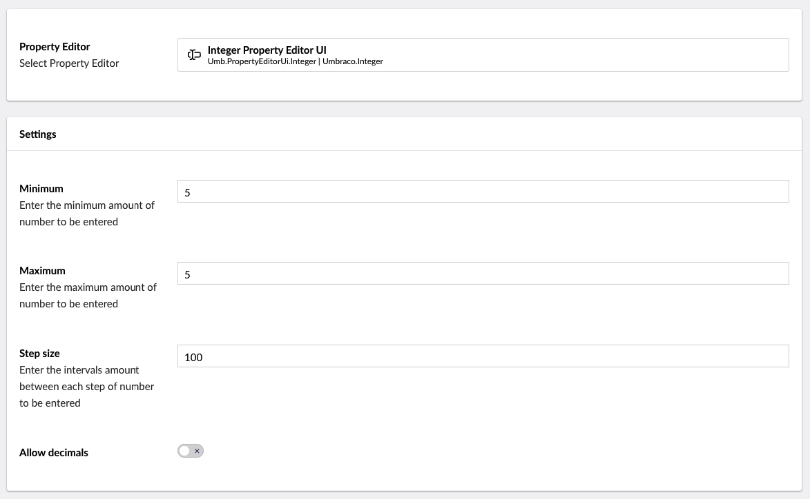

# Numeric

`Schema Alias: Umbraco.Integer`

`UI Alias: Umb.PropertyEditorUi.Integer`

`Returns: Integer`

Numeric is an HTML input control for entering numbers. Since it's a standard HTML element the options and behaviour are all controlled by the browser and therefore is beyond the control of Umbraco.

## Data Type Definition Example



### Minimum

This allows you to set up a minimum value. If you will always need a minimum value of 10 this is where you set it up and whenever you use the datatype the value will always start at 10. It's not possible to change the value to anything lower than 10. Only higher values will be accepted.

### Step Size

This allows you to control by how much value should be allowed to increase/decrease when clicking the up/down arrows. If you try to enter a value that does not match with the step setting then it will not be accepted.

### Maximum

This allows you to set up a maximum value. If you will always need a maximum value of 100 this is where you set it up. It's not possible to change the value to anything higher than 100. Only lower values will be accepted.

## Settings

## Content Example


## MVC View Examples

### Rendering the output casting to an int (without Modelsbuilder)

By casting the output as an int it's possible for you to do mathematical operations with the value.

```csharp
@{
    int students = Model.HasValue("students") ? Model.Value<int>("students") : 0;
    int teachers = Model.HasValue("teachers") ? Model.Value<int>("teachers") : 0;
    int totalTravellers = students + teachers;

    <p>@totalTravellers</p>
}
```

### Rendering the output casting to a string (Without Modelsbuilder)

You can also render the output by casting it to a string, which means you will not be able to do mathematical operations

```csharp
@{
    if(Model.HasValue("students")){
        <p>@(Model.Value<string>("students"))</p>
    }
}
```

### With Modelsbuilder

```csharp
@{
    int students = Model.Students;
    int teachers = Model.Teachers;
    int totalTravellers = students + teachers;

    <p>@totalTravellers</p>
}
```

## Add values programmatically

See the example below to see how a value can be added or changed programmatically. To update a value of a property editor you need the [Content Service](https://apidocs.umbraco.com/v15/csharp/api/Umbraco.Cms.Core.Services.ContentService.html).


The example below demonstrates how to add values programmatically using a Razor view. However, this is used for illustrative purposes only and is not the recommended method for production environments.


```csharp
@using Umbraco.Cms.Core.Services;
@inject IContentService Services;
@{
    // Get access to ContentService
    var contentService = Services;

    // Create a variable for the GUID of the page you want to update
    var guid = new Guid("32e60db4-1283-4caa-9645-f2153f9888ef");

    // Get the page using the GUID you've defined
    var content = contentService.GetById(guid); // ID of your page

    // Set the value of the property with alias 'students'
    content.SetValue("students", 20);
    
    // Save the change
    contentService.Save(content);

}
```

Although the use of a GUID is preferable, you can also use the numeric ID to get the page:

```csharp
@{
    // Get the page using it's id
    var content = contentService.GetById(1234); 
}
```

If Modelsbuilder is enabled you can get the alias of the desired property without using a magic string:



```csharp
@using Umbraco.Cms.Core.PublishedCache;
@inject IPublishedSnapshotAccessor _publishedSnapshotAccessor;
@{
    // Set the value of the property with alias 'students'
    content.SetValue(Home.GetModelPropertyType(_publishedSnapshotAccessor, x => x.Students).Alias, 20);
}
```
