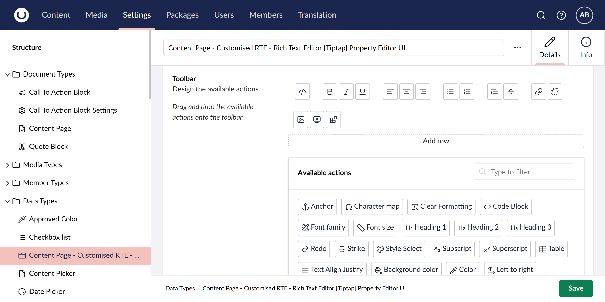
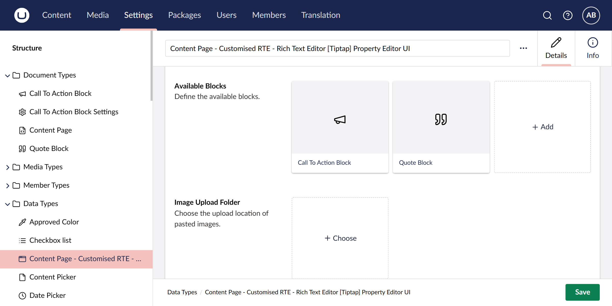
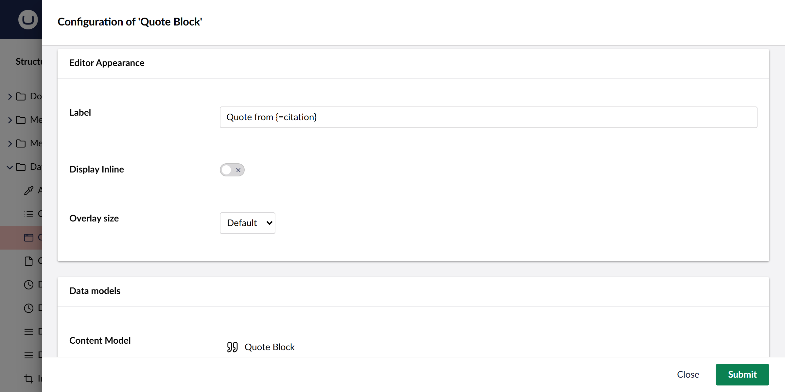
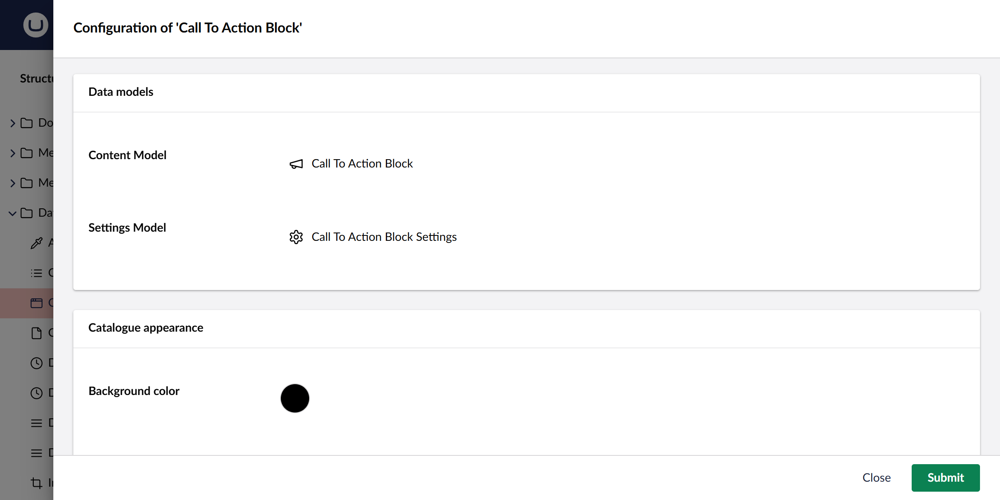
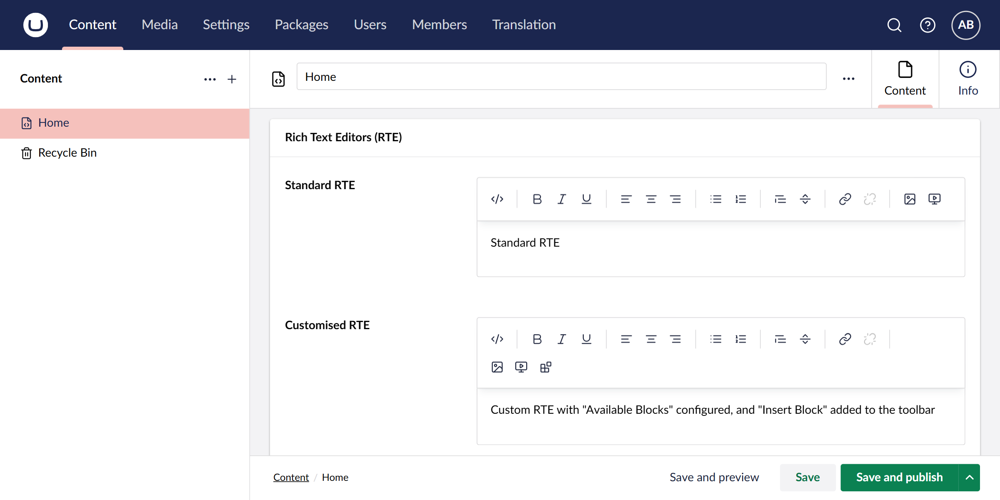
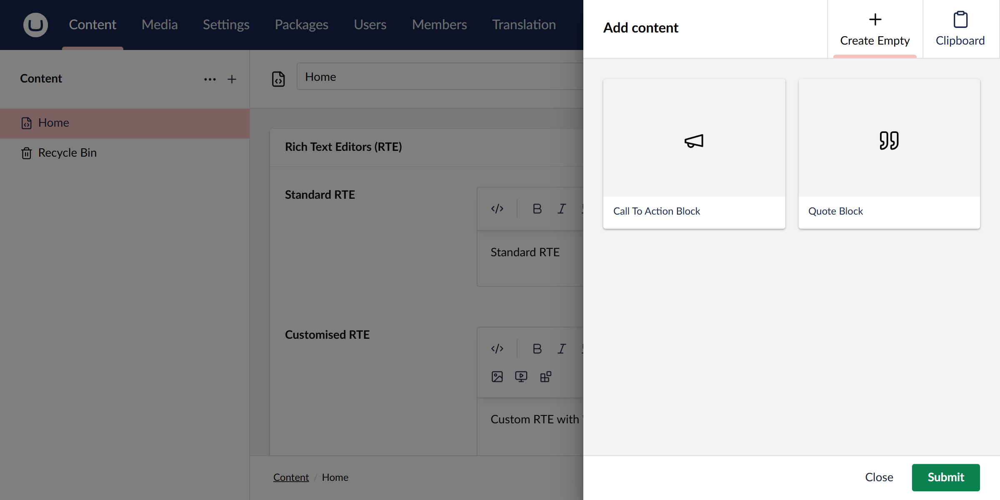
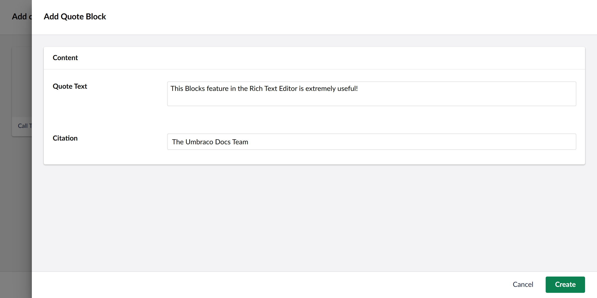

# Blocks

Blocks enable editors to insert structured content elements directly into the Rich Text Editor (RTE). Blocks are [Element Types](../../../../data/defining-content/default-document-types.md#element-type) and can be configured with custom properties, styling, and behavior.

Blocks can be added to the Rich Text Editor when:

* Available Blocks are specified as part of the Rich Text Editor Data Type configuration.
* The **Insert Block** toolbar option is enabled in the Rich Text Editor.



## Configure Blocks

Blocks are Element Types that must be created before configuring them as blocks in the Rich Text Editor. You can create Element Types in the **Settings** > **Document Types** section

Blocks functionality can then be configured through the Rich Text Editor Data Type configuration as follows.

1. Navigate to **Settings** > **Data Types**.
2. Select your Rich Text Editor Data Type or create a new one.
3. Locate the **Available Blocks** section.
4. Add the Element Types you want to make available as blocks.
5. Configure each Block Type with the options described below.



### Editor Appearance

Configure how blocks appear and behave in the Content section:

* **Label** - Define how the block appears in the editor. Umbraco 16 uses [Umbraco Flavoured Markdown](../../../../../reference/umbraco-flavored-markdown.md) (UFM) syntax for dynamic labels. Use `{=propertyAlias}` to display property values (e.g., `{=author}` for a text property containing the name of an author, or `Written by: {=author}` for a label with static text and dynamic content).
* **Display Inline** - When enabled, blocks remain inline with surrounding text. When disabled, blocks appear on separate lines.
* **Overlay size** - Set the size of the editing overlay when editors work with the block content.



### Data Models

Configure the content structure for your blocks:

* **Content model** - The Element Type that defines the main content properties for the block (required).
* **Settings model** - Optional Element Type that defines additional settings or configuration options for the block.



### Catalogue Appearance

Control how blocks appear in the block picker:

* **Background color** - Background color displayed behind the block icon or thumbnail.
* **Icon Color** - Color of the Element Type icon.
* **Thumbnail** - Custom image to replace the default Element Type icon.

## Working with Blocks

### Adding Blocks to Content

Editors can add blocks to rich text content using the **Insert Block** toolbar button:

1. Position the cursor where you want to insert the block

2. Click the **Insert Block** button in the Rich Text Editor toolbar

   

3. Select the desired Block from the available options

   

4. Configure the block content (and settings, if provided)

   

The block appears in the editor as a structured element.

## Rendering Blocks

To display blocks on the frontend, create Partial Views for each Block.


Rich Text Editor blocks use a different view location than Block List blocks. RTE blocks are placed in `Views/Partials/RichText/Components/`, while Block List blocks use `Views/Partials/BlockList/Components/`.


### File Structure

* **Location**: `Views/Partials/RichText/Components/`.
* **Naming**: Use the exact Element Type alias as the filename (e.g., `quoteBlock.cshtml` for alias `quoteBlock`).
* **Model**: `Umbraco.Cms.Core.Models.Blocks.RichTextBlockItem`.

The different folder structure ensures that RTE blocks and Block List blocks can have separate rendering implementations, even when using the same Element Types.


The view filename must match the Element Type alias exactly. If you see the error `ArgumentException: ~/Views/Partials/richtext/Components/[filename].cshtml does not match any available view`, verify that your view filename matches your Element Type alias precisely.


### Example Partial View

For a Block Type with Element Type alias `quoteBlock`:

```csharp
@inherits Umbraco.Cms.Web.Common.Views.UmbracoViewPage<Umbraco.Cms.Core.Models.Blocks.RichTextBlockItem>

@{
    var quoteText = Model.Content.Value("quoteText")?.ToString();
    var citation = Model.Content.Value("citation")?.ToString();
}

<blockquote class="quote-block">
    @if (!string.IsNullOrEmpty(quoteText))
    {
        <p class="quote-text">@Html.Raw(quoteText)</p>
    }

    @if (!string.IsNullOrEmpty(citation))
    {
        <cite class="quote-citation">@citation</cite>
    }
</blockquote>
```

### Example with Settings Model

For a Call To Action block with Element Type alias `callToActionBlock` and settings model `callToActionBlockSettings`:

```csharp
@inherits Umbraco.Cms.Web.Common.Views.UmbracoViewPage<Umbraco.Cms.Core.Models.Blocks.RichTextBlockItem>
@using Umbraco.Cms.Core.Models

@{
    // Get link from Multi URL Picker
    var linkPicker = Model.Content.Value<IEnumerable<Link>>("link");
    var link = linkPicker?.FirstOrDefault();

    // Get style from settings (if settings model exists)
    var style = "primary"; // Default style
    if (Model.Settings != null)
    {
        var settingsStyle = Model.Settings.Value("style")?.ToString();
        if (!string.IsNullOrEmpty(settingsStyle))
        {
            style = settingsStyle.ToLower();
        }
    }

    // CSS class based on style setting
    var cssClass = $"cta-button cta-button--{style}";
}

@if (link != null && !string.IsNullOrEmpty(link.Url))
{
    <div class="cta-block">
        <a href="@link.Url"
           class="@cssClass"
           @(link.Target == "_blank" ? Html.Raw("target=\"_blank\" rel=\"noopener noreferrer\"") : Html.Raw(""))>
            @(!string.IsNullOrEmpty(link.Name) ? link.Name : "Learn More")
        </a>
    </div>
}
```

### Type-Safe Rendering with Models Builder

When using Models Builder, specify the Content and Settings models for type-safe access:

```csharp
@inherits Umbraco.Cms.Web.Common.Views.UmbracoViewPage<Umbraco.Cms.Core.Models.Blocks.RichTextBlockItem<QuoteBlock, QuoteBlockSettings>>
@using ContentModels = Umbraco.Cms.Web.Common.PublishedModels;

@{
    var style = "";
    if (Model.Settings?.Color != null)
    {
        style = $"style=\"border-left-color: {Model.Settings.Color};\"";
    }
}

<blockquote class="quote-block" @Html.Raw(style)>
    @if (!string.IsNullOrEmpty(Model.Content.QuoteText))
    {
        <p class="quote-text">@Html.Raw(Model.Content.QuoteText)</p>
    }

    @if (!string.IsNullOrEmpty(Model.Content.Citation))
    {
        <cite class="quote-citation">@Model.Content.Citation</cite>
    }
</blockquote>
```

## Build a Custom Backoffice View

Building Custom Views for Block representations in Backoffice is the same for all Block Editors. [Read about building a Custom View for Blocks here](../../../../../tutorials/creating-custom-views-for-blocklist.md).

## Best Practices

### Content Design

* Design blocks for reusable content patterns.
* Keep block content focused on a single purpose.
* Use descriptive labels that help editors understand the block's function.

### Performance

* Avoid creating too many Blocks - this can overwhelm content editors.
* Use appropriate caching strategies for block rendering.
* Consider the impact of complex blocks on editor performance.

### Accessibility

* Ensure block markup follows accessibility guidelines.
* Provide meaningful labels and descriptions.
* Test block rendering with screen readers.

## Related Articles

* [Element Types](../../../../data/defining-content/default-document-types.md#element-type)
* [Rich Text Editor Configuration](configuration.md)
* [Rich Text Editor Extensions](extensions.md)
