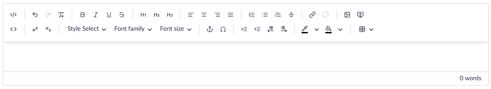
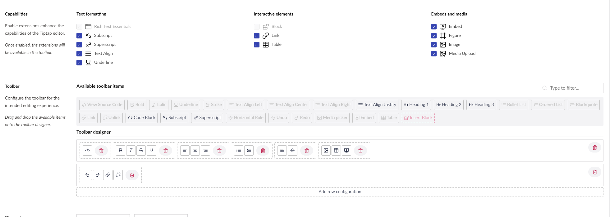

# Settings

In this article you can learn about the different options you have for configuring the Rich Text Editor (RTE).

## Toolbar

You have full control over which options should be available on the RTE.

In the example above, all 27 options have been enabled. These options include font styles like bold and italics, bullet lists, and options to embed videos and insert images.

You can customize the look of the toolbar:

* Enhance the capabilities of the toolbar by enabling or disabling extensions.
* Use the Toolbar designer to group together items and add additional rows if needed.

## Dimensions

Define `height` and `width` of the editor displayed in the content section.

## Maximum size for inserted images

Define the maximum size for images added through the Rich Text Editor.

If inserted images are larger than the dimensions defined here, the images will be resized automatically.

## Overlay Size

Select the width of the link picker overlay. The overlay size comes in three sizes: Small, Medium, Large, and Full.

## Available Blocks

Blocks can be added as elements in the Rich Text Editor. Configuration and rendering of Blocks are described in the [Blocks in Rich Text Editor](blocks.md) article.

## Image Upload Folder

Images added through the RTE are by default added to the root of the Media library.

Sometimes you might want to add the images to a specific folder. This folder can be configured using the "Image Upload Folder" setting.

## Ignore User Start Nodes

Some of the backoffice users might be restricted to a specific part of the content tree. When the "Ignore User Start Nodes" is checked, the users can pick any piece of content from the content tree, when adding internal links through the RTE.
