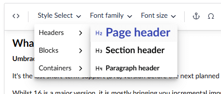

# Style Menu

A Style Menu is configurable extension to add a cascading menu to the toolbar, to apply text styles and formatting.




Any custom stylesheets associated with the Rich Text Editor will not auto generate a style menu in the toolbar.


### Creating a Style Menu

In this article you can find an example of how to setup a Style Menu using the package manifest file.


```json
{
    "name": "Name of your package",
    "alias": "My.Package",
    "extensions": [
        {
            "type": "tiptapToolbarExtension",
            "kind": "styleMenu",
            "alias": "MyCustom.Tiptap.StyleMenu",
            "name": "My Custom Tiptap Style Menu",
            "meta": {
                "alias": "myCustomStyleMenu",
                "icon": "icon-palette",
                "label": "My custom styles"
            },
            "items": [
                {
                    "label": "Headings",
                    "items": [
                        {
                            "label": "Heading 2",
                            "data": { "tag": "h2" },
                            "appearance": { "icon": "icon-heading-2" }
                        },
                        {
                            "label": "Heading 3",
                            "data": { "tag": "h3" },
                            "appearance": { "style": "font-size: large;" }
                        },
                        {
                            "label": "Heading 4",
                            "data": { "tag": "h4" }
                        }
                    ]
                },
                {
                    "label": "Attributes",
                    "items": [
                        {
                            "label": "Classes",
                            "data": { "class": "foo" }
                        },
                        { 
                            "label": "IDs",
                            "data": { "id": "bar" }
                        },
                        {
                            "label": "Mixed",
                            "data": { "tag": "span", "class": "foo", "id": "bar" }
                        }
                    ]
                }
            ]
        }
    ]
}
```



The "`items`" property defines the structure of the style menu. Each menu item has the following options.

- `label`: _(required)_ The label of the menu item. This supports localization keys.
- `appearance`: This defines the appearance of the menu item. The value has 2 optional properties:
  - `icon`: To prefix an icon to the menu item.
  - `style`: To apply CSS rules to the menu item.
- `data`: To configure the function of the style menu item. The value has 3 optional properties:
  - `tag`: A supported HTML tag name, _(see below)_, this will be applied to the selected text.
  - `class`: Applies a class attribute with the defined class name to the containing tag of the selected text.
  - `id`: Applies an ID attribute with the defined ID value to the containing tag of the selected text.
- `separatorAfter`: When `true`, it will add a line separator after the menu item.
- `items`: To enable a cascading menu, an array of nested menu items may be added.


Once configured, all custom style menus will appear in the Rich Text Editor toolbar options, as described in the [Rich Text Editor Configuration](configuration.md) article.


#### Supported HTML tags

Since the Tiptap has a strict rich-text schema, only supported HTML tags can be used in the style menu, _(arbitrary markup will be excluded)._ The following HTML tag names are supported: `h1`, `h2`, `h3`, `h4`, `h5`, `h6`, `p`, `blockquote`, `code`, `codeBlock`, `div`, `em` (italic), `ol`, `strong` (bold), `s` (strike-through), `span`, `u` (underline) and `ul`.
