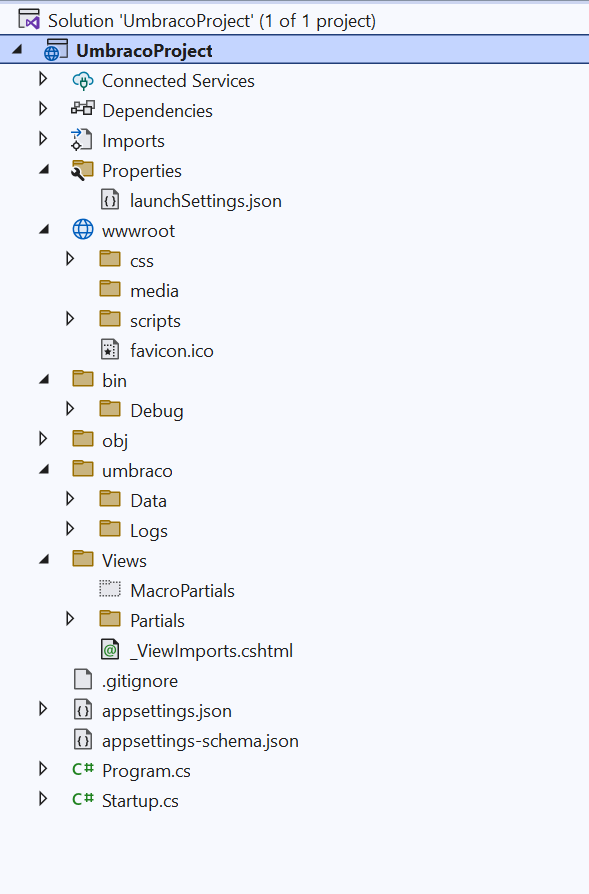

# Source Control

## Umbraco Cloud

When you are running your site on Umbraco Cloud, source control is a part of the experience. Have a look at the ['Technical overview of an Umbraco Cloud Environment'](https://docs.umbraco.com/umbraco-cloud/getting-started/environments) and the information on ['Working with a Local Clone'](https://docs.umbraco.com/umbraco-cloud/build-and-customize-your-solution/handle-deployments-and-environments/working-locally) for a steer on Source/Version Control good practices.

## Outside of Umbraco Cloud

If you are hosting your Umbraco implementation outside of Umbraco Cloud, it's generally considered good practice to set up source/version control for your site implementation files. This is especially a good idea when you are working with a team as it can help you track changes and manage conflicts with other developer's work.

So if you've made the decision to try to attempt to source/version control your Umbraco implementation work, perhaps setting up a ['Git Repository'](https://en.wikipedia.org/wiki/Git) - then a frequently asked question is:

### What folders and files should I **exclude** from my source control repository?

There are lots of different possible variations within your working environment that will affect the best way to set up version control. It depends on whether you are:

* Working with a team of developers.
* How your development environment is set up.
* Source control repository.
* And also how you intend to build and deploy your solution to your target production environment (build servers, Web Deploy or good old File Transfer Protocol (FTP), etc).

However, Umbraco ships with a `.gitignore` file with a custom Umbraco section, which will make git ignore the files for you. The Umbraco specific section looks like this:

```
##
## Umbraco CMS
##

# JSON schema file for appsettings.json
appsettings-schema.json

# Packages created from the backoffice (package.xml/package.zip)
/umbraco/Data/CreatedPackages/

# Temp folder containing Examine indexes, MediaCache, etc.
/umbraco/Data/TEMP/

# SQLite database files
/umbraco/Data/*.sqlite.db
/umbraco/Data/*.sqlite.db-shm
/umbraco/Data/*.sqlite.db-wal

# Log files
/umbraco/Logs/

# Media files
/wwwroot/media/
```

For most projects, this gitignore will be enough, and this article will not be an exhaustive list of how to version control Umbraco in all possible scenarios.

However, we will go through the different files in order to give you an insight into the anatomy of an Umbraco website and therefore which parts to include in version control and which parts not to.



#### The Umbraco Folder

The main folder where the Umbraco CMS resides is the `/umbraco` one inside your project.

Most of the files and folders within the Umbraco folder, is already added to the default gitignore file. As most of the Umbraco CMS core files are embedded, the `/umbraco` folder contains primarily temporary files and log files, which are all added as Umbraco is installed.

We recommend that you follow the structure of the default gitignore file, and do not include any temporary files, log files or cache files to git.

Below are a set of general recommendations regarding the files within the `/umbraco` folder.

* `/umbraco/data/TEMP` - This folder contains examine indexes, NuCache files, and so on, these are temporary and should not be committed.
* `/umbraco/Logs` - Umbraco currently uses _Serilog_, and a file will be generated in this folder containing trace logs of your application, one JSON file for each day.
* `/umbraco/mediacache` - _ImageSharp_ ships with Umbraco and when an image is requested via the processor, for example, to be resized or cropped, a cached version of the transformed image will be stored in this folder. (The [Imaging settings section](../../reference/configuration/imagingsettings.md) allows you to determine where this cache is stored)

#### Umbraco Models Builder

The strategy here will depend a little on which mode ['Umbraco Models Builder'](../../reference/templating/modelsbuilder/) you have opted to work with.

* **InMemoryAuto** (default), The models are generated in memory, no source control is required.
* **SourceCodeManual** and **SourceCodeAuto**, The models are generated in the `/umbraco/models` folder of your project (or can be configured to be in a different folder or project), allowing you to track changes to the models in source/version control.

#### Media

The Media section of Umbraco (unless configured otherwise) stores files in the `/wwwroot/media` folder. These can be updated by editors, in the Umbraco backoffice, so generally speaking, you would not source control these files.

These are by default ignored by git.

#### Packages and Plugins

The **App\_Plugins** folder is the home for all third-party packages installed on your site.

Depending on how you installed the plugin it will affect how you choose to version control a particular third-party plugin:

Since plugins are installed via NuGet the installed files for individual plugins shouldn't need to be source controlled (and your deployment process should pull the packages implementation files from NuGet during the build and deployment process).


Each plugin could be different depending on its implementation and functionality. It may contain files that it would be useful to track via Source control, and also files that should be ignored: check with the plugin's supporting website/developer for more information.


### What folders and files should I **include** in my source control repository?

#### Front-end build

A lot depends on how you maintain the front-end build of your website, e.g. are you using CSS preprocessors such as Sassy Cascading Style Sheets (SCSS)/ Leaner CSS (LESS) etc - gulp/grunt tasks to combine and minify script resources.

But generally, you will need to source control all your website's static assets: JavaScript, CSS, Fonts, Page Furniture Images, etc.

#### Views/Templates/Partials

Umbraco site templates/views can be edited via the Umbraco Backoffice. They also reside in the `/Views` folder on disk. As these views/templates often include code, it can make a lot of sense to have their changes tracked under source/version control.

However, this can pose a problem if the templates are updated via the backoffice outside of source control on the production environment.

This is not an advisable approach since often this will cause breaking changes to your website.

You would need to manually merge these files before considering a deployment.

Umbraco Cloud is a good solution in these scenarios, as changes via the backoffice are tracked in a Git repository automatically.

#### Controllers/Classes/Custom Code

Any supporting custom code for your application should be in version control, eg any of the following files

* C# implementation,
  * Surface Controllers
  * API Controllers
  * ViewModels
  * Helpers / Extension Methods
  * Services etc.
* Supporting class library projects,
* Models generated by Modelsbuilder in SourceCodeManual or SourceCodeAuto mode.

#### Config

Your site's `appsettings.json` and `appsettings.Development.json` files contain the configuration for your Umbraco site.

In general, it is recommended to add these to source control. When you do this, be sure that the file(s) doesn't contain any secrets, like API keys and connection strings. These can be added as needed, but omitted from any commits made to source control.

#### DocumentType - Backoffice Structure Changes

When you create and edit eg. Document Types, Media Types, and Data Types in the Umbraco Backoffice these values are stored in the Umbraco Database, making them difficult to source control in a 'file based' version control system.

There are a series of add-on packages that can help add source control to these structure changes:

* [_The uSync package (free)_](https://our.umbraco.com/projects/developer-tools/usync/) - which can be configured to serialize these changes to files on disk, in a folder called /uSync - enabling you to source/version control these changes and synchronise them to other environments.
* [_uSync Snapshots (licensed)_](https://our.umbraco.com/packages/developer-tools/usyncsnapshots/) - an extension to uSync, for taking 'before' and 'after' snapshots of an Umbraco site, for managing a release of a 'set of changes' between environments.
* [_Umbraco Deploy on Premise_](https://umbraco.com/products/umbraco-deploy/umbraco-deploy-on-premises/) - the on premise version of the package used by Umbraco Cloud.
