# Creating Media

Media in Umbraco CMS is handled the same way as content. You define **Media Types** that act as a base for media items. The following default Media Types are available:

* Article - used for uploading and storing documents.
* Audio - used for uploading and storing digital audio files.
* File - used for uploading and storing different types of files in the Media section.
* Folder - a container for organizing media items in the Media section tree.
* Image - used for uploading and storing images.
* Vector Graphics (SVG) - used for uploading and storing Scalable Vector Graphics (SVG) files which are text files containing source code to draw the desired image.
* Video - used for uploading and storing video files.

The default Media Types aim to cover most needs for media on a website. You do not need to define your Media Types to start using the Media section. The tools for organizing and uploading the media are already in place.


If you have upgraded from an older version than 8.14 the Media Types listed above are not added automatically. You can add those types manually yourselves by following the steps below ['Creating a new Media Type'](./#creating-a-media-type). On the [default media types page](default-media-types.md), you will find a detailed overview of all Media Types.


## Uploading Media

You can upload media in two different ways:

* [Through the Media section](./#add-media-through-the-media-section) and
* [Through the Content section](./#add-media-through-the-content-section)

### Add media through the Media section

From the **Media** section in the Umbraco backoffice, you can add new media items by following either of the approaches defined below:

*   Use the **Create** dialog to create a new Media item in the Media section

    * The Media item will be created based on the type you choose.
    * Upload the image or file, give the Media item a name, and click **Save**.

    <figure><figcaption>
Upload Media - Create Button
</figcaption></figure>
*   Use the Drag and drop feature to add your files to the Media section.

    * Umbraco will automatically detect the Media Type and create the Media item.
    * You can drop entire folder structures to recreate that same structure in the Media section.

    <figure><figcaption>
Upload Media - Media section
</figcaption></figure>

### Add media through the Content section

New media items can be added to your site without interrupting the content creation flow. This can be done following either of the two approaches outlined below.

* Drag and drop the image(s) from your file explorer directly into the Media Picker property on the Content page.
  * Images added this way is automatically added to the user's start node in the Media section of the Umbraco backoffice.

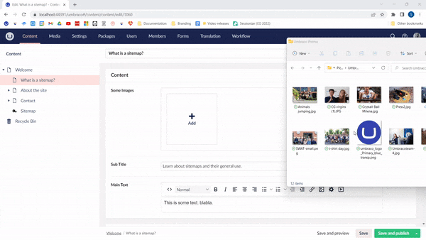

* Select the "+" icon to open the "Select media" dialog where you can add images from your file explorer directly or using drag and drop.

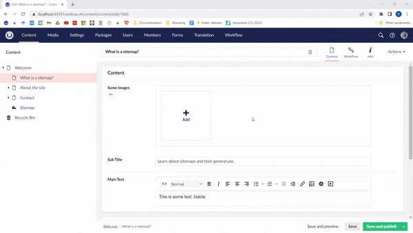

## Creating a folder

It is always a good idea to start by creating a folder for your media items. It can be a good idea to align these folders with the content on your website. This will give the editors a better overview of the files and enable them to upload media items in the correct place.

Follow these steps to create a folder in the Media section:

1. Go to the **Media** section.
2. Select **...** next to **Media**.
3. Select **Create**.
4. Select **Folder**.
5. Enter a name for the folder and select **Save** in the bottom-right corner.

## Media Type properties

The **Image** Media Type has 5 properties: **Upload Image**, **Width**, **Height**, **Size**, and **Type**. These are populated once the image is uploaded. The properties can be viewed in the **Media** section and accessed in your Templates.

Except for the **Folder** Media Type, the other Media Types have 3 properties: **Upload Image**, **Type**, and **Size**.

Learn more about each Media Type in [the article about default Media Types](default-media-types.md).

## Organizing and editing media items

The default view for the Media section is a card view that lets you preview the different files that have been uploaded.

<figure><figcaption>
Media Section - Cardview
</figcaption></figure>

By selecting multiple media items it is possible to perform bulk operations like moving or deleting the items.

To edit properties on a single media item, click the name of the item, which you will see once you hover over the item.

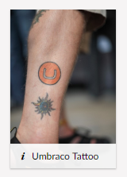

From the top-right corner of the Media section, you can toggle between the list and grid view. There is also an option to search for the items in the Media section.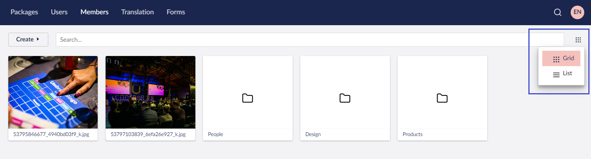

## Using media items in the Content section

By adding a **Media Picker** property to a Document Type the editor will have the ability to select media items when creating content.

## Creating a Media Type

You can create custom Media Types and control the structure of the Media tree as you would with Document Types. This means you can store information that is specific to the media on the item itself.

### Video tutorial


Watch this tutorial and learn how to create your own Media Types in Umbraco CMS.


A Media Type is created in the **Settings** section using the Media Type editor.

1. Go to the **Settings** section.
2. Click **...** next to **Media Types**.
3. Click **Create** > **New Media Type**.
4. Name the new Media Type **Employee Image**.
5. Choose an icon by selecting the icon left of the name field.

You will now see the Media Type editor. It is similar to the editor used for creating Document Types.

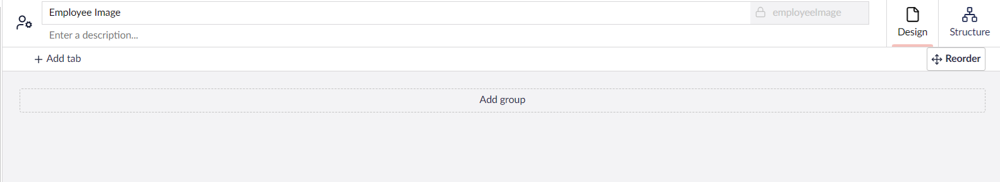


Having different folders for different Media Types makes it possible to restrict where media items can be created and added. Only allowing PDF uploads in a certain folder and employee images in another make it easier to keep the Media section organized.


### Adding groups

Before we start adding properties to the Media Type we need to add a group to put these in.

1. Click on **Add group**.
2. Call the group _Image_.

### Adding properties

We need to add the same properties as on the default **Image** Media Type. These are:

* `umbracoFile`
* `umbracoWidth`
* `umbracoHeight`
* `umbracoBytes`
* `umbracoExtension`

Follow the steps outlined below to add the properties to the Media Type:

1. Click **Add property**.
2. Name it _Upload image_.
3. Change the alias to _umbracoFile_.
4. Click **Select property editor**.
5. Select **Image cropper**.
6. Rename the editor _Employee Image Cropper_.
7. Add two new crops called _Thumbnail_ (200px x 350px) and _wideThumbnail_ (350px x 200px).

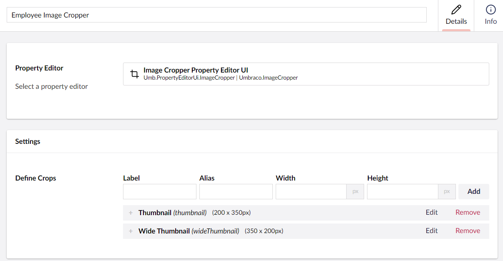\
8\. Click **Save**.\
9\. Click **Add**.\
10\. Name the remaining four properties _Width_, _Height_, _Size_, and _Type_, and give them the aliases as mentioned above. They should all use the **Label** editor.

As mentioned before these properties will automatically be populated once an image has been uploaded.

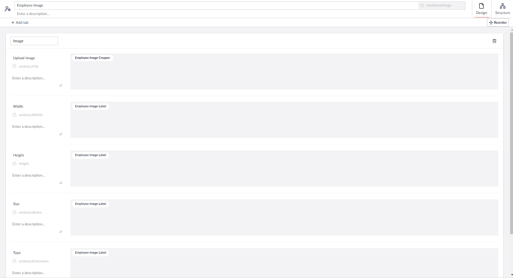

## Defining a Media Type folder

Next up, we will create a folder to hold the employee images. We could use the existing **Folder** Media Type but that would mean editors can upload employee images to any folder of that type. If we create a folder specifically for employee images there is only one place to put them.

1. Go back to the **Settings** section and create a new Media Type.
2. Name it _Employee Images_.
3. Select the folder icon by clicking the icon to the left of the name.
4. Navigate to the **Structure** tab.
5. Click **Configure as a Collection** under **Presentation.**
6. Choose **List view - Media.**

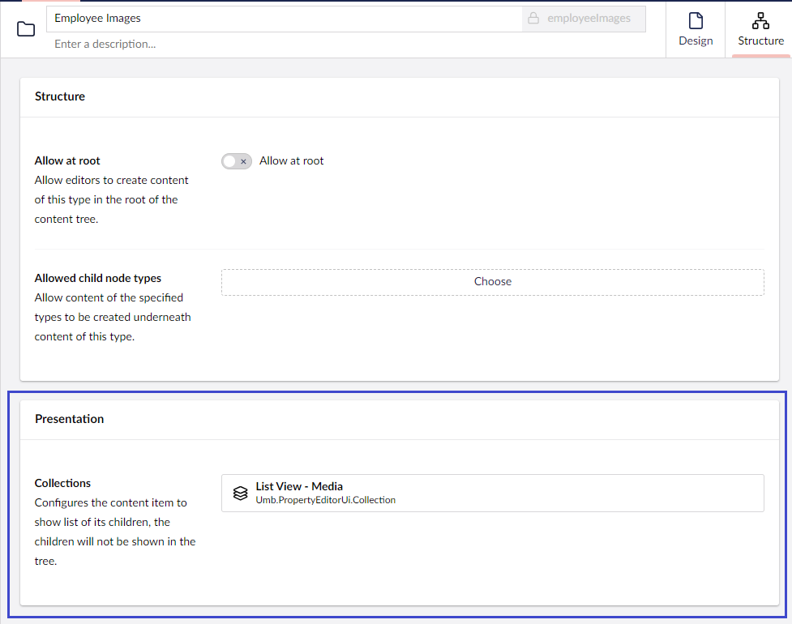\
7\. Click **Save**.

The new folder is created under the Media Types folder. We also need to only allow the Employee Image Media Type in our new folder. Both of these configurations can be set on the **Structure** tab.

1. Go to the **Structure** tab of the _Employee Images_ folder.
2. Toggle the **Allow at root**.
3. Click **Choose** in the **Allowed Child Node Types**.
4. Select **Employee Image**.
5. Click **Choose**.

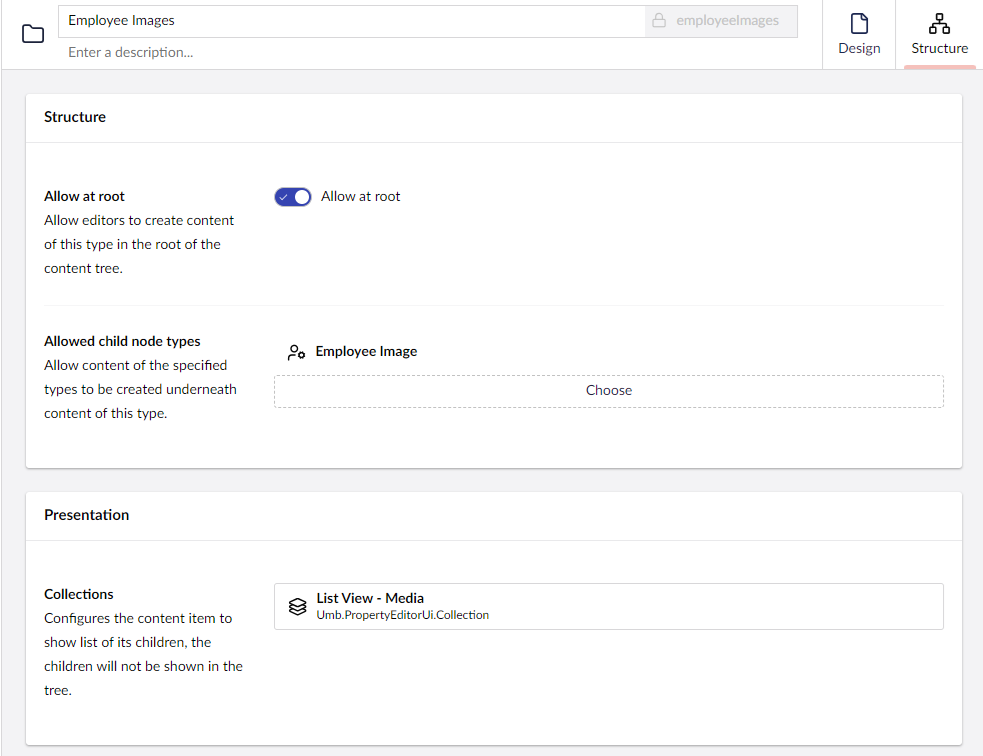

### Creating the folder and media items

1. Go to the **Media** section.
2. Select **...** next to Media.
3. Click **Create** > **Employee Images** folder.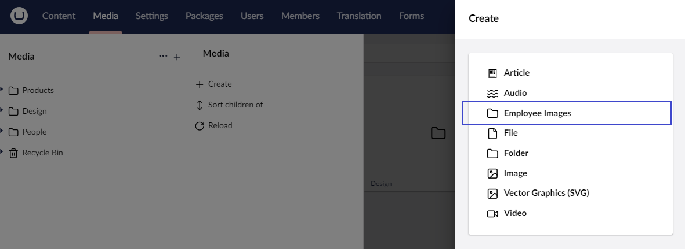
4. Name it _Employee Images_.
5. Click **Save**.


Uncheck the **Allow at root** option on the **Employee Images** Media Type to prevent the creation of multiple folders of this type. This will only disable the creation of new ones and not affect existing folders.


### Cropping the images

If you select an image that has been uploaded to the folder you will see the full image and the two defined crops.

Moving the focal point circle on the image will update the crops to focus accordingly. You can also edit the individual crops by selecting them and moving the image or adjusting the slider to zoom.

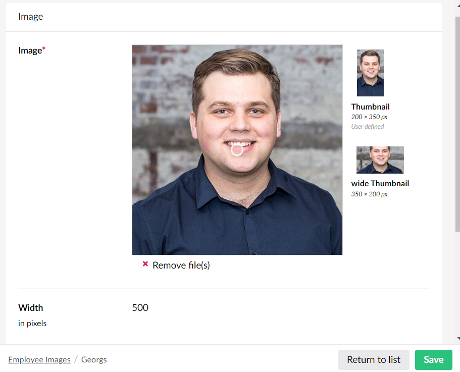

## More information

* [Rendering Media](../../design/rendering-media.md)
* [Customizing Data Types](../data-types/)

## Related Services

* [MediaService](https://apidocs.umbraco.com/v15/csharp/api/Umbraco.Cms.Core.Services.MediaService.html)
