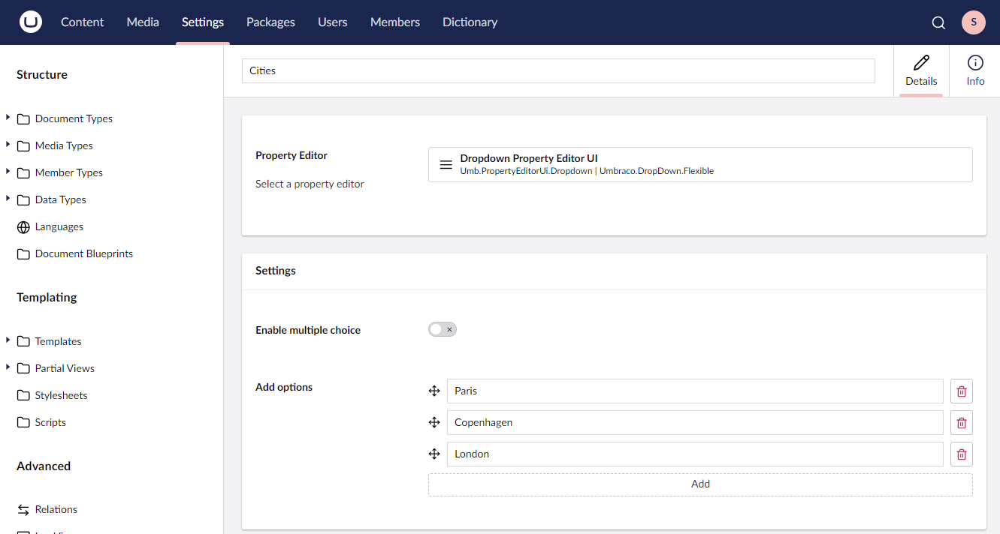

# Data Types

_A Data Type defines the type of input for a property. So when adding a property (on Document Types, Media Types and Members) and selecting the Type you are selecting a Data Type. There are preconfigured Data Types available in Umbraco and more can be added in the Settings section._

## What is a Data Type?

A Data Type can be something basic such as TextString, Number, True/False and so on. Or it can be more complex such as Multi Node Tree Picker, Image Cropper, Block Grid and so on.

The Data Type references a Property Editor and if the Property Editor has settings these are configured on the Data Type. This means you can have multiple Data Types referencing the same Property Editor.

An example of this could be to have two dropdown Data Types both referencing the same dropdown Property Editor. One configured to show a list of cities, the other a list of countries.

## Creating a new Data Type

Follow these steps to create a new Dropdown Data Type:

1. Go to the **Settings** section within the backoffice.
2. Select the **+** icon to the right of the **Data Types** folder.
3. Choose **New Data Type...**.
4. Name the Data Type.
5. Click on **Select a property editor**.
6. Find and click on the **Dropdown** editor.
7. Click **Select**.
8. Choose whether to enable multiple selections.
9. Add **options**.
10. **Save** the Data Type once you have added the required configuration.


**Data Type configuration**

**Property Editor** This is where you pick the Property Editor UI that the Data Type will be referencing. By default, Umbraco ships with a wide selection to choose from. Learn more about each of them in the [Default Data Types](default-data-types.md) article.

In the **Settings** box below, the configuration options specific to the chosen Property Editor UI will be available. Some Property Editors have many configuration options while some only have a few.


When you're happy with the list press **Save**. It is now possible to select this Data Type for a property on Document Types, Media Types, and Members. Doing this will then create a dropdown list for the editor to choose from and save the choice as a string.

## Customizing Data Types

To customize an existing Data Type go to the **Settings** section, expand the **Data Types** folder and select the **Data Type** you want to edit.

Besides the Data Types that are available out of the box there are some additional **Property Editors**. For example, think of the **Slider** and **Block List**.

## Viewing Data Type References

To view the Data Type reference, go to the **Settings** section and expand the **Data Types** folder. Select the **Data Type** you wish to view the reference for and click the **Info** tab.

This gives you an overview of the Types that currently use the Data Type.

Learn more about viewing references or implementing tracking in the [Tracking References](../../../customizing/property-editors/tracking.md) article.

### More information

* [List of available Data Types](default-data-types.md)
* [Property Editors](../../backoffice/property-editors/)

### Related Services

* [DataTypeService](https://apidocs.umbraco.com/v15/csharp/api/Umbraco.Cms.Core.Services.IDataTypeService.html)

### Umbraco Learning Base Channel
