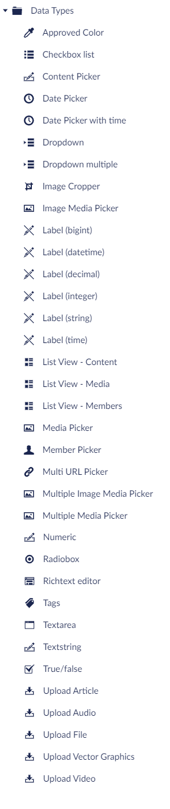

# Default Data Types

Here's a list of the default Data Types that come installed with Umbraco. There are plenty more that you can create based on the installed [Property Editors](../../backoffice/property-editors/).

## Approved Color

Adds a list of approved colors. The approved colors are added as hex values by using the color picker. Optionally, you can enable labels to give the colors different names.

## Checkbox List

Displays a list of preset options as a list of checkbox controls. The preset options are added when configuring a Property Editor using the Data Type. Alternatively, the options can also be updated in the **Settings** section under **Data Types**. The value saved is a comma-separated string of IDs.

## Content Picker

The Content Picker opens a modal to pick a specific page from the content structure. The value saved is the selected page's ID.

## Date Picker

Displays a calendar UI for selecting date and time. The value saved is a standard DateTime value but does not contain time information.

## Date Picker with time

Displays a calendar UI for selecting date and time. The value saved is a standard DateTime value.

## Dropdown

Displays a list of preset options as a list where only a single value can be selected. The default Data Type does not contain any predefined options. The value saved is the selected value as a string.

## Dropdown multiple

Displays a list of preset options as a list where multiple values can be selected. The default Data Type does not contain any predefined options. The value saved is a comma-separated string of IDs.

## Image Cropper

Allows to upload and crop images by using a focal point. Specific crop definitions can also be added. This Data Type is used by default on the Image Media Type.

## Image Media Picker

The Image Media Picker opens a modal to pick images from the **Media** tree or images from your Computer. The value saved is the selected media node UDI.

## Label

Is a non-editable control and can be used to _only_ display the value. It can also be used in the **Media** section to load in values related to the node, such as width, height and file size.

There are six Label Data Types:

* Label (bigint) - Allows to save a big integer value for a Label.
* Label (datetime) - Allows to set a DateTime value for a Label.
* Label (decimal) - Allows to set a decimal value for a Label.
* Label (integer) - Allows to set an integer value for a Label.
* Label (string) - Allows to set a long string value for a Label.
* Label (time) - Allows to set time for a Label

## List View - Content

This Data Type is used by **Document Types** that are set to display as a Collection.

## List View - Media

This Data Type is used by **Media Types** that is set to display as a Collection.

## List View - Members

This Data Type is used by **Member Types** that is set to display as a Collection.

## Media Picker

The picker opens a modal to pick a specific media item from the Media tree. The value saved is the selected media node UDI.

## Member Picker

Displays a dropdown with all the available members. A single member can be selected. The value saved is the ID of the member.

## Multi URL Picker

This Data Type allows an editor to add an array of links. These can either be internal Umbraco pages external URLs or links to media in the Media section. The Data Type can be configured by limited number of links it is possible to add.

## Multiple Image Media Picker

The picker opens a modal to pick multiple images from the **Media** tree. The value saved is a comma separated string of media node UDIs.

## Multiple Media Picker

The picker opens a modal to pick multiple media items from the **Media** tree. The value saved is a comma separated string of media node UDIs.

## Numeric

A textbox to input a numeric value.

## Radiobox

This Data type enables editors to choose from a list of radiobuttons.

## Richtext Editor

A TipTap-based What You See Is What You Get (WYSIWYG) editor. This is the standard editor used to edit a larger amount of text. The editor has a lot of settings, which can be changed on the Richtext editor Data Type in the Settings section.

Learn more about the configuration options in the [Rich Text Editor articles](../../backoffice/property-editors/built-in-umbraco-property-editors/rich-text-editor/).

## Tags

A textbox that allows you to use multiple tags on a **Document Type**. You can specify a Tag Group for the Data Type, if you need to use Tags on different sections of your site.

## Textarea

A textarea provides a multi-line plain-text editing control. You can set the maximum allowed characters for the textarea and the number of rows, if any.

## Textstring

A normal HTML input text field.

## True/False

A checkbox which saves either 0 or 1, depending on the checkbox being checked or not. A common use is to create a property with the 'umbracoNaviHide' alias and the Data Type True/False. This will provide editors with the option to hide nodes in the navigation menu on the website.

## Upload

Adds an upload field, which allows documents or images to be uploaded to Umbraco. This does not add them to the media library, they are added to the document data.

There are five Upload Data Types:

* Upload Article - Used for uploading and storing documents.
* Upload Audio - Used for uploading and storing digital audio files.
* Upload File - Used for uploading and storing different types of files in the Media section
* Upload Vector Graphics - Used for uploading and storing Scalable Vector Graphics (svg) files which are text files containing source code to draw the desired image.
* Upload Video - Used for uploading and storing video files.
