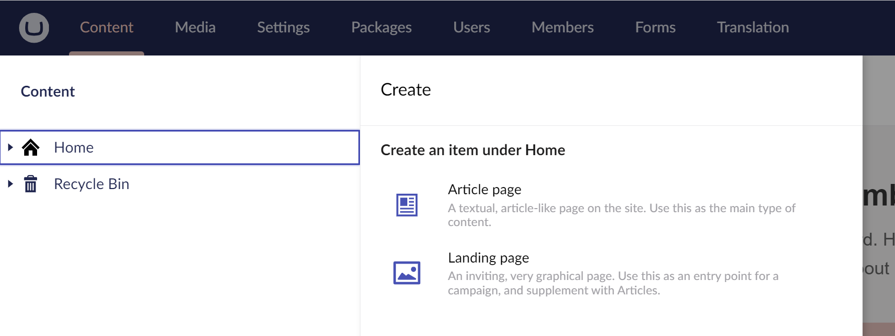

# Document Type Localization

The Umbraco backoffice is localized to match the [user's configured UI Culture](../../../tutorials/multilanguage-setup#changing-the-default-backoffice-language-of-a-user).

When defining a Document Type, you can apply localization to:

* Document Type name and description.
* Property names and descriptions.
* Custom property validation messages.
* Tab and group names.


Everything in this article also applies to defining [Media Types](../../backoffice#media-types) and [Member Types](../../backoffice#member-types).


## Register Document Type localization Files

To register Document Type localizations, you must create a new manifest using an `umbraco-package.json` file.


The `umbraco-package.json` file is only registered when placed directly in the `/App_Plugins/` or `/App_Plugins/{SubFolderName}` folder. It will not be recognized in nested subfolders.



```json
{
  "name": "Document Type Localization",
  "extensions": [
    {
      "type": "localization",
      "alias": "DocumentType.Localize.En",
      "name": "English",
      "meta": {
        "culture": "en"
      },
      "js": "/App_Plugins/DocumentTypeLocalization/en.js" //replace js file path as required
    }
  ]
}
```


## Creating localizations

Once you have registered the Document Type localization, you can add your localization texts for use in Document Types. The following localizations are used for the samples in this article:


```js
export default {
    contentTypes: {
        article: 'Article page',
        'article-desc': 'A textual, article-like page on the site. Use this as the main type of content.',
        landing: 'Landing page',
        'landing-desc': 'An inviting, very graphical page. Use this as an entry point for a campaign, and supplement with Articles.'
    },
    tabs: {
        content: 'Page content',
        seo: 'SEO configuration',
    },
    groups: {
        titles: 'Page titles'
    },
    properties: {
        title: 'Main title',
        'title-desc': 'This is the main title of the page.',
        'title-message': 'The main title is required for this page.',
        subTitle: 'Sub title',
        'subTitle-desc': 'This is the sub title of the page.',
    }
};
```



Umbraco must be restarted to register the localization manifest. Any subsequent localization text changes will need to be reloaded within the browser.


## Applying localizations

The localizations are applied by using the syntax `#{area alias}_{key alias}`.

1. Create a **Document Type with Template** called `#contentTypes_article` with the **alias**: `articlePage`.
2. Under the newly created Document Type follow these steps:

* Set the **description** to `#contentTypes_article-desc`.
* Create a new **tab** called `#tabs_content`.
* Add a new **group** called `#groups_titles`.
* Add a **property** called `#properties_title` with **alias** `title`.
  * Set the description to `{#properties_title-desc}`.
  * Use a `TextString` editor.
  * Set the field validation to `mandatory`.
  * Under validation add `#properties_title-message`.


Property descriptions support [Umbraco Flavored Markdown](../../../reference/umbraco-flavored-markdown.md), which uses a different syntax (wrapped in brackets) to avoid conflicts with Markdown headers.



* Add a **property** called `#properties_subTitle` with **alias** `subTitle`.
  * Set the description to `{#properties_subTitle-desc}`.
  * Use a `TextString` editor.
* Enable `Allow at root` in the **Structure** tab.


3. When creating and editing the content, you will see that the backoffice now uses the configured localizations.



4. Create a new "Article" node:


5. When trying to save the node without adding the mandatory content, you will see a warning as expected:


