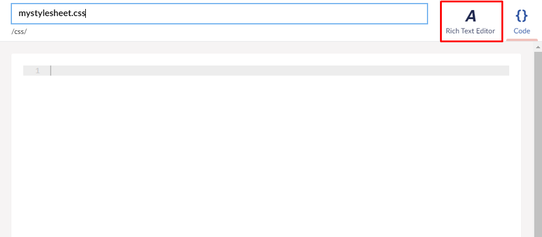
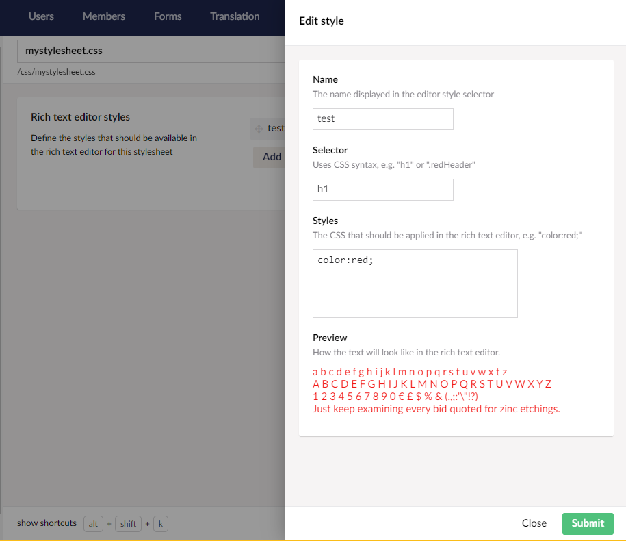
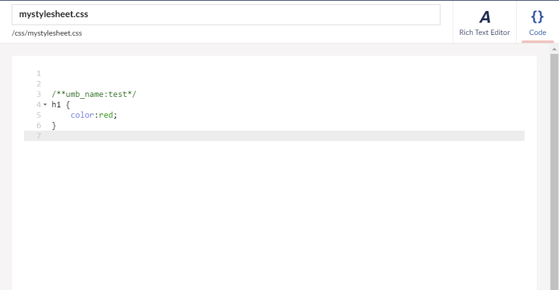
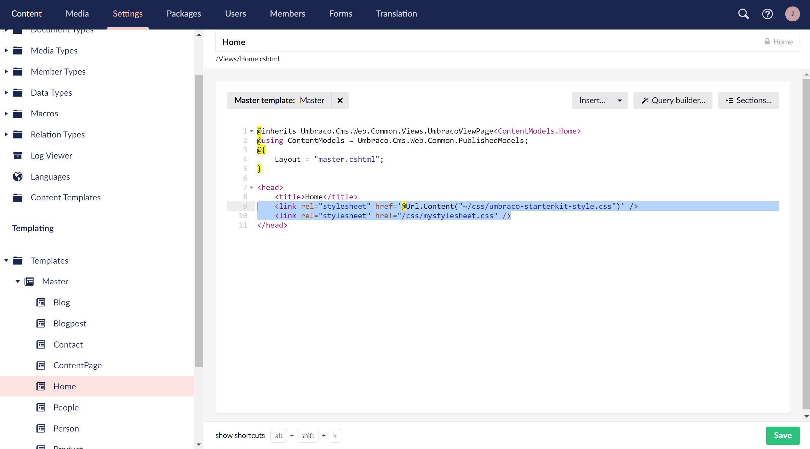
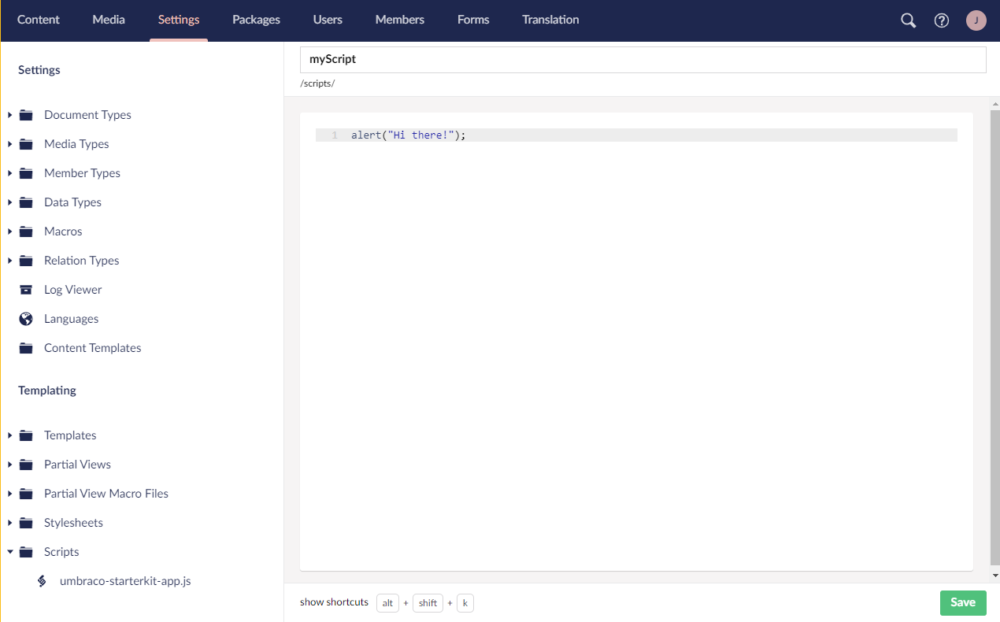
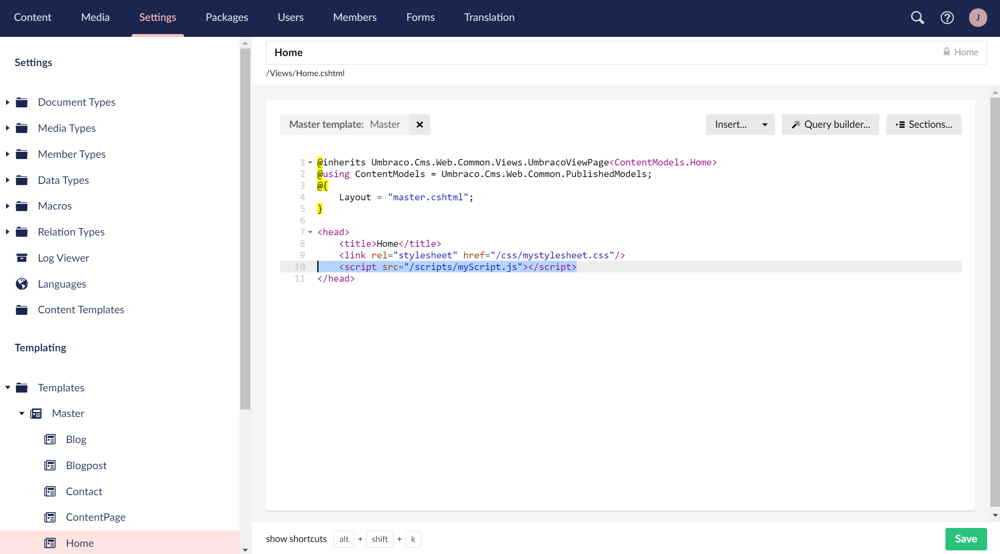

# Stylesheets And JavaScript

## Stylesheets in the Backoffice

You can create and edit stylesheets in the Stylesheets folder in the Settings section of the Backoffice.

<figure><figcaption><p>Creating a new stylesheet</p></figcaption></figure>

In the Create menu, these options are available:

* Stylesheet file (for use in templates/views)
* Rich Text Editor stylesheet file (for use in [Rich Text Editor](../backoffice/property-editors/built-in-umbraco-property-editors/rich-text-editor/))
* Folder (for keeping stylesheets organized)


It is currently not possible to use any CSS preprocessor (such as Syntactically Awesome Style Sheets (SASS)) in the backoffice.


After creating a new stylesheet, you would work with it as you would with templates or JavaScript files - using the built-in backoffice text editor. When you're working with stylesheets, you also have access to the Rich Text Editor, which allows you to create CSS styles and get a real-time preview.



The rules you create in the Rich Text Editor section will carry over to the Code tab.

 

To reference your newly included stylesheet in a template file, navigate to Templates, pick the template you like (CSS files are usually referenced in the layout or home templates) and link to it with the `link` tag.



By default, the stylesheets will be saved in the `wwwroot/css` folder in the solution. To reference them you can use either of the methods used in the above screenshot.

```html
<link rel="stylesheet" href='@Url.Content("~/css/mystylesheet.css")' />
```

or

```html
<link rel="stylesheet" href="/css/mystylesheet.css" />
```

With the stylesheet referenced, you will be able to style the template file with the rules and classes defined in the stylesheet.

Your stylesheets can be used in Rich Text Editors (datatype) as well. See the [Rich Text Editor](../backoffice/property-editors/built-in-umbraco-property-editors/rich-text-editor/css-properties.md) documentation for more information.


If your RTE is styled differently on the frontend of the site, the backoffice styling might be getting overwritten by other stylesheets you have included.


## JavaScript files in the Backoffice

To create and edit JavaScript files in the Backoffice, head on over to the Scripts folder in the Settings section of the Backoffice.

<figure><figcaption><p>Creating a new JavaScript</p></figcaption></figure>

From here you can add a new JavaScript file, or a new folder.

Add a new JavaScript file and write your code:



Then, navigate to the template where you would like to include your JS file.

```html
<script src="/scripts/myScript.js"></script>
```



By default all JavaScript files will be stored in the `wwwroot/scripts` folder in the solution.


If you are working locally, you can create CSS and JS files outside of the Backoffice - as long as they are placed in appropriate folders (`css` and `scripts`), they will show up in the Backoffice when you click **...** next to the **Stylesheets** folder and then select **Reload**.

