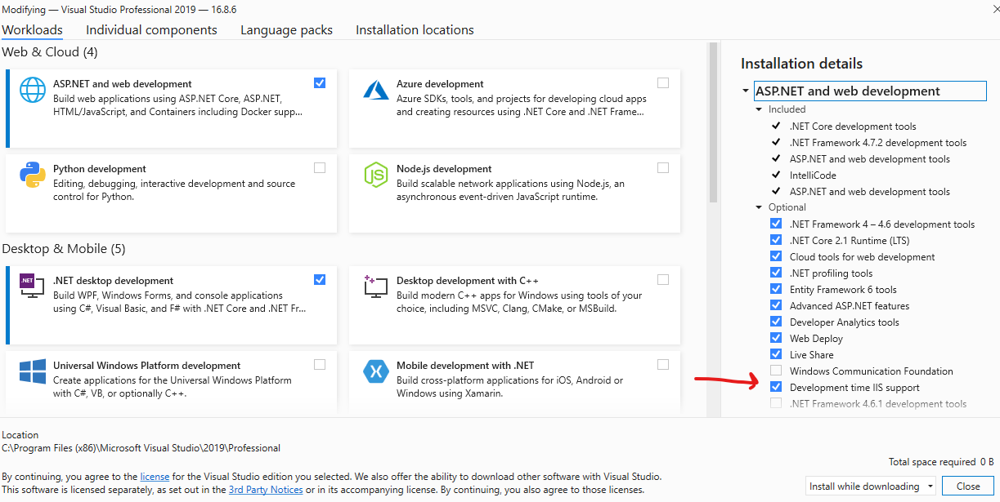
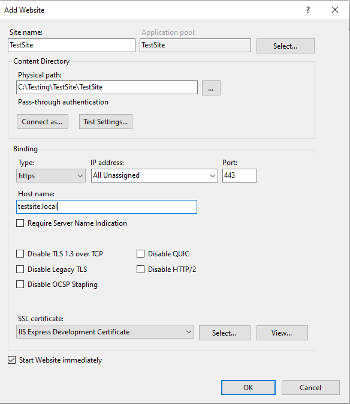
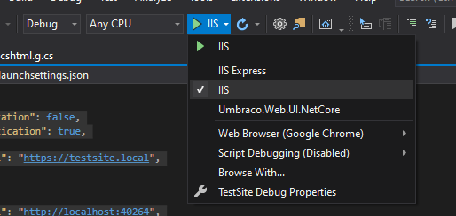
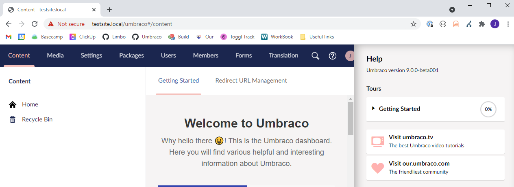

# Local IIS With Umbraco

This is a quick guide on getting your Umbraco website running locally on IIS.

The guide will assume you already have IIS configured and know your way around it, as well as having a local website you wish to host.

## Setting up prerequisites

First, you need to ensure you have "Development time IIS support installed". To check this, go to the Visual Studio installer, click modify and check on the right side under "ASP.NET and web development":



Once that is installed you should set up a new IIS site - and make sure to add the hostname to your hosts file as well. Here is my setup for an example:




For the path you want to point it at the root of your site - where the `.csproj` file is.


## Add permissions to NuGet cache folder

You might need to change permissions for the NuGet cache folder - `C:\users\<username>\.nuget\packages`. The user or group (IIS\_IUSRS) that the IIS site is running on requires Read permissions on this folder because this is where some of the files for Umbraco and Umbraco packages are being served from during development. If the IIS user or group does not have permission to read from the NuGet cache folder, you could run into a `DirectoryNotFoundException` while running the site.

When the site is published these files are copied from the NuGet cache folder to `wwwroot/umbraco` and `wwwroot/App_Plugins` and these folders will typically have the correct permissions. For more information on setting permissions, see the [File and folder permissions](../server-setup/permissions.md) article.

## Add new launch profile

At this point you can go to your Visual Studio solution of the site and in the `Properties` folder there is a `launchSettings.json` file, that looks like this:

```json
{
  "iisSettings": {
    "windowsAuthentication": false,
    "anonymousAuthentication": true,
    "iisExpress": {
      "applicationUrl": "http://localhost:40264",
      "sslPort": 44360
    }
  },
  "profiles": {
    "IIS Express": {
      "commandName": "IISExpress",
      "launchBrowser": true,
      "environmentVariables": {
        "ASPNETCORE_ENVIRONMENT": "Development"
      }
    },
    "Umbraco.Web.UI.NetCore": {
      "commandName": "Project",
      "environmentVariables": {
        "ASPNETCORE_ENVIRONMENT": "Development"
      },
      "applicationUrl": "https://localhost:44360;http://localhost:40264"
    }
  }
}
```

You can add a new profile called IIS, and point it at your local domain. Here it is with my example domain:

```json
{
  "iisSettings": {
    "windowsAuthentication": false,
    "anonymousAuthentication": true,
    "iis": {
      "applicationUrl": "https://testsite.local",
      "sslPort": 0
    },
    "iisExpress": {
      "applicationUrl": "http://localhost:40264",
      "sslPort": 44360
    }
  },
  "profiles": {
    "IIS Express": {
      "commandName": "IISExpress",
      "launchBrowser": true,
      "environmentVariables": {
        "ASPNETCORE_ENVIRONMENT": "Development"
      }
    },
    "IIS": {
      "commandName": "IIS",
      "launchBrowser": true,
      "launchUrl": "https://testsite.local",
      "environmentVariables": {
        "ASPNETCORE_ENVIRONMENT": "Development"
      }
    },
    "Umbraco.Web.UI.NetCore": {
      "commandName": "Project",
      "environmentVariables": {
        "ASPNETCORE_ENVIRONMENT": "Development"
      },
      "applicationUrl": "https://localhost:44360;http://localhost:40264"
    }
  }
}
```

At this point IIS will be added to the launch profiles, and you can run the site from Visual Studio by choosing IIS in the dropdown:



And finally the site is running from your local IIS:


