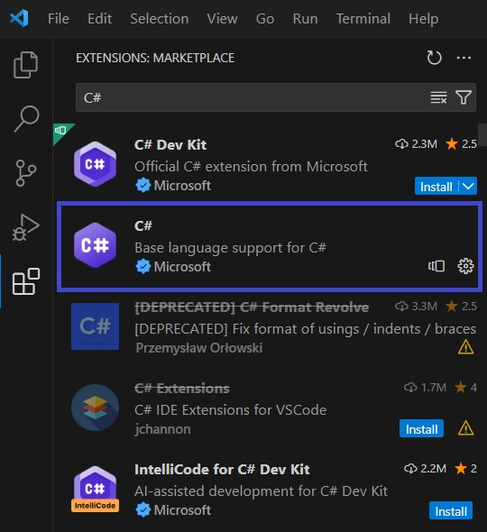
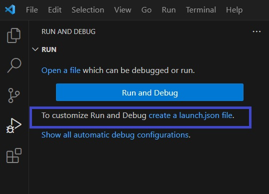
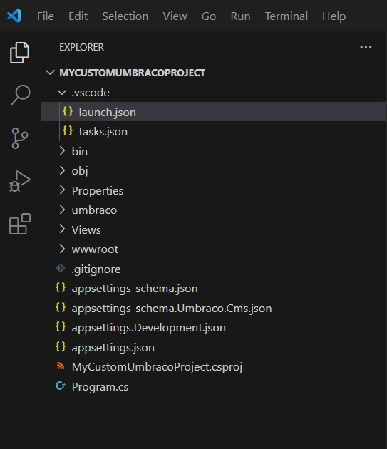

# Install using Visual Studio Code

Follow these steps to set up an Umbraco project with VS Code. The benefit of using VS Code is that it is super quick to get up and running.

## Installing and setting up VS Code

1. Go to [https://code.visualstudio.com/](https://code.visualstudio.com/) and download VS Code for free.
2. Once installed, launch VS Code.
3.  Click the extensions menu at the bottom on the left side. Then search for **C#** and install it.

    

## Creating your Umbraco project

Follow the [Templates Guide](install-umbraco-with-templates.md) to create your project folder.

## Configure VS Code to run the Umbraco project

Open your project folder in VS Code, your project will look something like this:

Now we need to tell VS Code how to run your project.

Open the command palette, you can use the shortcut `Ctrl+Shift+P`, and type in `Tasks: Configure` and select the `Tasks: Configure Task` option:

Select "Create task.json from template"

Now select ".NET Core" as your template.

After this VS Code will have created a folder called `.vscode` that contains a file called `tasks.json`, it's this file that tells VS Code how to build your project.

Now that we've told VS Code how to build your project, we need to tell it how to launch it. VS Code can do this for you. First, select the little play button in the left side menu, and then select the "create a launch.json file" link.

This will prompt a menu to appear, select **.NET 5+ and .NET Core**:


If **.NET 5+ and .NET Core** is missing in the drop-down menu:

1. Press **Ctrl + Shift + P** (on Windows/Linux) or **Cmd + Shift + P** (on macOS) to open the Command Palette.
2. Search for the command `.NET: Generate Assets for Build and Debug`.\
   This command will generate the necessary assets for building and debugging your .NET application.


Now you'll see a green play button appear with a dropdown where ".NET Core Launch (web)" is selected.

If you navigate to the Files section, a new `launch.json` file is created in the `.vscode` folder. When you press F5, the `launch.json` file tells VS Code to build your project, run it, and then open a browser .

With that, you're ready to run the project! Press F5, or click the little green play button in the **Run and Debug** section to run your brand new Umbraco site locally.

## Umbraco Web Installer

This section continues from where we left off but covers the installation and configuration of Umbraco inside your web browser when you run Umbraco for the first time.

You will see the install screen where you will need to fill in some data before Umbraco can be installed.

When the installer is done, you will be logged into the backoffice.

<figure><figcaption></figcaption></figure>

Congratulations, you have installed an Umbraco site!


You can log into your Umbraco site by entering the following into your browser: http://yoursite.com/umbraco/.

