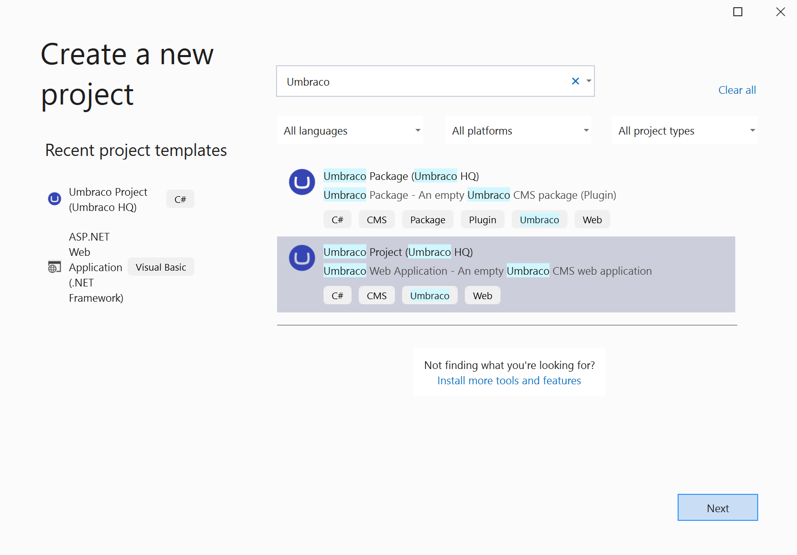
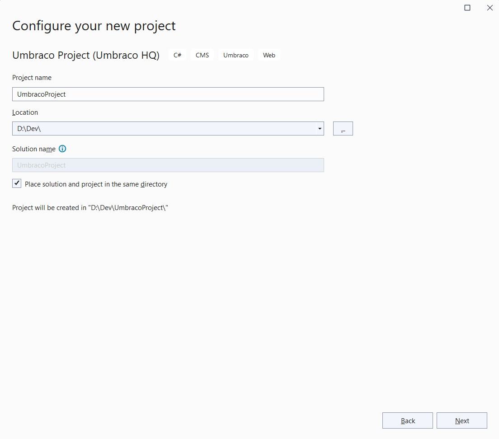
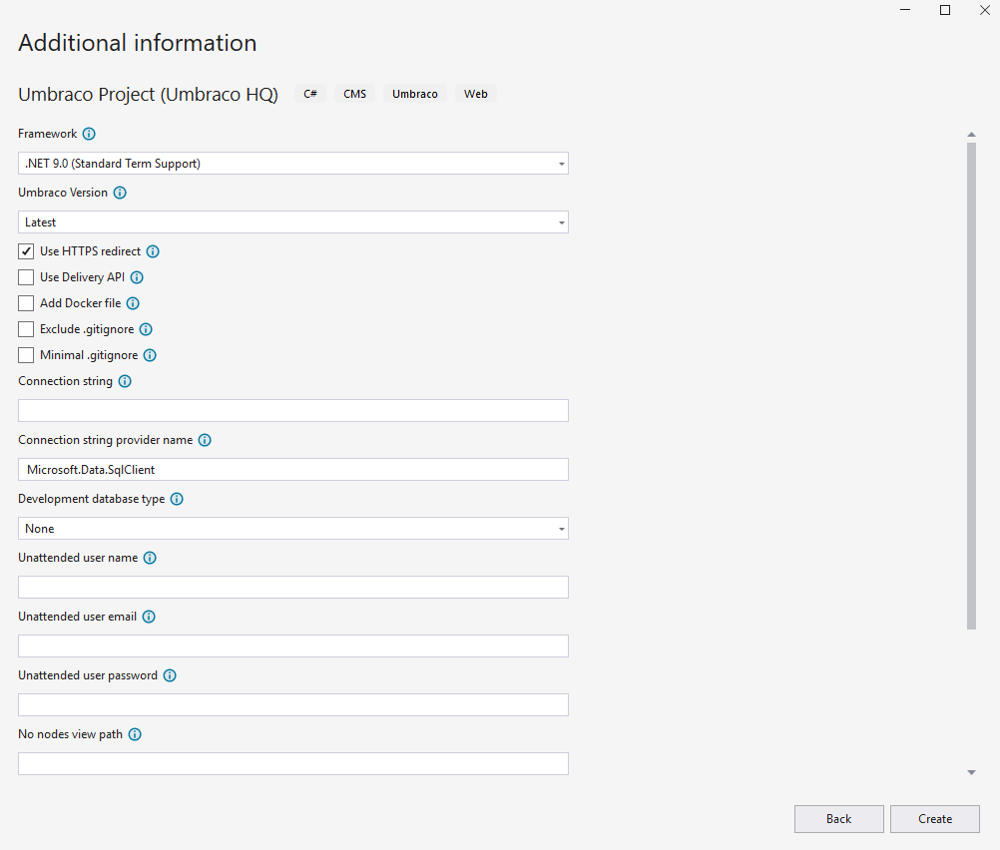
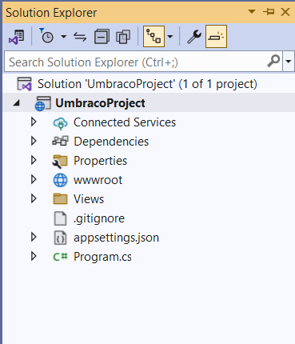

# Install using Visual Studio

## Prerequisites

* Install the newest [Umbraco dotnet templates](install-umbraco-with-templates.md).
  * In Visual Studio 2022, the .NET CLI templates are enabled to appear, by default. For information on how to enable .NET CLI templates in Visual Studio 2019, see the [.NET CLI Templates in Visual Studio](https://devblogs.microsoft.com/dotnet/net-cli-templates-in-visual-studio/) article.
* Check the [Requirements](../requirements.md) to ensure you have everything you need to start your Umbraco project.

## Quick Start

This is an abbreviated version of the installation steps. Jump to the [Create a new project](#create-a-new-umbraco-project) section for a more thorough guide.

* Open Visual Studio.
* Go to `File` > `New` > `Project`, search for **Umbraco**.
* Choose **Umbraco Project (Umbraco HQ)** then click **Next**.
* Choose or specify the parameters, leave the default or leave them all empty.
* Click **Create**.
* Use **CTRL+F5** to run the project and start the Umbraco installer.

## Video Tutorial


How to install Umbraco using NuGet and Visual Studio


## Create a new Umbraco project

To install Umbraco, follow these steps:

1. Install the latest [.NET SDK](https://dotnet.microsoft.com/download).
2. Run `dotnet new install Umbraco.Templates` to install the project templates.

### Create the Visual Studio project

Go to **File > New > Project** and search for `Umbraco` in the _Search for templates_ field.

Once you select **Umbraco Project (Umbraco HQ)** navigate to the next step by clicking _Next_.

### Configure project

In this step, you will be able to give your project a name specific to the project you are creating.


Refrain from changing the Solution name, as this will cause a namespace conflict with the CMS itself.


### Additional information

In the next step, you are able to specify some additional parameters like the _Target framework_. The rest are optional.

You can then click the _Create_ button and your Umbraco Project will be ready for you.

### Running the site

You can now run the site through Visual Studio using **F5** or the **Debug** button.

Follow the installation wizard and after a few steps, you will get a message saying the installation was a success.

## Next steps

You are now ready to start building your Umbraco project. Have a look below for different resources on the next steps.

* [Getting Started with Umbraco](../../../tutorials/creating-a-basic-website/getting-started.md)
* [Tutorial: Create a website from scratch](../../../tutorials/creating-a-basic-website/)
* [Find different options for hosting your Umbraco website](../server-setup/)
* [Learn about configuration in Umbraco CMS](../../../reference/configuration/)
