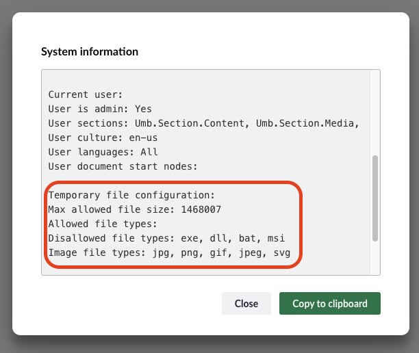

# Maximum Upload Size Settings

Learn how to change the upload size limit for your Umbraco site depending on your hosting setup:

- [Using IIS](#using-iis)
- [Hosting on Umbraco Cloud](#hosting-on-umbraco-cloud)
- [Using Kestrel](#using-kestrel)

By default, Umbraco does not restrict upload size. The limits are controlled by the hosting platform.


It is advisable that you tell Umbraco what the maximum upload size is by setting the `Umbraco:CMS:Runtime:MaxRequestLength` in the `appsettings.json` file. The Backoffice will use this value to help guide the users.


## Using IIS

The default upload limit in IIS is 30000000 bytes (~28.6 MB). The maximum value allowed is 4 GB.

To increase the upload limit:

1. Create or update the `web.config` file at the root of your project.
2. Add the following configuration:

```xml
<?xml version="1.0"?>
<configuration>
  <system.webServer>
    <security>
      <requestFiltering>
        <!-- 2 MB in bytes -->
        <requestLimits maxAllowedContentLength="2000000" />
      </requestFiltering>
    </security>
  </system.webServer>
</configuration>
```

`maxAllowedContentLength` is specified in bytes. For example:

- 2 MB = 2,000,000 bytes
- 100 MB = 100,000,000 bytes
- 4 GB = 4294967295 (maximum value allowed)

## Hosting on Umbraco Cloud

Umbraco Cloud uses IIS for hosting, so changes must be made in the `web.config` file as described above. The default upload limit on Umbraco Cloud is 50 MB.

To customize this limit, adjust the `maxAllowedContentLength` value in your `web.config` file accordingly.

## Using Kestrel

Kestrel’s runtime settings allow you to configure `MaxRequestLength`. If you want to upload files larger than 50MB, or amend this default value, update this value in the `appsettings.json` file.

Example configuration:

```json
"Umbraco": {
  "CMS": {
    "Runtime": {
      "MaxRequestLength": 2000
    }
  }
}
```

- `MaxRequestLength` is specified in kilobytes. For example:
  - 2000 KB = 2 MB
  - 100000 KB = 100 MB

You can check the current configuration by inspecting the "System information" output in the Backoffice. You can access it by clicking the logo and then "System information":

<figure>
  
  <caption>System Information with "Max allowed file size" Settings</caption>
</figure>

## External Server Configurations

### [Using Nginx (external)](https://nginx.org/en/docs/http/ngx_http_core_module.html#client_max_body_size)

### [Using apache (external)](https://httpd.apache.org/docs/2.2/mod/core.html#limitrequestbody)
