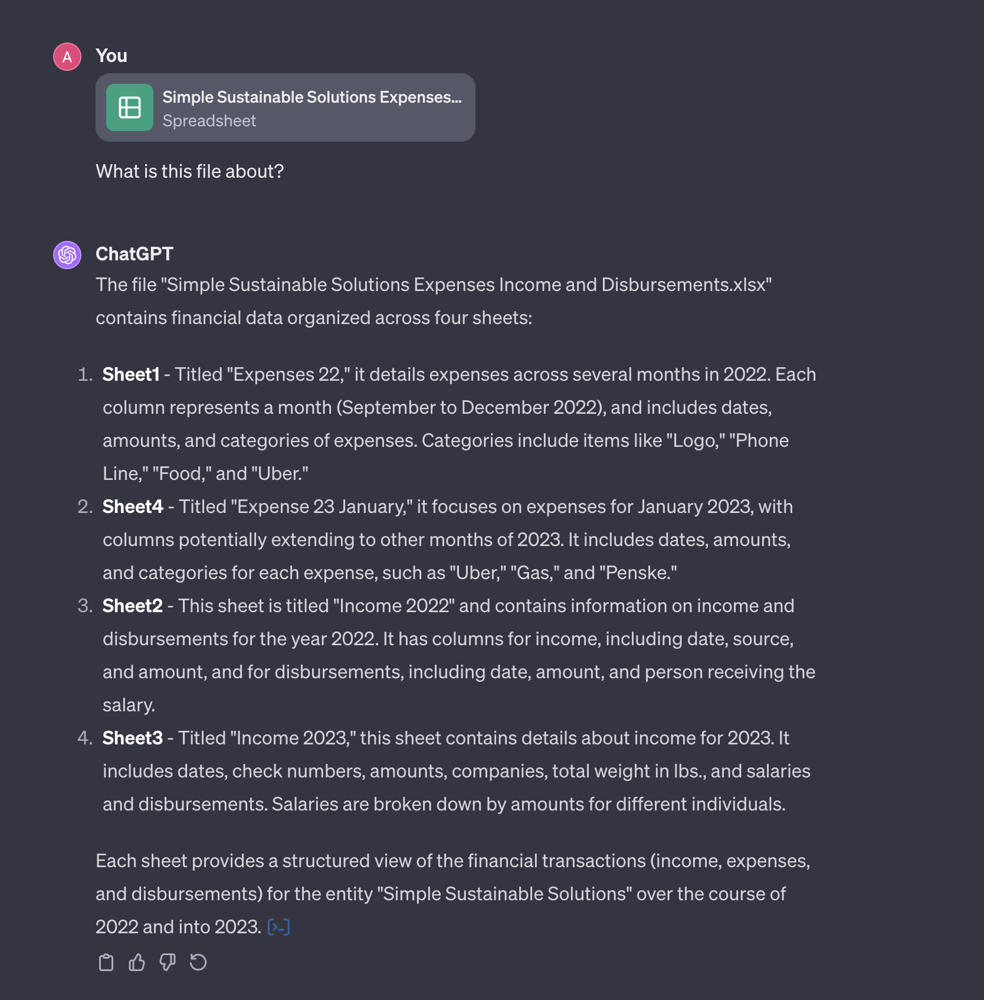
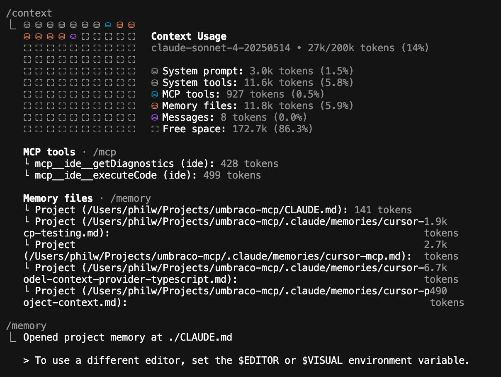

# Context engineering

Context Engineering is the foundation of any interaction with with any large language models (LLMs) and consequently the best way to control how the Umbraco Developer MCP Server delivers precise, reliable, and efficient responses. It’s all about shaping what the LLM sees and how it understands your request.

## What is Context

At its most basic level, context is the conversation between you and a tool like ChatGPT. It includes:

- The entire message history (your inputs and the model’s outputs).

- The most recent system and user instructions that define the current topic or task.

LLMs are stateless — they don’t support retaining state previous sessions. Each time you send a message, the entire context (conversation history + any injected system data) is sent to the model to generate a new response.

You can never completely control what an LLM with return. You can influence the outcome — and context is the only way that you do that.


The more intentional and relevant your context, the more predictable and useful the model’s output becomes.


## What is Context Engineering

**Context engineering** is the practice of providing the LLM with only the information it needs to produce accurate and reliable results.

It’s about curating and managing what gets sent to the model:

- **Ensuring the context is correct**, concise, and relevant for the current task.

- **Avoiding information overload** — sending too much context can confuse the model and lead to poor-quality responses or hallucinations.

## Why Context Engineering Is Important Now

In the early days of large language models (LLMs), the context of a conversation was simple — just your messages and the model’s responses.
Conversations were short and easy to follow, but even then, you could see context drift — as earlier parts of the discussion faded, the model’s memory weakened and response quality declined.

Today, however, the landscape has changed dramatically.

Modern AI systems rely on increasingly **complex and layered contexts**, which include far more than just the user conversation. A single MCP-driven interaction may now contain:

- A **system prompt** (the invisible instructions defining the model’s role and tone).
- **Rules or instruction** files that constrain or enhance model behavior.
- **MCP definitions**, which describe how external tools and data sources can be used during a conversation.

All of these elements must fit inside the model’s **context window** — the limited amount of information the model can “see” at once.
Even the most advanced models today have larger but still finite context windows, so how you fill that space matters.

If too much irrelevant or poorly structured information is included, useful parts of the context may get pushed out or forgotten, leading to confusion, incomplete answers, or hallucinations.
That’s why **context engineering is more important now than ever** — it’s about managing this limited space carefully and intentionally.


Be mindful of which MCP tools you’ve added and why. Each one adds new context data that competes for space and affects how effectively the model can respond.


## How this affects the Umbraco CMS developer MCP

In the Umbraco CMS Developer MCP (Model Context Protocol), context engineering is applied through structured tool contexts and well-defined prompts.
Doing this makes requests more effective, **efficient, and more likely to succeed** — and also makes **prompts easier to write, reuse and mainatin**.


Think of context engineering as the art of precision storytelling: every piece of information you include should help the model stay on track and deliver value.


Your choice of enabled tools directly shapes the quality of your context.
By managing which tools and tool collections are active, you control how much information is sent to the model — improving both performance and response reliability.

For more information, see [Tool Collections](../mcp-toolkit.md)