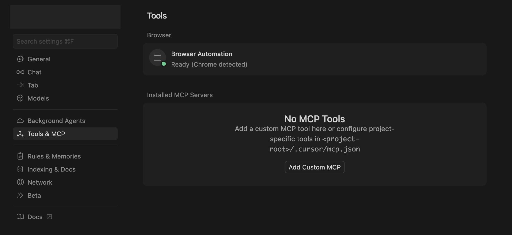
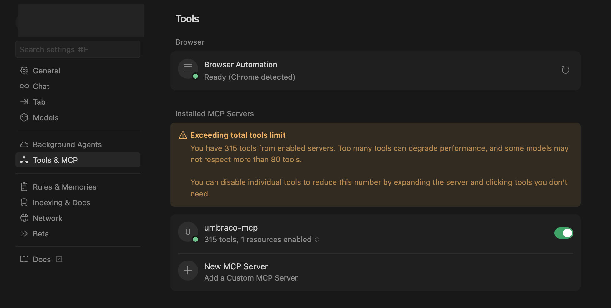

# Cursor Setup

[Cursor](https://cursor.com/) is an AI-powered code editor built as a fork of Visual Studio Code. It enhances the familiar VS Code experience with conversational AI features that help you write, refactor, and understand code more efficiently.

## Getting started 

Go to `Cursor Settings` -> `Tools & MCP` -> `Add Custom MCP`. 



Add the following to the config file.

```json
{
  "mcpServers": {
    "umbraco-mcp": {
      "command": "npx", 
      "args": ["@umbraco-cms/mcp-dev@beta"],
      "env": {
        "NODE_TLS_REJECT_UNAUTHORIZED": "0",
        "UMBRACO_CLIENT_ID": "umbraco-back-office-mcp",
        "UMBRACO_CLIENT_SECRET": "1234567890",
        "UMBRACO_BASE_URL": "https://localhost:12345",
        "UMBRACO_INCLUDE_TOOL_COLLECTIONS": "document,media,document-type,data-type"
      }
    }
  }
}
```

Replace the UMBRACO_CLIENT_ID, UMBRACO_CLIENT_SECRET, and UMBRACO_BASE_URL values with your local connection details.



The warning above indicating that the number of tools exceeds the limit is expected behaviour. 
From here, you should [choose which tools or tool collections](../mcp-toolkit.md) you want to enable for your first task.


Selecting only the tools you need helps keep your setup efficient and conversations with your AI assistant more focused.
