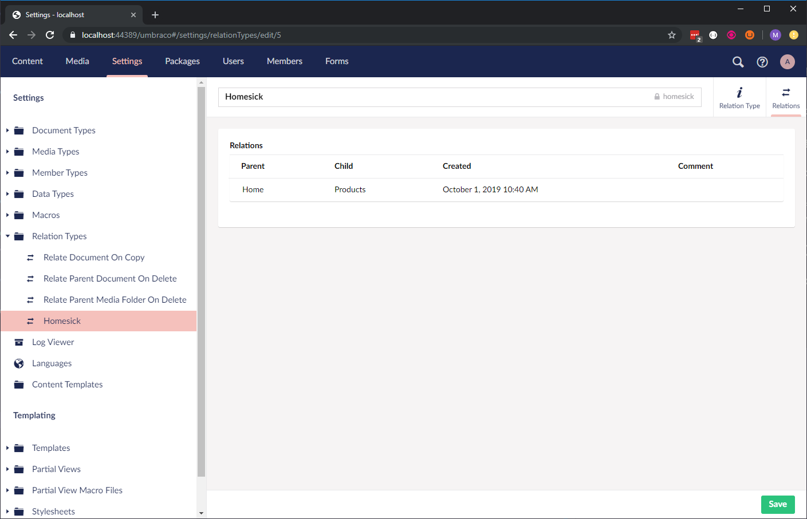
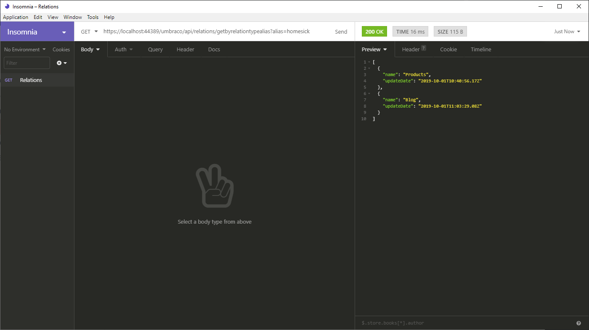

# Relation Service

The `RelationService` allows you to create relations between objects that would otherwise have no obvious connection.

Below you will find examples using `RelationService`.

## Automatically relate to the root node

To perform the said task we need a Notification Handler:

[You can read more about composing Umbraco here](../../../implementation/composing.md)

```csharp
using Umbraco.Cms.Core.Events;
using Umbraco.Cms.Core.Notifications;
using Umbraco.Cms.Core.Services;

namespace Doccers.Core.Components;

public class ContentPublishedNotificationHandler(IContentService contentService, IRelationService relationService) : INotificationHandler<ContentPublishedNotification>
{
    public void Handle(ContentPublishedNotification notification)
    {
        var home = contentService.GetRootContent().FirstOrDefault();
        if (home == null) return;

        // Get the relation type by alias
        var relationType = relationService.GetRelationTypeByAlias("homesick");

        if (relationType == null) return;

        foreach (var entity in notification.PublishedEntities
                     .Where(x => x.Id != home.Id))
        {
            // Check if they are already related
            if (!relationService.AreRelated(home.Id, entity.Id))
            {
                // If not then let us relate the currenty entity to home
                relationService.Relate(home.Id, entity.Id, relationType);
            }
        }
    }
}
```

To have Umbraco recognize our Notification Handler we need to register it in a composer:

```csharp
using Umbraco.Cms.Core.Composing;
using Umbraco.Cms.Core.Notifications;

namespace Doccers.Core.Composers;

public class RelationComposer : IComposer
{
    public void Compose(IUmbracoBuilder builder)
    {
        builder.AddNotificationHandler<ContentPublishedNotification, ContentPublishedNotificationHandler>();
    }
}
```

If I now `Save and Publish` my `Products` node I get the following result:



Now let us try and fetch the data from an API.

```csharp
using Microsoft.AspNetCore.Mvc;
using System.Runtime.Serialization;
using Umbraco.Cms.Core.Services;
using Umbraco.Cms.Web.Common;

namespace Doccers.Core.Controllers.Http;

[ApiController]
[Route("/umbraco/api/relations")]
public class RelationsController : Controller
{
    private readonly IRelationService _relationService;
    private readonly UmbracoHelper _umbracoHelper;

    public RelationsController(IRelationService relationService, UmbracoHelper umbracoHelper)
    {
        // Alternatively you could also access
        // the service via the service context:
        // _relationService = Services.RelationService;
        _relationService = relationService;
        _umbracoHelper = umbracoHelper;
    }

    [HttpGet("getbyrelationtypealias")]
    public IActionResult GetByRelationTypeAlias(string alias)
    {
        var relationType = _relationService.GetRelationTypeByAlias(alias);
        if (relationType == null)
            return BadRequest("Invalid relation type alias");

        var relations = _relationService.GetAllRelationsByRelationType(relationType.Id);
        var content = relations.Select(x => _umbracoHelper.Content(x.ChildId))
            .Select(x => new Relation()
            {
                Name = x.Name,
                UpdateDate = x.UpdateDate
            });

        return Ok(content);
    }
}
```

Notice the `x => new Relation()`? We need to make sure what we are returning can be serialized. Therefore the `Relation` class is:

```csharp
[DataContract(Name = "relation")]
public class Relation
{
    [DataMember(Name = "name")]
    public string Name { get; set; }

    [DataMember(Name = "updateDate")]
    public DateTime UpdateDate { get; set; }
}
```

Browsing `/umbraco/api/relations/getbyrelationtypealias?alias=homesick` now returns the following:





If you want to do something similar it is recommended that you wrap a caching layer around it, as the RelationService queries the database directly.


