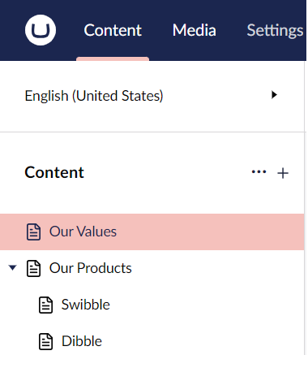

# Outbound request pipeline

The **outbound pipeline** consists out of the following steps:

1. [Create segments](outbound-pipeline.md#segments)
2. [Create paths](outbound-pipeline.md#paths)
3. [Create urls](outbound-pipeline.md#urls)

To explain things we will use the following content tree:



## 1. Create segments

When the URL is constructed, Umbraco will convert every node in the tree into a segment. Each published Content item has a corresponding URL segment.

In our example "Our Products" will become "our-products" and "Swibble" will become "swibble".

The segments are created by the "Url Segment provider"

### Url Segment Provider

The DI container of an Umbraco implementation contains a collection of `UrlSegmentProviders`. This collection is populated during Umbraco boot up. Umbraco ships with a 'DefaultUrlSegmentProvider' - but custom implementations can be added to the collection.

When the `GetUrlSegment` extension method is called for a content item + culture combination, each registered `IUrlSegmentProvider` in the collection is executed in 'collection order'. This continues until a particular `UrlSegmentProvider` returns a segment value for the content, and no further `UrlSegmentProviders` in the collection will be executed. If no segment is returned by any provider in the collection a `DefaultUrlSegmentProvider` will be used to create a segment. This ensures that a segment is always created, like when a default provider is removed from a collection without a new one being added.

To create a new Url Segment Provider, implement the following interface:

```csharp
public interface IUrlSegmentProvider
{
  string GetUrlSegment(IContentBase content, string? culture = null);
}
```

Note each 'culture' variation can have a different Url Segment!

The returned string will be the Url Segment for this node. Any string value can be returned here but it cannot contain the URL segment separator character `/`. This would create additional "segments" - something like `5678/swibble` is not allowed.

#### Example

For the segment of a 'product page', add its unique SKU / product ref to the existing Url segment.

```csharp
using Umbraco.Cms.Core.Models;
using Umbraco.Cms.Core.Strings;

namespace RoutingDocs.SegmentProviders;

public class ProductPageUrlSegmentProvider : IUrlSegmentProvider
{
    private readonly IUrlSegmentProvider _provider;

    public ProductPageUrlSegmentProvider(IShortStringHelper stringHelper)
    {
        _provider = new DefaultUrlSegmentProvider(stringHelper);
    }
    
    public string GetUrlSegment(IContentBase content, string? culture = null)
    {
        // Only apply this rule for product pages
        if (content.ContentType.Alias != "productPage")
        {
            return null;
        }

        var segment = _provider.GetUrlSegment(content, culture);
        var productSku = content.GetValue<string>("productSKU");
        return $"{segment}--{productSku}".ToLower();
    }
}
```

The returned string becomes the native Url segment - there is no need for any Url rewriting.

For our "swibble" product in our example content tree the `ProductPageUrlSegmentProvider`, would return a segment `swibble--123xyz`. In this case, 123xyz is the unique product sku/reference for the swibble product.

Register the custom UrlSegmentProvider with Umbraco, either using a composer or an extension method on the `IUmbracoBuilder`:

```csharp
using Umbraco.Cms.Core.Composing;
using Umbraco.Cms.Core.DependencyInjection;

namespace RoutingDocs.SegmentProviders;

public class RegisterCustomSegmentProviderComposer : IComposer
{
    public void Compose(IUmbracoBuilder builder)
    {
        builder.UrlSegmentProviders().Insert<ProductPageUrlSegmentProvider>();
    }
}
```

### The Default Url Segment Provider

The Default Url Segment provider builds its segments by looking for one of the below values, checked in this order:

1. A property with alias _umbracoUrlName_ on the node. (this is a convention led way of giving editors control of the segment name - with variants - this can vary by culture).
2. The 'name' of the content item e.g. `content.Name`.

The Umbraco string extension `ToUrlSegment()` is used to produce a clean 'Url safe' segment.

## 2. Create paths

To create a path, the pipeline will use the segments of each node to produce a path.

If we look at our example, the "swibble" node will receive the path: "/our-products/swibble". If we take the `ProductPageUrlSegmentProvider` from above, the path would become: "/our-products/swibble-123xyz".

### Multiple sites in a single Umbraco implementation

But, what if there are multiple websites in a single Umbraco Implementation? in this multi-site scenario then an (internal) path to a node such as "/our-products/swibble-123xyz" could belong to any of the sites, or match multiple nodes in multiple sites. In this scenario additional sites will have their internal path prefixed by the node id of their root node. Any content node with a hostname defines a “new root” for paths.


| Node         | Segment        | Internal Path                |
| ------------ | -------------- | ---------------------------- |
| Our Values   | our-values     | /our-values                  |
| Our Products | our-products   | /our-products                |
| Swibble      | swibble-123xyz | /our-products/swibble-123xyz |
| Dibble       | dibble-456abc  | /our-products/dibble-456abc  |
| Another Site | another-site   | **9676**/                    |
| Their Values | their-values   | **9676**/their-values        |

Paths can be cached, what comes next cannot (http vs https, current request…).

#### Some further considerations when **working with hostnames**

* **Domain without path** e.g. "www.site.com" will become "1234/path/to/page"
* **Domain with path** e.g. "www.site.com/dk" will produce "1234/dk/path/to/page" as path
* **No domain specified**: "/path/to/page"
* **Unless HideTopLevelNodeFromPath config is true**, then the path becomes "/to/page"

## 3. Creating Urls

The Url of a node consists of a complete [URI](https://en.wikipedia.org/wiki/Uniform\_Resource\_Identifier): the Schema, Domain name, (port) and the path.

In our example the "swibble" node could have the following URL: "[http://example.com/our-products/swibble](http://example.com/our-products/swibble)"

Generating this url is handled by the Url Provider. The Url Provider is called whenever a request is made in code for a Url e.g.:

```csharp
@Model.Url
@Umbraco.Url(1234)
@UmbracoContext.UrlProvider.GetUrl(1234);
```

The DI container of an Umbraco implementation contains a collection of `UrlProviders` this collection is populated during Umbraco boot up. Umbraco ships with a `DefaultUrlProvider` - but custom implementations can be added to the collection. When .Url is called each `IUrlProvider` registered in the collection is executed in 'collection order' until a particular `IUrlProvider` returns a value. (and no further `IUrlProviders` in the collection will be executed.)

### DefaultUrlProvider

Umbraco ships with a `DefaultUrlProvider`, which provides the implementation for the out-of-the-box mapping of the structure of the content tree to the URL.

```csharp
// This one is initialized by default
public class NewDefaultUrlProvider : IUrlProvider
{
    public virtual UrlInfo GetUrl(IPublishedContent content, UrlMode mode, string? culture, Uri current)
    {…}

    public virtual IEnumerable<UrlInfo> GetOtherUrls(int id, Uri current)
    {…}
}
```

### How the Default Url provider works

* If the current domain matches the root domain of the target content.
  * Return a relative Url.
  * Else must return an absolute Url.
* If the target content has only one root domain.
  * Use that domain to build the absolute Url.
* If the target content has more than one root domain.
  * Figure out which one to use.
  * To build the absolute Url.
* Complete the absolute Url with scheme (http vs https).
  * If the domain contains a scheme use it.
  * Else use the current request’s scheme.
* If "addTrailingSlash" is true, then add a slash.
* Then add the virtual directory.

If the URL provider encounters collisions when generating content URLs, it will always select the first available node and assign the URL to this one. The remaining nodes will be marked as colliding and will not have a URL generated. Fetching the URL of a node with a collision URL will result in an error string including the node ID (#err-1094) since this node does not currently have an active URL. This can happen if an umbracoUrlName property is being used to override the generated URL of a node, or in some cases when having multiple root nodes without hostnames assigned.


This means publishing an unpublished node with a conflicting URL, might change the active node being rendered on that specific URL in cases where the published node should now take priority according to sort order in the tree!


### Custom Url Provider

Create a custom Url Provider by implementing `IUrlProvider` interface:

```csharp
public interface IUrlProvider
{
    UrlInfo? GetUrl(IPublishedContent content, UrlMode mode, string? culture, Uri current);

    IEnumerable<UrlInfo> GetOtherUrls(int id, Uri current);
}
```

The URL returned in the 'UrlInfo' object by GetUrl can be completely custom.

If implementing a custom Url Provider, consider the following things:

* Cache things.
* Be sure to know how to handle schema's (http vs https) and hostnames.
* Inbound might require rewriting.


If there is only a small change to the logic around Url generation, then a smart way to create a custom Url Provider is to inherit from the DefaultUrlProvider and override the GetUrl() virtual method.


#### Example

Add /fish on the end of every URL. It's important to note here that since we're changing the outbound URL, but not how we handle URLs inbound, this **will** break the routing. In order to make the routing work again you have to implement a custom content finder, see [IContentFinder](icontentfinder.md) for more information on how to do that.


The below example is using `ILocalizationService` which is currently obsolete and will be removed in v15. Use `ILanguageService` or `IDictionaryItemService` (for dictionary item operations) instead.


```csharp
using System;
using System.Collections.Generic;
using Microsoft.Extensions.Logging;
using Microsoft.Extensions.Options;
using Umbraco.Cms.Core.Configuration.Models;
using Umbraco.Cms.Core.Models.PublishedContent;
using Umbraco.Cms.Core.Routing;
using Umbraco.Cms.Core.Web;

namespace RoutingDocs.UrlProviders;

public class ProductPageUrlProvider : NewDefaultUrlProvider
{
    public ProductPageUrlProvider(
        IOptionsMonitor<RequestHandlerSettings> requestSettings,
        ILogger<NewDefaultUrlProvider> logger,
        ISiteDomainMapper siteDomainMapper,
        IUmbracoContextAccessor umbracoContextAccessor,
        UriUtility uriUtility,
        ILocalizationService localizationService)
        : base(requestSettings, logger, siteDomainMapper, umbracoContextAccessor, uriUtility, localizationService)
    {
    }

    public override IEnumerable<UrlInfo> GetOtherUrls(int id, Uri current)
    {
        // Add custom logic to return 'additional urls' - this method populates a list of additional urls for the node to display in the Umbraco backoffice
        return base.GetOtherUrls(id, current);
    }

    public override UrlInfo? GetUrl(IPublishedContent content, UrlMode mode, string? culture, Uri current)
    {
        if (content is null)
        {
            return null;
        }
        
        // Only apply this to product pages
        if (content.ContentType.Alias == "productPage")
        {
            // Get the original base url that the DefaultUrlProvider would have returned,
            // it's important to call this via the base, rather than .Url, or UrlProvider.GetUrl to avoid cyclically calling this same provider in an infinite loop!!)
            UrlInfo? defaultUrlInfo = base.GetUrl(content, mode, culture, current);
            if (defaultUrlInfo is null)
            {
                return null;
            }
            
            if (!defaultUrlInfo.IsUrl)
            {
                // This is a message (eg published but not visible because the parent is unpublished or similar)
                return defaultUrlInfo;
            }
            else
            {
                // Manipulate the url somehow in a custom fashion:
                var originalUrl = defaultUrlInfo.Text;
                var customUrl = $"{originalUrl}fish/";
                return new UrlInfo(customUrl, true, defaultUrlInfo.Culture);
            }
        }
        // Otherwise return null
        return null;
    }
}
```

Register the custom UrlProvider with Umbraco:

```csharp
using Umbraco.Cms.Core.Composing;
using Umbraco.Cms.Core.DependencyInjection;

namespace RoutingDocs.UrlProviders;

public class RegisterCustomUrlProviderComposer : IComposer
{
    public void Compose(IUmbracoBuilder builder)
    {
        builder.UrlProviders().Insert<ProductPageUrlProvider>();
    }
}
```


If you want to have multiple URL providers, you can add them one after the other with multiple `Insert` methods. Umbraco will cycle through all the providers registered until it finds one that doesn't return `null`. If all custom URL providers return `null` it will fall back to the default URL provider. The last added with `Insert` is the first that will be executed.


### GetOtherUrls

The GetOtherUrls method is only used in the Umbraco Backoffice to provide a list to editors of other Urls which also map to the node.

For example, let's consider a convention-led `umbracoUrlAlias` property that enables editors to specify a comma-delimited list of alternative URLs for the node. It has a corresponding `AliasUrlProvider` registered in the `UrlProviderCollection` to display this list to the Editor in the backoffice Info Content app for a node.

### Url Provider Mode

Specifies the type of URLs that the URL provider should produce, eg. absolute vs. relative URLs. Auto is the default

These are the different modes:

```csharp
public enum UrlMode
{
  /// <summary>
  /// Indicates that the url provider should do what it has been configured to do.
  /// </summary>
  Default = 0,

  /// <summary>
  /// Indicates that the url provider should produce relative urls exclusively.
  /// </summary>
  Relative,

  /// <summary>
  /// Indicates that the url provider should produce absolute urls exclusively.
  /// </summary>
  Absolute,

  /// <summary>
  /// Indicates that the url provider should determine automatically whether to return relative or absolute urls.
  /// </summary>
  Auto
}
```

Default setting can be changed in the `Umbraco:CMS:WebRouting` section of `appsettings.json`:

```json
"Umbraco": {
  "CMS": {
    "WebRouting": {
      "UrlProviderMode": "Relative"
    }
  }
}
```

See [WebRouting config reference documentation](../../configuration/webroutingsettings.md) for more information on routing settings.

### Site Domain Mapper

The `ISiteDomainMapper` implementation is used in the `IUrlProvider` and filters a list of `DomainAndUri` to pick one that best matches the current request.

Create a custom SiteDomainMapper by implementing ISiteDomainMapper

```csharp
public interface ISiteDomainMapper
{
    DomainAndUri? MapDomain(IReadOnlyCollection<DomainAndUri> domainAndUris, Uri current, string? culture, string? defaultCulture);
    IEnumerable<DomainAndUri> MapDomains(IReadOnlyCollection<DomainAndUri> domainAndUris, Uri current, bool excludeDefault, string? culture, string? defaultCulture);
}
```

The MapDomain methods will receive the Current Uri of the request, and custom logic can be implemented to decide upon the preferred domain to use for a site in the context of that request. The SiteDomainMapper's role is to get the current Uri and all eligible domains, and only return one domain which is then used by the UrlProvider to create the Url.

Only a single `ISiteDomainMapper` can be registered with Umbraco.

Register the custom `ISiteDomainMapper` with Umbraco using the `SetSiteDomainHelper` extension method

```csharp
using Umbraco.Cms.Core.Composing;
using Umbraco.Cms.Core.DependencyInjection;
using Umbraco.Extensions;

namespace RoutingDocs.SiteDomainMapper;

public class RegisterCustomSiteDomainMapperComposer : IComposer
{
    public void Compose(IUmbracoBuilder builder)
    {
        builder.SetSiteDomainHelper<CustomSiteDomainMapper>();
    }
}
```

### Default SiteDomainMapper

Umbraco ships with a default `SiteDomainMapper`. This has some useful functionality for grouping sets of domains together. With Umbraco Cloud, or another Umbraco development environment scenario, there maybe be multiple domains setup for a site 'live, 'staging', 'testing' or a separate domain to access the backoffice. Each domain will be setup as a 'Culture and Hostname' inside Umbraco. By default editors will see the full list of possible URLs for each of their content items on each domain, which can be confusing. If the additional URLs aren't present in Culture and Hostnames, then when testing the front-end of the site on a 'staging' URL, will result in navigation links taking you to the registered domain!


What the editor sees without any SiteDomainMapper, visiting the backoffice URL:


Which is 'noise' and can lead to confusion: accidentally clicking the staging url, which is likely to be served from a different environment / different database etc may display the wrong content...

To avoid this problem, use the default SiteDomainMapper's AddSite method to group Urls together.

Since the SiteDomainMapper is registered in the DI, we can't consume it directly from a composer, so first create a component which adds the sites in the initialize method:

```csharp
using Umbraco.Cms.Core.Composing;
using Umbraco.Cms.Core.Routing;

namespace RoutingDocs.SiteDomainMapping;

public class SiteDomainMapperComponent : IComponent
{
    private readonly SiteDomainMapper? _siteDomainMapper;

    public SiteDomainMapperComponent(ISiteDomainMapper siteDomainMapper)
    {
        // SiteDomainMapper can be overwritten, so ensure it's the default one which contains the AddSite
        if (siteDomainMapper is SiteDomainMapper concreteSiteDomainMapper)
        {
            _siteDomainMapper = concreteSiteDomainMapper;
        }
    }

    public void Initialize()
    {
        _siteDomainMapper?.AddSite("backoffice", "umbraco-v8-backoffice.localtest.me", "umbraco-v8.localtest.me");
        _siteDomainMapper?.AddSite("preproduction", "umbraco-v8-preprod.localtest.me");
        _siteDomainMapper?.AddSite("staging", "umbraco-v8-staging.localtest.me");
    }

    public void Terminate()
    { }
}
```

Then add the component with a composer:

```csharp
using Umbraco.Cms.Core.Composing;

namespace RoutingDocs.SiteDomainMapping;

public class AddSiteComposer : ComponentComposer<SiteDomainMapperComponent>
{ 
}
```

Now if an editor visits the backoffice via the staging url they will only see domains for the staging url:


Now if an editor visits the backoffice via the backoffice url they will only see domains for the backoffice url and the production url:


NB: it's not a 1-1 mapping, but a grouping. Multiple Urls can be added to a group. Think multilingual production and staging variations, and in the example above, if an editor logged in to the backoffice via the production url, eg umbraco-v8.localtest.me/umbraco - they would see the umbraco-v8-backoffice.localtest.me domain listed.

#### Grouping the groupings - BindSites

The SiteDomainMapper contains a 'BindSites' method that enables different site groupings to be bound together:

```csharp
public void Initialize()
{
    _siteDomainMapper?.AddSite("backoffice", "umbraco-v8-backoffice.localtest.me", "umbraco-v8.localtest.me");
    _siteDomainMapper?.AddSite("preproduction", "umbraco-v8-preprod.localtest.me");
    _siteDomainMapper?.AddSite("staging", "umbraco-v8-staging.localtest.me");
    _siteDomainMapper?.BindSites("backoffice", "staging");
}
```

Visiting the backoffice now via umbraco-v8-backoffice.localtest.me/umbraco would list all the 'backoffice' grouped domains AND all the 'staging' grouped domains.
