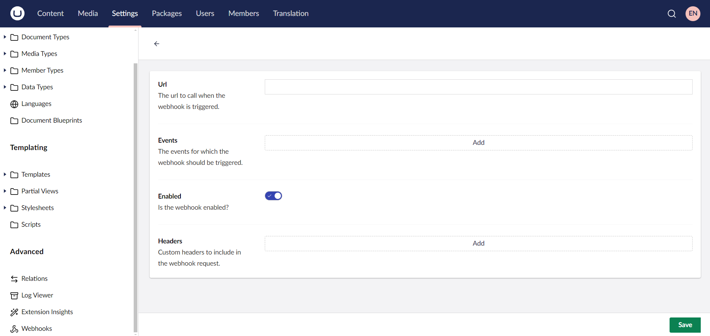

# Webhooks

Webhooks provide real-time, event-driven communication within Umbraco. They enable external services to react to content changes instantly by sending HTTP requests when specific events occur. This allows developers to integrate with third-party services, automate workflows, and synchronize data effortlessly.

## Getting Started

To manage webhooks, navigate to **Settings > Webhooks** in the Umbraco backoffice.


To create a webhook, click **Create**. This opens the webhook creation screen where you can configure the necessary details.



## Configuring a Webhook

### URL

The `Url` is the endpoint where the webhook will send an HTTP request when the selected event is triggered. Ensure this endpoint is publicly accessible and capable of handling incoming requests.

### Events

Webhooks are triggered by specific events in Umbraco. By default, the following events are available:

| Event Name          | Description                         |
| ------------------- | ----------------------------------- |
| Content Published   | Fires when content is published.    |
| Content Unpublished | Fires when content is unpublished.  |
| Content Deleted     | Fires when content is deleted.      |
| Media Deleted       | Fires when a media item is deleted. |
| Media Saved         | Fires when a media item is saved.   |

### Content Type Filtering

For **Content** or **Media** events, developers can specify whether the webhook should trigger for all content types or only specific ones. This is useful when activating webhooks for certain document types, such as blog posts or products.

### Custom Headers

Developers can define custom HTTP headers that will be included in the webhook request. Common use cases include:

* Specifying request format: `Accept: application/json`
* Adding authentication tokens: `Authorization: Bearer <your-token>`
* Including security headers

## Default Behavior of Umbraco Webhooks

Umbraco webhooks come with predefined settings and behaviors.

### JSON Payload

Each webhook event sends a JSON payload. The following types of payloads are available by default.

#### Legacy

This is the current default but will be removed in a future version. Legacy payloads follow the format used before version 16. They are inconsistent and may include data that should not be exposed or has been superseded (e.g., use of `int` instead of `Guid`).

#### Minimal

This will become the default in version 18 and later. Minimal payloads include only essential information to identify the resource. For most events, this means a unique identifier. Some events may include additional data. For example, a document publish event also includes the list of published cultures.

#### Extended

Extended payloads include all relevant information for an event, where available. However, sensitive data, such as usernames, member names, or email addresses, is excluded for privacy and security reasons. If an extended payload is not available for an event, the system falls back to the minimal payload.

### Configuring Payload Types

Payload type can be configured in the following ways:

* Changing the appsetting `Umbraco:CMS:Webhook:PayloadType`. Be aware that the system that uses this value runs before any composers. If you manipulate the `WebhookEventCollectionBuilder` in any way, then those methods will not automatically pick up this app setting.
* Passing in the PayloadType into the `WebhookEventCollectionBuilderExtensions` methods to control which webhook events are added.

```csharp
using Umbraco.Cms.Core.Composing;
using Umbraco.Cms.Core.Webhooks;

namespace Umbraco.Cms.Web.UI.Composers;

// this composer clears all registered webhooks and then adds all (umbraco provided) webhooks with their extended payloads
public class AllWebhookComposer : IComposer
{
    public void Compose(IUmbracoBuilder builder)
    {
        builder.WebhookEvents().Clear().AddCms(onlyDefault: false, payloadType: WebhookPayloadType.Extended);
    }
}

```

* Manually manipulating the `WebhookEventCollectionBuilder`.

```csharp
using Umbraco.Cms.Core.Composing;
using Umbraco.Cms.Core.Webhooks.Events;

namespace Umbraco.Cms.Web.UI.Composers;

// since legacy is the default, this composer removes the old content published webhookevent and changes it with the new extended version.
public class AllWebhookComposer : IComposer
{
    public void Compose(IUmbracoBuilder builder)
    {
        builder.WebhookEvents().Remove<LegacyContentPublishedWebhookEvent>();
        builder.WebhookEvents().Add<ExtendedContentPublishedWebhookEvent>();
    }
}
```

### Default Headers

Webhook requests include the following headers by default:

| Header Name                         | Description                                                                                             |
| ----------------------------------- | ------------------------------------------------------------------------------------------------------- |
| `user-agent: Umbraco-Cms/{version}` | Identifies the Umbraco version sending the webhook.                                                     |
| `umb-webhook-retrycount: {number}`  | Indicates the retry count for a webhook request.                                                        |
| `umb-webhook-event: {event}`        | Specifies the event that triggered the request. Example: `umb-webhook-event: Umbraco.ContentPublished`. |

## Extending Webhooks

### Adding Custom Events

You can extend the list of webhook events using `IUmbracoBuilder` and `IComposer`. Here’s an example of how to add custom webhook events:

```csharp
using Umbraco.Cms.Core.Composing;

public class CustomWebhookComposer : IComposer
{
    public void Compose(IUmbracoBuilder builder)
    {
        builder.WebhookEvents()
            .Clear()
            .AddCms(cmsBuilder =>
            {
                // Add custom events
                cmsBuilder
                    .AddDefault()
                    .AddContent()
                    .AddContentType()
                    .AddDataType()
                    .AddDictionary()
                    .AddDomain()
                    .AddFile()
                    .AddHealthCheck()
                    .AddLanguage()
                    .AddMedia()
                    .AddMember()
                    .AddPackage()
                    .AddPublicAccess()
                    .AddRelation()
                    .AddRelationType()
                    .AddUser();
            });
    }
}
```

To enable all available events, use:

```csharp
builder.WebhookEvents().Clear().AddCms(false);
```

### Replacing Webhook Events

Developers can modify existing webhook events, such as changing the payload format, by creating a custom implementation:

```csharp
using Microsoft.Extensions.Options;
using Umbraco.Cms.Core;
using Umbraco.Cms.Core.Configuration.Models;
using Umbraco.Cms.Core.DeliveryApi;
using Umbraco.Cms.Core.Models;
using Umbraco.Cms.Core.Notifications;
using Umbraco.Cms.Core.PublishedCache;
using Umbraco.Cms.Core.Services;
using Umbraco.Cms.Core.Sync;
using Umbraco.Cms.Core.Webhooks;

namespace CommunityDocs.Controllers;

[WebhookEvent("Content Published", Constants.WebhookEvents.Types.Content)]
public class MyCustomContentPublishedWebhookEvent(
    IWebhookFiringService webhookFiringService,
    IWebhookService webhookService,
    IOptionsMonitor<WebhookSettings> webhookSettings,
    IServerRoleAccessor serverRoleAccessor,
    IApiContentBuilder apiContentBuilder,
    IPublishedContentCache publishedContentCache): 
    WebhookEventContentBase<ContentPublishedNotification, IContent>(webhookFiringService, webhookService, webhookSettings, serverRoleAccessor)
{
    public override string Alias => "Umbraco.ContentPublish";
    protected override IEnumerable<IContent> GetEntitiesFromNotification(ContentPublishedNotification notification) => notification.PublishedEntities;

    protected override object? ConvertEntityToRequestPayload(IContent entity)
    {
        var cachedPublishedContent = publishedContentCache.GetById(entity.Key);

        return new
        {
            CustomData = "Your data",
            PublishedContent = cachedPublishedContent is null ? null : apiContentBuilder.Build(cachedPublishedContent)
        };
    }
}
```


Umbraco developers need to inject `IPublishedContentCache`, `IPublishedMediaCache`, `IPublishedMemberCache`, and `IPublishedContentTypeCache` individually, instead of injecting the `IPublishedSnapshotAccessor` as in previous versions.


The code below shows an example that replaces the default Umbraco webhook with a custom implementation:

```csharp
public class MyComposer : IComposer
{
    public void Compose(IUmbracoBuilder builder)
    {
        builder.WebhookEvents().Replace<ContentPublishedWebhookEvent, MyCustomContentPublishedWebhookEvent>();
    }
}
```

## Webhook Settings

Webhook settings are configured in `appsettings.*.json` under `Umbraco::CMS`:


```json
{
    "$schema": "appsettings-schema.json",
    "Umbraco": {
        "CMS": {
            "Webhook": {
                "Enabled": true,
                "MaximumRetries": 5,
                "Period": "00:00:10",
                "EnableLoggingCleanup": true,
                "KeepLogsForDays": 30
            }
        }
    }
}
```


| Setting                | Description                                    |
| ---------------------- | ---------------------------------------------- |
| `Enabled`              | Enables or disables webhooks.                  |
| `MaximumRetries`       | Sets the maximum number of retry attempts.     |
| `Period`               | Defines the retry interval.                    |
| `EnableLoggingCleanup` | Enables automatic cleanup of logs.             |
| `KeepLogsForDays`      | Determines how long webhook logs are retained. |

## Testing Webhooks

Use [Beeceptor](https://beeceptor.com/) or [RequestBin](https://pipedream.com/requestbin) to test the event trigger integrations before deploying them to production.
