# Connecting Umbraco Forms and Zapier

This guide takes you through the steps of connecting your Umbraco Forms to Zapier.

## What is Zapier

[Zapier](https://zapier.com/) is an “if this, then that” tool that allows you to automate workflows between the different web apps you use. Zapier has integrations to more than 2,000 web apps and lets you connect to your accounts with a few clicks without any code.

## Why use Zapier for your Umbraco Forms data

Umbraco Forms stores entries in the backoffice. It has a set of default workflow types that you can use when a new form entry is submitted. To use this data in other applications, such as your Customer Relationship Management (CRM) or marketing automation platform, you need integrations to those platforms. Integration with Zapier can be done using the default workflows in Umbraco Forms. All without having to write any additional code.

This enables marketers and editors to make automated workflows that pass data between the web apps they use without having to involve a developer.

## Who is this tutorial for

This tutorial is for all users of Umbraco and does not require any particular skills to be performed. It is especially useful for marketers who get the freedom to make integrations and automate tasks in a simpler and faster way.

## Prerequisites

Here is what you will need for this tutorial:

* A paid Zapier account (Premium apps are unavailable in the free plan)
* Umbraco Forms
* A Google account (only necessary if you want to follow the last example in the guide)

## Creating a Zapier webhook trigger

The first step is to generate the webhook URL that your Umbraco Forms has to send data to. This is done by logging into your Zapier account and clicking “Make a Zap”

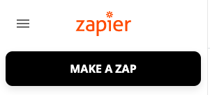

The next thing to do is pick an app in the “When this happens…” box. This is your trigger and determines when your Zap will start. Select the “Webhooks by Zapier” app

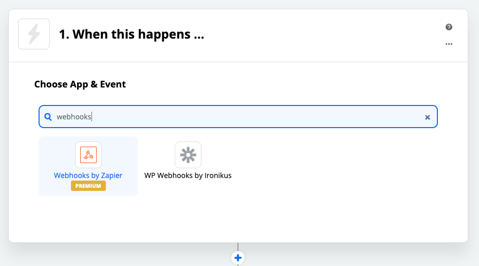

Now select the “Catch Hook” trigger event and click continue.

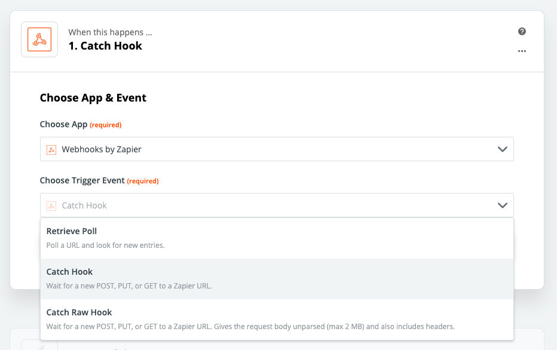

Now you will get a “Custom Webhook URL” that you will need for your Umbraco Forms.

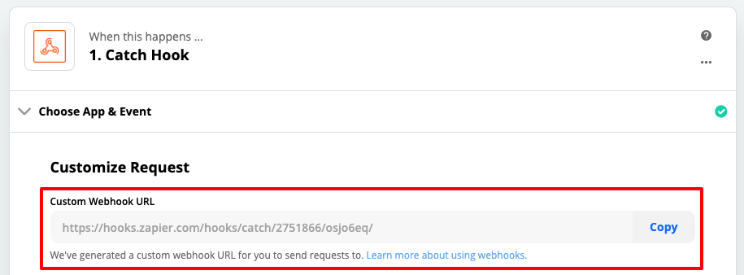

Copy this URL and have it ready for later. You will need it when you set up your Umbraco Forms workflow. Now we have to go into the Umbraco backoffice, but keep the Zap you created open. We will get back to it later to finish setup.

## Creating your Umbraco form

Now it’s time to login to the Umbraco backoffice so you can create your form. If you already have a form you want to connect you can skip to the next step.

To create a form you can follow this tutorial with step-by-step instructions: [Creating a form in Umbraco Forms](https://docs.umbraco.com/umbraco-forms/editor/creating-a-form).

Once you have created your form you are ready to set up the workflow.

## Setting up the “Send form to URL” workflow

Once you have set up your form, it is time to add the “Send form to URL” workflow to your form. This will allow you to post your data to the Zapier webhook URL you generated earlier.

Go to your form in the backoffice and click on “configure workflow”. In the “On Submit” workflow you click “Add workflow”.

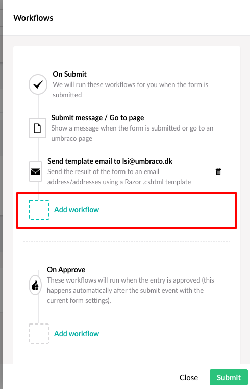

Now choose the workflow “Send form to URL”.

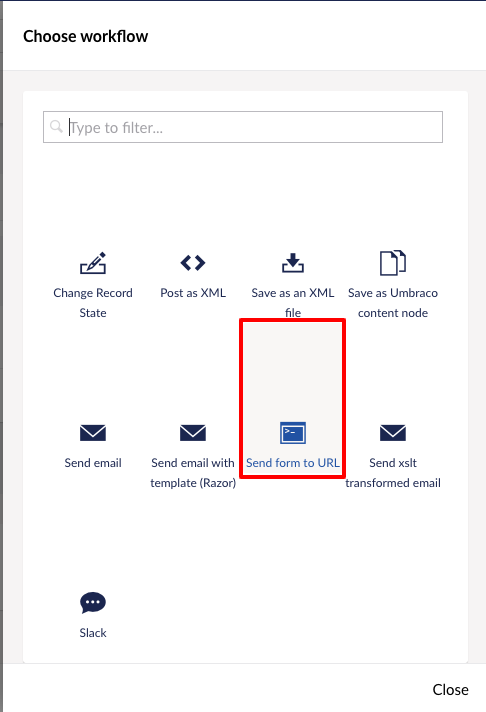

After giving the workflow a descriptive name, you paste in the webhook URL from Zapier in the “Url” field and choose POST in “Method”. Leave “Fields”, “User” and “Password” blank.

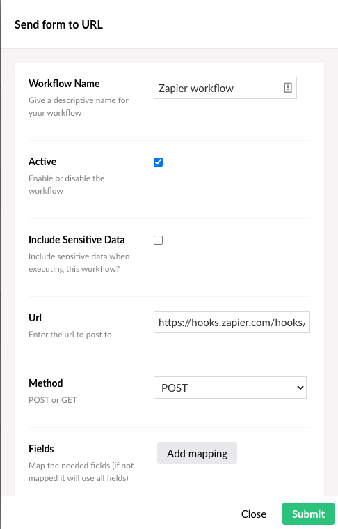

Now your workflow is ready. Submit your changes and save your form.

## Submit an entry to the form

Now your form is ready to send data to Zapier and any entry submitted will be posted to the Zapier webhook URL.

To set up field mapping and actions in Zapier your form needs an entry. If this is a new form, add it to a page and submit an entry ([guide to adding your form to a page](https://docs.umbraco.com/umbraco-forms/editor/creating-a-form)).

Here is the form and the fields that were submitted for this tutorial.

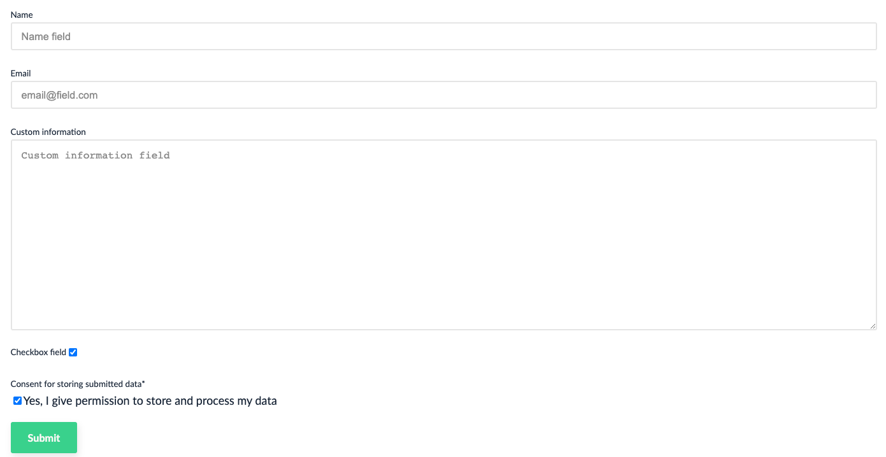

Once you have an entry in your form you are done in the Umbraco backoffice. Now it is time to go back to Zapier and finish setting up your automation.

## Find your form entry data in Zapier

In Zapier, open up the Zap you started setting up in the first step of this guide. In that Zap we are now ready to continue the setup of our webhook trigger. Start by clicking continue and get to the “Find Data” step.

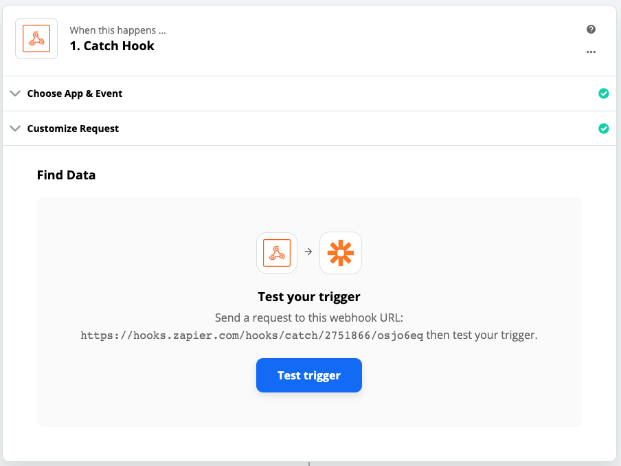

Now click on “Test trigger”. If there is an entry to the form it should look like this.

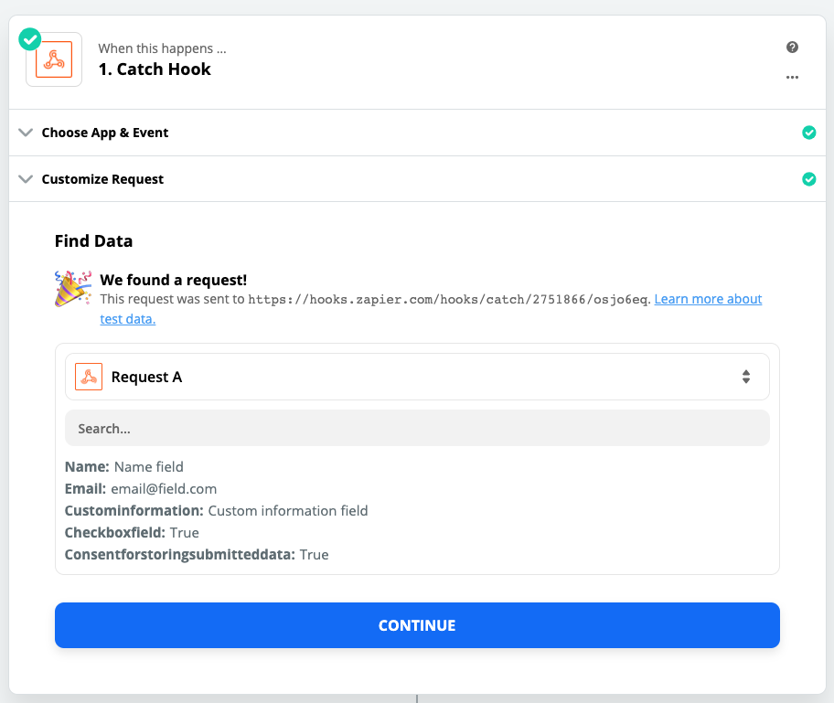

Now you have data to further map in your Zap and can continue choosing the action for the Zap. If Zapier does not find any data, try to submit a new form entry.

After clicking “continue” you are now starting on the “Do this…” action of your Zap.

## Choose an action for your Zap

Up until now, the steps will be the same for everyone. Now that you have connected Umbraco Forms and Zapier it is up to you to decide where you want to send the data.

In this tutorial you will get an example of how you can send your data to Google Sheets. This allows you to see how a finalized Zap looks like.

## Example: Sending data to Google Sheets

As a “Do this…” action you want to send data to Google Sheets. Before doing so in your Zap you need to ensure that you have created a Google Sheet to receive the data. You also need to connect your Zapier account to your Google Sheets account.

Once you have done these steps it is time to finish the setup of the Zap.

First thing to do is find the “Google Sheets” app in the “Do this…” action.

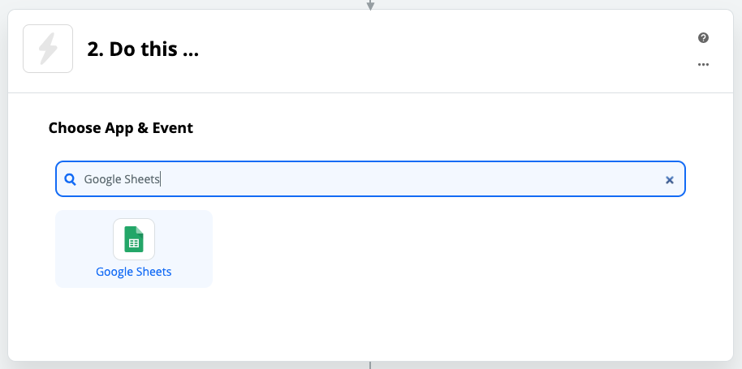

Now choose the Action event “Create a spreadsheet row” and continue.

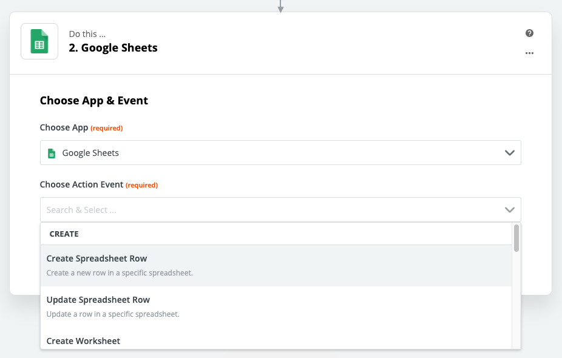

Now you need to choose the Google Sheets account you want to connect to. If you have not set this up yet, you will be prompted to do so. Once connected you choose that account and click continue.

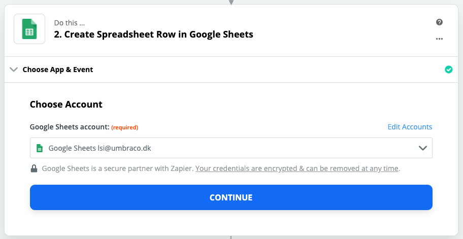

Now you can choose which Google Drive to use, find the spreadsheet and choose the worksheet that you want to send the data to. After doing so, you will get a list of possible fields that you can post your data to.

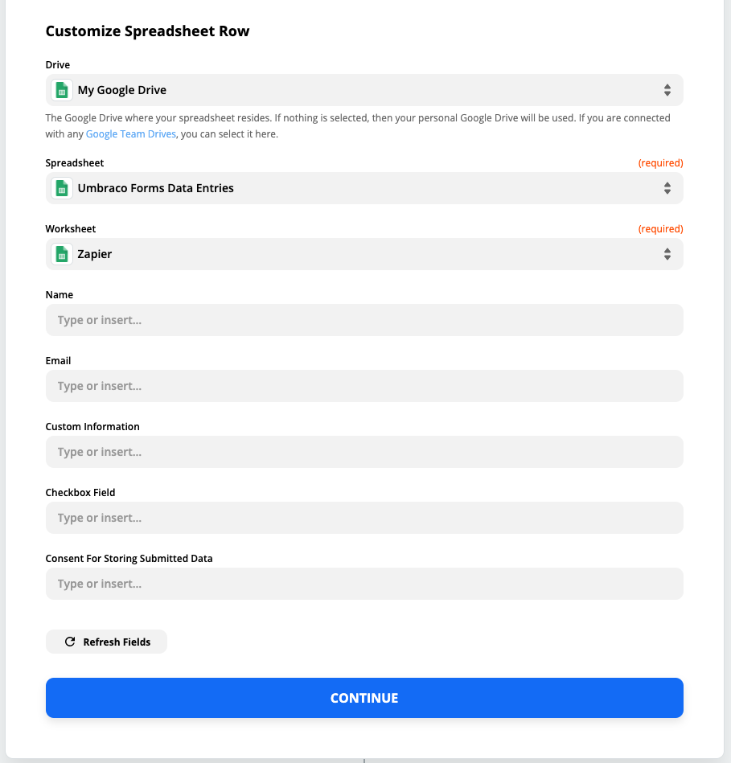

The fields showing are all columns in your spreadsheet that have a name in row 1. To map the input data to the different fields in the spreadsheet follow these steps:

* Select the “Type or insert…” field.
* Choose which data to put in the field.

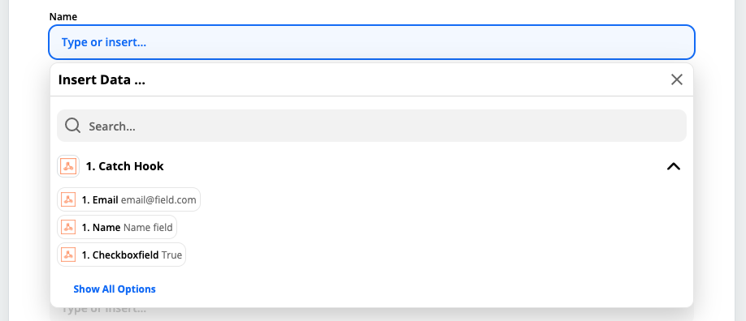

The data that was caught by the webhook will all be dynamic and you will want to pick the fields here. That way, when a new entry comes in, the field will dynamically insert the data they submitted for that field.

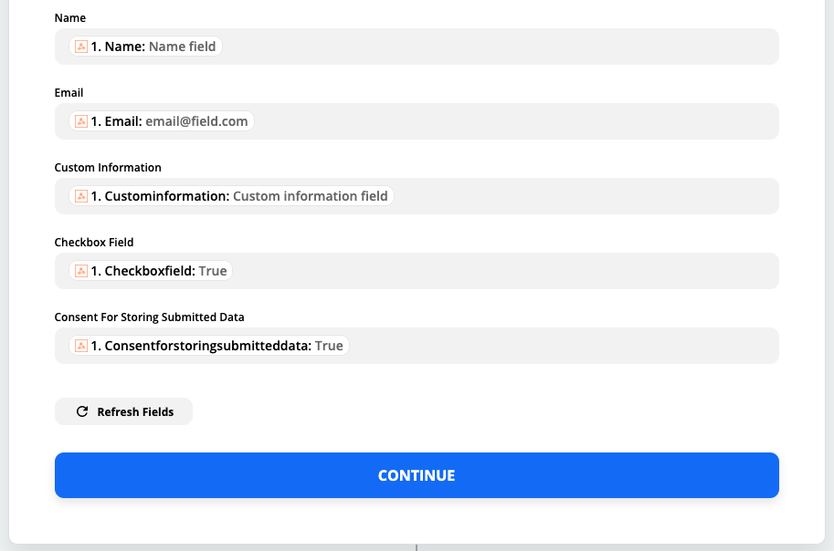

Once you have mapped all of the fields it is time to click “continue” and test if the data is sent correctly to our spreadsheet.

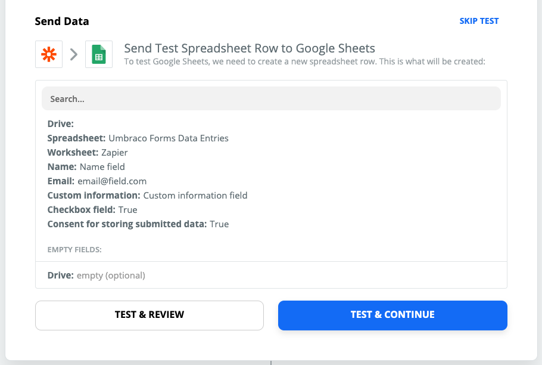

Click “Test & Continue” and wait for it to process. Once it is done, go to the spreadsheet you created and see if the data is there.

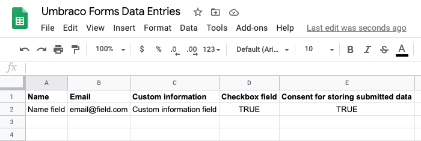

Tada! Now your Zap is ready and can be activated to automatically add form entries to Google Sheets. To activate the Zap you go back to your Zap and change the toggle from “Off” to “On”. Now it will be waiting for new form entries and be ready to send them to Google Sheets.

## Connecting multiple Umbraco Forms to Zapier

If you want to connect multiple forms to Zapier you can follow the above steps to do so. Remember to add individual Zaps to each form if the data being sent is different or you want to use different actions for the data.

You can reuse the same Zap and webhook URL if all data sent to Zapier is formatted in the same way. Otherwise errors will occur.

That’s it. Now you are ready to connect Umbraco Forms to Zapier and can use it to send data to the tools you choose.
