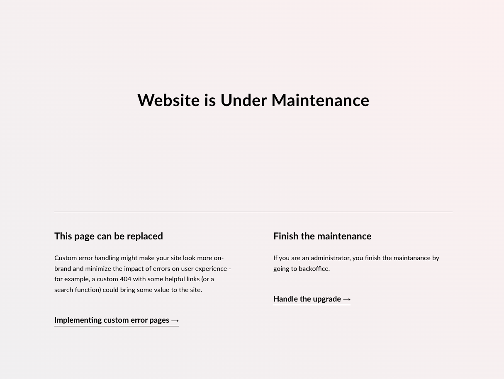

# Create a custom maintenance page

A maintenance page will be shown when an Umbraco project is running an upgrade. This prevents visitors from landing on an upgrade page or seeing content meant for project maintainers.



## Customize the maintenance page

The following guide will take you through the steps to customize and brand the default maintenance page.

1. Go to the root of your Umbraco project files.
2. Create a new folder called `UmbracoWebsite`, and open it.
3. Add a new file called `maintenance.cshtml`.
4. Add your custom markup to the file.


Keeping the Umbraco project in Upgrade mode for a longer time is not recommended. Most migrations can be executed while the website continues to work.


## Disable the maintenance page

As most upgrades can be done without the website having to restart or go down, the maintenance page can be disabled.

1. Open the project `appSettings.json` file.
2. Add the following configuration:


```json
{
    "Umbraco": {
        "CMS": {
            "Global": {
                "ShowMaintenancePageWhenInUpgradeState": false
            }
        }
    }
}
```

