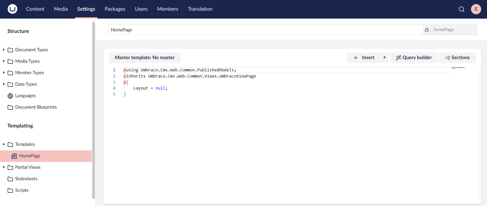
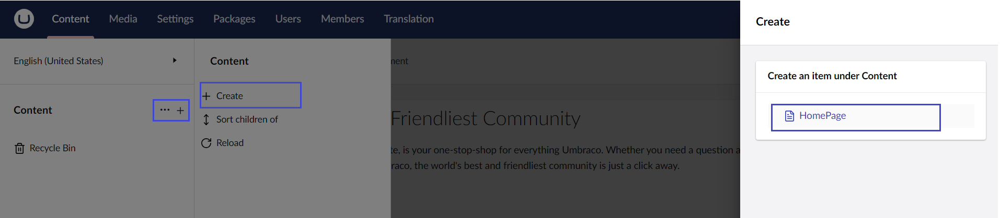
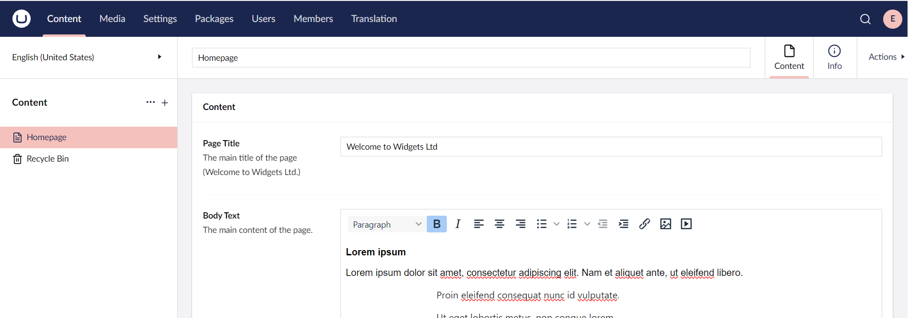
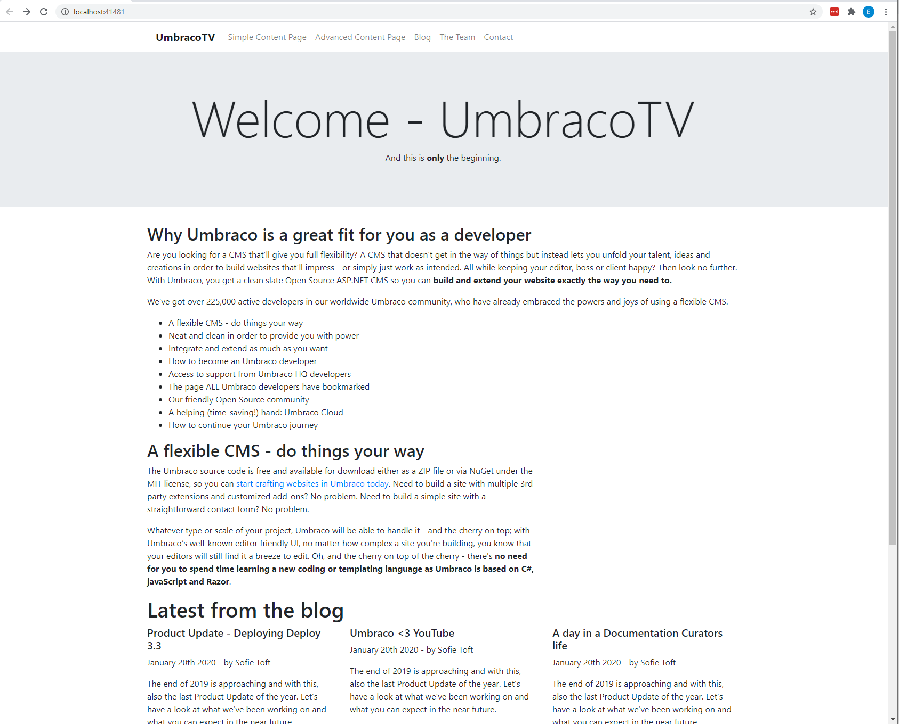

# Creating Your First Template

Umbraco creates a corresponding template when you select the **Document Type with Template** option when creating a Document Type.

To edit the template:

1. Go to **Settings**.
2.  Expand the **Templates** folder in the **Templating** section of the tree. You should see a template titled **HomePage**.

    
    If you do not see the template, try refreshing the page.
    
3.  Open the template. It contains a little bit of Razor code.

    **Code Breakdown:**

    * `@using Umbraco.Cms.Web.Common.PublishedModels;` - Imports the namespace for Umbraco's strongly-typed content models.
    * `@inherits Umbraco.Cms.Web.Common.Views.UmbracoViewPage` - Sets the view to inherit from Umbraco's base view class for accessing Umbraco-specific features and helpers.
    * `Layout = "null";` - The view will not use a layout page unless explicitly specified. For more information on [Razor Pages Layout](https://learn.microsoft.com/en-us/aspnet/core/mvc/views/layout), see the Microsoft Documentation.

    

We will use the files from the [Custom Umbraco Template](https://umbra.co/Umbracotemplate) folder. Clicking the link will automatically download the files to your device.

1. Open the **Custom Umbraco Template** folder and copy the contents of **index.html**.
2. Paste the content into the _HomePage_ template below the closing curly brace "}".
   * Umbraco _**Templates**_ uses _**Razor**_ that allows you to add code in your _**Template**_ files. _**Razor**_ reacts to `@` signs.
3. Click **Save**.

We now have a _Template_. That's two out of the three stages complete for our first page.

## Creating Your First content node

Our third and final stage to creating our first page in Umbraco, is to create a _**content node**_. The content node uses our _**Document Type**_ and _**Template**_ to serve up an HTML page to web visitors.

To add a content node:

1. Go to **Content**.
2. Select **...** next to **Content** in the tree.
3. Click **Create**.
4.  Select **HomePage**. The Home Page opens in the content editor.

    * If you cannot see the content node, check that **Settings** > **Document Types** > **HomePage** > **Structure** > **Allow at root** is enabled.

    
5. Enter the **Name** for the content node. We are going to call this _Homepage_.
   * The name will show up in the node list and will be used to create a URL for the page. Try to keep it short but descriptive.
6.  Enter the following details:

    | Name        | Description                                                                                                                                                                                                                                                                                                                                                                                                                                                                                                                                                        |
    | ----------- | ------------------------------------------------------------------------------------------------------------------------------------------------------------------------------------------------------------------------------------------------------------------------------------------------------------------------------------------------------------------------------------------------------------------------------------------------------------------------------------------------------------------------------------------------------------------ |
    | Page Title  | Welcome to Widgets Ltd                                                                                                                                                                                                                                                                                                                                                                                                                                                                                                                                             |
    | Body Text   | 
<strong>Lorem ipsum</strong>

Lorem ipsum dolor sit amet, consectetur adipiscing elit. Nam et aliquet ante, ut eleifend libero.
<ul><li>Proin eleifend consequat nunc id vulputate.</li><li>Ut eget lobortis metus, non congue lorem.</li><li>Orci varius natoque penatibus et magnis dis parturient montes, nascetur ridiculus mus.</li><li>Maecenas tempus non lectus rhoncus efficitur.</li></ul>
Sed est ligula, maximus in dolor sed, lacinia egestas ligula. Donec eu nisi lectus.

<em>Morbi pharetra pulvinar arcu non gravida.</em>
 |
    | Footer Text | Copyright Widgets Ltd 2024                                                                                                                                                                                                                                                                                                                                                                                                                                                                                                                                         |
7.  Click **Save and Publish**. The content tree will reload with the homepage node.

    

## Accessing the Frontend

To view your content on the frontend:

1. Go to the **Info** tab in the **Homepage** content node.
2. Click on the link under the **Links** section.

The default Umbraco page is gone and we can see a basic unstyled page. We are getting there.


If you see a blank page, check if the template is entered and remember to save it.


