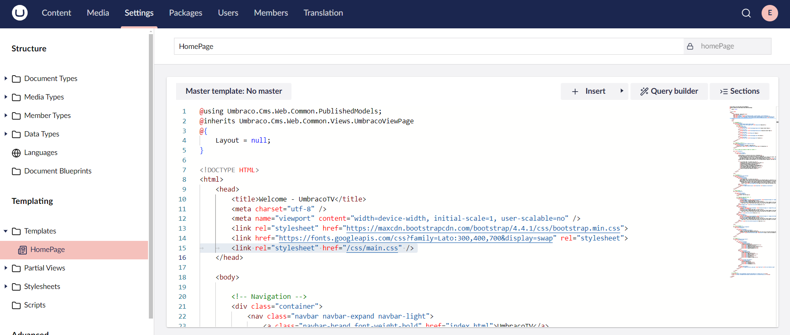

# CSS and Images

Our homepage is currently missing the CSS and image files. To include these files:

1. Navigate to the **MyCustomUmbracoProject** folder and the **Custom Umbraco Template** folder in File Explorer.
2. Copy the **css** and **images** folders from the _Custom Umbraco template_ folder and place it in the **wwwroot** folder inside the _MyCustomUmbracoProject_ folder.
3. Navigate to the **HomePage** template in the **Settings** section and ensure the stylesheet reference link is `/css/main.css`.

    
4. Using Chrome/Firefox/Edge Developer Tools, start or refresh your `http://localhost:xxxx.`

    The network tab should not report any missing CSS or images files. If the network tab reports any error, check for typos and if the folders are in the right places.
