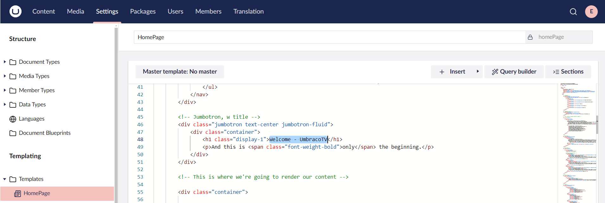

# Displaying the Document Type Properties

You might have noticed that the content we've added to the homepage is not being displayed. We need to wire up the Data Type properties to the template.

Let’s look at our template and identify where the content should be displayed.

The top arrow in this image is the _Page Title_ and the bottom arrow is the _Body Text_. The Footer is all the way at the bottom of the page.

## Setting the Document Type Properties

To set the Document Type properties:

1. Go to **Settings**.
2. Open the **Homepage** template.
3.  Scroll down to the `<!-- Jumbotron, w title -->` section (around line 45) and highlight the text `“Welcome - UmbracoTV”` (around line 48).

    
4. Click **Insert** and select **Value**.
5. Select **Document Type** from the **Choose field** dropdown list.
6. Select **HomePage**.
7. Click **Choose**.
8.  Select **pageTitle** field from the **HomePage** dropdown list.

    
9. Click **Submit**.
10. Go to the content between the `
` tags (around line 60 to 77):
11. Highlight the content as shown in the figure.

    
12. Repeat steps 4 to 9 to insert the **bodyText** field.
13. Go to the content between the `
` tag (around line 148 to 181):
14. Highlight the content between the `
` tags.

    
15. Repeat steps 4 to 9 to insert the **footerText** field.
16. Click **Save**.

Reload your homepage to view the content. You should see something similar like the image below:

Now, you can go back and add additional fields or update existing fields in the Document Type. Fill them out in the content node and then add them in the template to display the data in the website.
