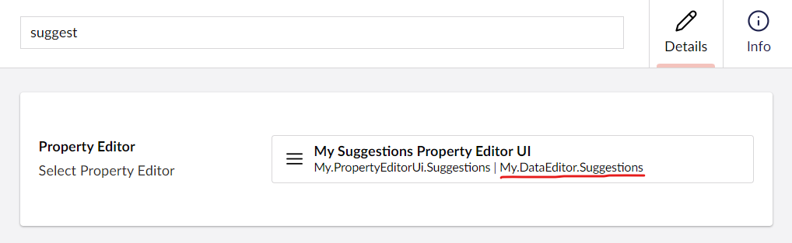

# Adding server-side validation

## Overview

When creating Property Editors, our intended audience is trusted (logged-in) backoffice users. Therefore, we can rely on client-side validation of user inputs. However, there are occasions when server-side validation is necessary as well.

Server-side validation is performed by implementing a Data Editor, which is the server-side pendent to the Property Editor.

In this article, we will implement server-side validation for the `Suggestion` Property Editor created in the previous steps.

## When should I use a Data Editor?

As mentioned above, server-side validation is the most common use-case for implementing a Data Editor.

Less common use-cases include:

- Custom content indexing for search,
- Server-side conversion of the data that is passed to - and received from - the Property Editor UI,
- and more.

These will be discussed briefly at the end of this article.

## Implementing server-side validation

Validation is initiated by the Data Editor, but the actual handling is performed in a Data Value Editor implementation:


```csharp
using Umbraco.Cms.Core.Models;
using Umbraco.Cms.Core.PropertyEditors;

namespace Umbraco.Docs.PropertyEditors;

[DataEditor("My.DataEditor.Suggestions", ValueEditorIsReusable = true)]
public class MySuggestionsDataEditor : DataEditor
{
    public MySuggestionsDataEditor(IDataValueEditorFactory dataValueEditorFactory)
        : base(dataValueEditorFactory)
    {
    }

    protected override IDataValueEditor CreateValueEditor()
        => DataValueEditorFactory.Create<MySuggestionsDataValueEditor>(Attribute!);
}
```


The Data Value Editor in turn employs Value Validators to handle specific aspects of validation. Usually we'll create our own Value Validator implementations, but we could also reuse the ones in Umbraco (for example, the `EmailValidator`).


```csharp
using Umbraco.Cms.Core.IO;
using Umbraco.Cms.Core.PropertyEditors;
using Umbraco.Cms.Core.PropertyEditors.Validators;
using Umbraco.Cms.Core.Serialization;
using Umbraco.Cms.Core.Strings;

namespace Umbraco.Docs.PropertyEditors;

public class MySuggestionsDataValueEditor : DataValueEditor
{
    public MySuggestionsDataValueEditor(
        IShortStringHelper shortStringHelper,
        IJsonSerializer jsonSerializer,
        IIOHelper ioHelper,
        DataEditorAttribute attribute)
        : base(shortStringHelper, jsonSerializer, ioHelper, attribute)
        => Validators.Add(new MySuggestionsValueValidator());
}
```


The Value Validator performs validation based on the user input from the Property Editor along with the configuration of the Data Type:


```csharp
using System.ComponentModel.DataAnnotations;
using Umbraco.Cms.Core.PropertyEditors;

namespace Umbraco.Docs.PropertyEditors;

public class MySuggestionsValueValidator : IValueValidator
{
    public IEnumerable<ValidationResult> Validate(object? value, string? valueType, object? dataTypeConfiguration)
    {
        // do we have a string value and a valid set of configuration data?
        if (value is not string stringValue
            || dataTypeConfiguration is not Dictionary<string, object?> dataTypeConfigurationValues)
        {
            // no - let's not attempt to handle this.
            return [];
        }

        // do we have a "maxChars" int configuration?
        if (dataTypeConfigurationValues.TryGetValue("maxChars", out object? maxCharsConfigurationValue) is false
            || maxCharsConfigurationValue is not int maxCharsValue)
        {
            // no - nothing to base our validation on.
            return [];
        }

        return stringValue.Length <= maxCharsValue
            ? []
            : [new ValidationResult($"The suggestion exceeded the max allowed characters ({maxCharsValue})")];
    }
}
```


## Coupling the Property Editor and the Data Editor

With the Data Editor in place, update the Property Editor `propertyEditorSchemaAlias` in `umbraco-package.json` to match the Data Editor alias (`My.DataEditor.Suggestions`):

```json
{
    "$schema": "../../umbraco-package-schema.json",
    "name": "My.AwesomePackage",
    "version": "0.1.0",
    "extensions": [
        {
            ...
            "meta": {
                ...
                "propertyEditorSchemaAlias": "My.DataEditor.Suggestions",
                ...
            }
        }
    ]
}
```

Reload the backoffice and open the "Suggestions" Data Type:



The Umbraco UI already lists the Data Type as using the Data Editor. However, the Data Type configuration is still stored in the database using `Umbraco.Plain.String`. To effectively apply the Data Editor, we must re-save the Data Type.

## Advanced Data Editor use-cases

As mentioned earlier, the Data Editor has more use-cases than adding server-side validation.

While it is beyond the scope of this article to discuss these in depth, a few of them deserve a mention.

### Custom content indexing for search

We can control how property data is indexed by overriding the `PropertyIndexValueFactory` property of the `DataEditor` base class.

The [Tags Property Editor](https://github.com/umbraco/Umbraco-CMS/blob/main/src/Umbraco.Infrastructure/PropertyEditors/TagsPropertyEditor.cs) contains an example of how this is done. The Property Editor stores a CSV value, which is split and indexes as individual tags for search.

### Server-side data conversion to and from the client

Sometimes it is necessary to perform outbound and/or inbound conversion of property data (to/from the Property Editor UI). Some known use-cases are:

- Cleaning up property data - for example, removing previously selected options that no longer apply at server level.
- Transforming property data to/from a format supported by the Property Editor UI.

These operations can be performed in the `DataValueEditor` implementation:

- Override `ToEditor()` to perform outbound conversion.
- Override `FromEditor()` to perform inbound conversion.

The [Markdown Property Editor](https://github.com/umbraco/Umbraco-CMS/blob/main/src/Umbraco.Core/PropertyEditors/MarkDownPropertyValueEditor.cs) contains an example of data conversion. It sanitizes the property data before storing the data in the database.
