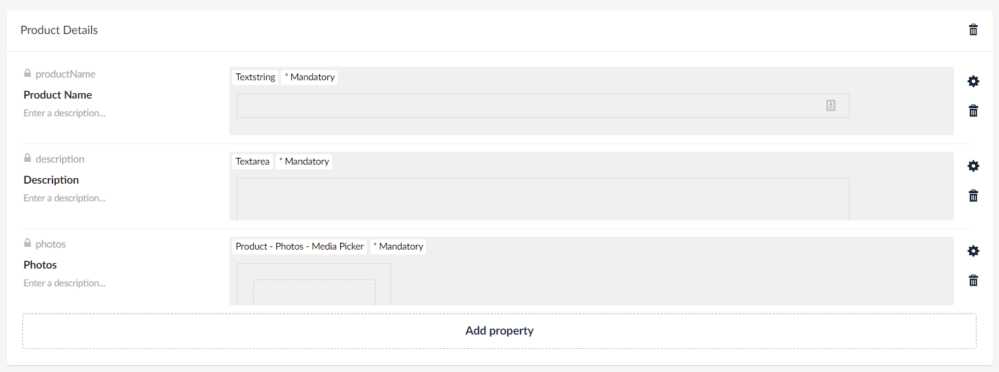
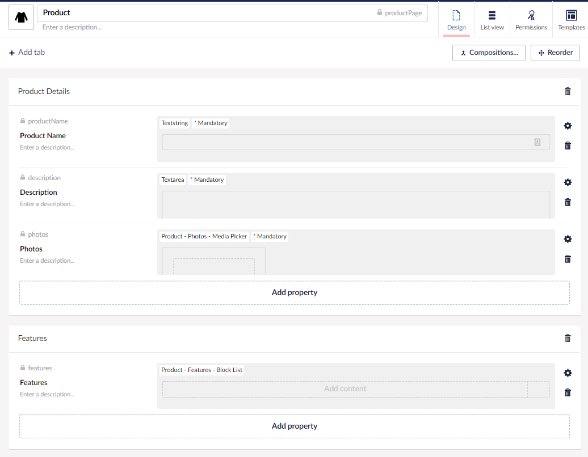
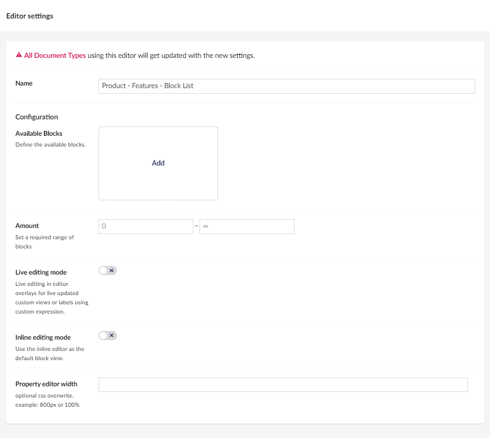
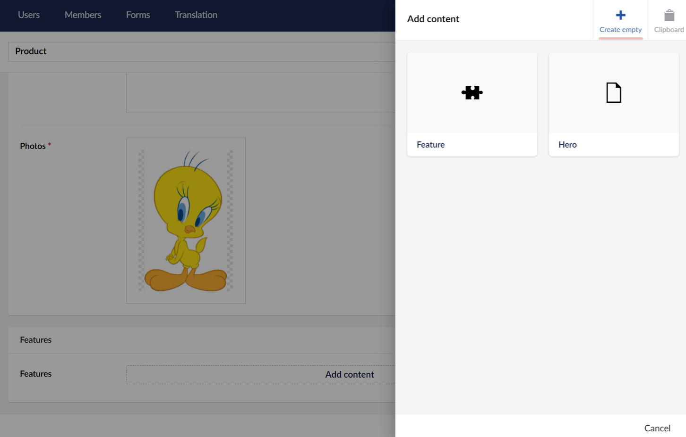
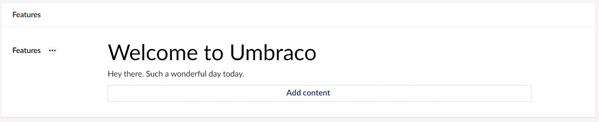
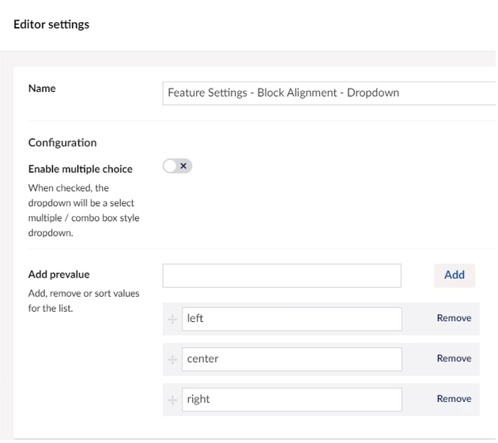
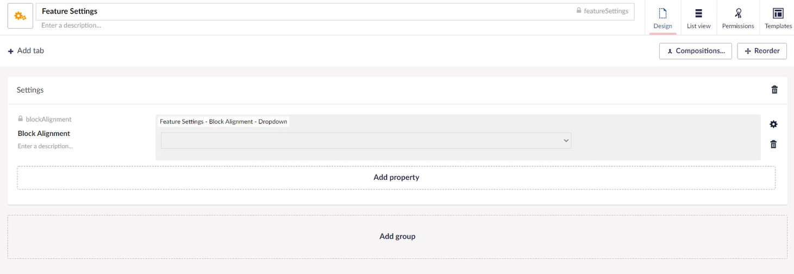

# Custom Views for Block List

Custom Views are used to overwrite the presentation of a Block. We can improve the editing experience by providing a better representation of the Blocks content. It could be a presentation of how it will look on the front end or the specific properties available.


This article is a work in progress and may undergo further revisions, updates, or amendments. The information contained herein is subject to change without notice.


## Creating the Document Type

For this tutorial, we will set-up a simple document type and create a new property using Block List as the property editor.

To create a Document Type:

1. Go to **Settings**.
2. Select the **...** next to the **Document Types** in the **Settings** tree.
3. Select **Document Type with Template**.
   * Using folders can help you organize your **Document Types**.
4. Enter a **Name** for the **Document Type**. Let's call it _Product_. You'll notice that an **Alias** is automatically created.
5. Click **Add Group** and **Enter a Name** for the group. Let's call it _Product Details_.
6.  Add the following properties: \\

    <figure><figcaption></figcaption></figure>
7.  Add another group called **Features** and a property with the following specification:

    | Name      | Features   |
    | --------- | ---------- |
    | Alias     | features   |
    | Data Type | Block List |
8.  Click **Save**. Your document type should look like:

    <figure><figcaption></figcaption></figure>

## Creating the Content Node

To create the Content Node:

1. Go to the **Permissions** tab of the root content node and select **Add Child** in the **Allowed child node types**. The **Choose Child Node** window appears.
2. Select the **Product** document type and click **Save**.
3. Go to **Content**.
4. Select **...** next to the root content node and select **Product**.
5. **Enter the Name** for the article. We are going to call it _Product_.
6. Fill the required details in the **Product** page and click **Save**.

## Configuring the Block List Editor

To configure the Block List editor:

1. Go to **Settings** and open the **Product** document type.
2.  Click on the **Block List** property we created earlier. You'll see the Block list editor's configuration, as shown below:

    

In the **Configuration** section, we can add **Available Blocks**, define the range of blocks that can be added, control the live and inline editing mode, or set the property editor width. The Available Blocks in the Block List editor configuration differentiates it from the other property editors. The list you create with the Block List editor is based on one or more blocks. Each block is based on an Element Type.

To add blocks to our Block List editor:

1. Click **Add** in the **Available Blocks**. The **Pick Element Type** window opens. From here, you have the option to select an existing Element Type, if any, or you can create a new Element Type from the configuration screen.
2. For this tutorial, we will **Create a new Element Type**.
3.  Setup a new Element type called **Feature** and use the following configuration:

    | Property Name | Alias       | Editor       |
    | ------------- | ----------- | ------------ |
    | Name          | featureName | Textstring   |
    | Details       | details     | Textarea     |
    | Image         | image       | Media Picker |
4. Click **Save and Close**. The block configuration window opens. For more information on the block configuration, see the [Setup Block Types](../fundamentals/backoffice/property-editors/built-in-umbraco-property-editors/block-editor/block-list-editor.md#setup-block-types) section.
5. Similarly, I'll set up another block called **Hero**.
6. Toggle **Live Editing mode** and select **Submit**.

## Creating Custom Views for blocks

We can improve the editing experience by overwriting the default representation of our block entries with a custom view. This can be used to provide a more detailed representation of the block. You can make the content look as it will on the frontend or highlight specific values for data overview.

A Custom View is a Web Component registered as a Backoffice Extension.

Let us create an `example-block-custom-view.ts` file with the following code:


```typescript
import { html, customElement, LitElement, property, css } from '@umbraco-cms/backoffice/external/lit';
import { UmbElementMixin } from '@umbraco-cms/backoffice/element-api';
import type { UmbBlockEditorCustomViewElement } from '@umbraco-cms/backoffice/block-custom-view';
import type { UmbBlockDataType } from '@umbraco-cms/backoffice/block';

@customElement('example-block-custom-view')
export class ExampleBlockCustomView extends UmbElementMixin(LitElement) implements UmbBlockEditorCustomViewElement {

    @property({ attribute: false })
    content?: UmbBlockDataType;

    override render() {
        return html`
            <h5>My Custom View</h5>
            <p>Headline: ${this.content?.headline}</p>
        `;
    }

    static override styles = [
        css`
            :host {
                display: block;
                height: 100%;
                box-sizing: border-box;
                background-color: #dddddd;
                border-radius: 9px;
                padding: 12px;
            }
        `,
    ];
}

export default ExampleBlockCustomView;
```



This is a TypeScript file. It is recommended to follow the documentation on how to compile TypeScript.


### Assigning the View to a Block Type

Now that we have created our Web Component, let us register it to show up on our block:

```typescript
{
    type: 'blockEditorCustomView',
    alias: 'Example.blockEditorCustomView.Product',
    name: 'Example Block Editor Custom View for Product Block of Block List Editors',
    element: () => import('./example-block-custom-view.js'),
    forContentTypeAlias: 'product',
    forBlockEditor: 'block-list',
}
```

While the `forContentTypeAlias` and `forBlockEditor` parameters are optional, they also accept arrays. They can therefore be used to declare a custom view for multiple blocks and block editors. The code snippet below shows an example of such an array:

```typescript
    forContentTypeAlias: ['product', 'anotherContentTypeAlias'],
    forBlockEditor: ['block-list', 'block-grid', 'block-rte'],
```

Depending on the values, the custom view is applied to the following data types:

* `block-list` - For more information, see the [Block List editor](../fundamentals/backoffice/property-editors/built-in-umbraco-property-editors/block-editor/block-list-editor.md).
* `block-grid` - For more information, see the [Block Grid editor](../fundamentals/backoffice/property-editors/built-in-umbraco-property-editors/block-editor/block-grid-editor.md).
* `block-rte` - Blocks used inline in the [Rich Text editor](../fundamentals/backoffice/property-editors/built-in-umbraco-property-editors/rich-text-editor/blocks.md).

Read about [extension-manifest](../customizing/extending-overview/extension-registry/extension-manifest.md) to learn how to register an Extension Manifest.

Once registered, the Block will be represented by the given Web Component.

### Adding Content to the Blocks

To add content to the blocks:

1. Go to the **Content** section and select **Product**.
2.  Select **Add Content** in the **Features** group. The **Add Content** displays the blocks we created earlier.

    <figure><figcaption></figcaption></figure>
3. Select **Feature**. The **Feature** window opens.
4. Enter the **Name** and **Details** in the Feature window. You will notice you can view the content as you type. This is because we have enabled the **Live editing** mode.
5. Click **Confirm**.

<figure><figcaption></figcaption></figure>

## Creating `Settings` section for Blocks

Now, we have overwritten the AngularJS view for the content editor's block presentation by using our own view. Let's create a **Settings** section to control the data alignment of the block. To do this, we need to add a **Settings** model to our block configuration.

To add a Settings model:

1. Go to **Product** in the **Settings** tree.
2. Click the `cog` wheel next to **Features**.
3. Select the **Product - Features - Block List**. The **Editor Settings** window opens.
4. Select **Feature** from the **Available Blocks** configuration.
5. Select **Settings Model** in the Data Models section. The **Attach a settings Element Type** window opens.
6. Select **Create new Element Type**.
   * **Enter a Name** for the element type. Let's say _Feature Settings_.
   * Give it an icon.
   * Click **Add Group** and **Enter a Name**. Let's call it _Settings_.
   * Click **Add Property** and **Enter a Name**. Let's call it _Block Alignment_. An alias `blockAlignment` is generated.
   * Select **Dropdown List** as the editor. The **Editor Settings** window opens.
   * In the Add options field, add **left**, **center** and **right** as values.
   *   Click **Submit**.

       <figure><figcaption></figcaption></figure>
7. Click **Submit**.
8.  Click **Save and Close**.

    <figure><figcaption></figcaption></figure>
9. Click **Submit** until you reach the Product document type.
10. Click **Save**.

We need to update the `example-block-custom-view.ts` file with the following configuration:


```typescript
import { html, customElement, LitElement, property, css } from '@umbraco-cms/backoffice/external/lit';
import { UmbElementMixin } from '@umbraco-cms/backoffice/element-api';
import type { UmbBlockEditorCustomViewElement } from '@umbraco-cms/backoffice/block-custom-view';
import type { UmbBlockDataType } from '@umbraco-cms/backoffice/block';

@customElement('example-block-custom-view')
export class ExampleBlockCustomView extends UmbElementMixin(LitElement) implements UmbBlockEditorCustomViewElement {

    @property({ attribute: false })
    content?: UmbBlockDataType;

    @property({ attribute: false })
    settings?: UmbBlockDataType;

    override render() {
        return html`
            <div class="${this.settings?.blockAlignment ? 'align-' + this.settings?.blockAlignment : undefined}">
                <h5>My Custom View</h5>
                <p>Headline: ${this.content?.headline}</p>
                <p>Alignment: ${this.settings?.blockAlignment}</p>
            </div>
        `;
    }

    static override styles = [
        css`
            :host {
                display: block;
                height: 100%;
                box-sizing: border-box;
                background-color: #dddddd;
                border-radius: 9px;
                padding: 12px;
            }

            .align-center {
                text-align: center;
            }
            .align-right {
                text-align: right;
            }
        `,
    ];
}

export default ExampleBlockCustomView;
```


## Rendering the Block List Content

To render the stored value of your Block List editor on the frontend, see the [Rendering Block List Content](../fundamentals/backoffice/property-editors/built-in-umbraco-property-editors/block-editor/block-list-editor.md) section.
