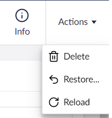
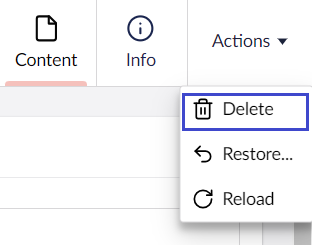

# Deleting and Restoring Pages

If you have pages that are no longer required for your website, you can delete them. Upon deletion, the page is moved to the **Recycle Bin** and is not deleted permanently.

In case you wish to restore the page, you can restore them from the **Recycle Bin**. You also have the option to empty the Recycle Bin which permanently deletes all the items.

## Deleting a Page

To delete a page:

1. Go to **Content**.
2. Click **...** next to the page you wish to delete.
3.  Select **Trash**.

    

    Alternatively, click **Actions** in the top-right corner of the screen and select **Trash**.

    
4.  A window appears confirming if you want to delete the page.

    
5. Click **OK**.
6. A confirmation message appears. Click **OK** to dismiss the confirmation message.

## Restoring a Deleted Page from the Recycle Bin

The **Recycle Bin** is a separate tree list which can be found at the bottom of the section tree view. Clicking the arrow to the left of the Recycle Bin icon will reveal any pages that have been deleted from the website.

To restore deleted pages from the Recycle Bin:

1.  Click **•••** next to the page in the Recycle Bin and select **Restore**.

    

    You can also click **Actions** in the top-right corner of the screen and select **Restore**.

    
2.  A window appears confirming if you want to restore the page.

    
3. Click **Restore**.
4. A confirmation message appears. Click **OK** to dismiss the confirmation message.


To display the page on the website, click **Save and publish**.


## Emptying the Recycle Bin

If you are confident you no longer require any pages in the **Recycle Bin**, you can permanently delete it. You can delete pages one by one or empty the Recycle Bin in one go.


After deleting the pages from the **Recycle Bin**, you will **not** be able to retrieve any data associated with that page.


To empty the Recycle Bin:

1.  Click **•••** next to the **Recycle Bin** and select **Empty recycle bin**.

    
2.  A message appears confirming if you want to empty the recycle bin.

    
3. Click **OK**.

To delete individual pages from the Recycle Bin:

1.  Click **•••** next to the page from the Recycle Bin and select **Delete**.

    

    You can also click **Actions** in the top-right corner of the screen and select **Delete**.

    
2.  A message appears confirming if you want to delete the page.

    
3. Click **OK**.
4. A confirmation message appears. Click **OK** to dismiss the confirmation message.
