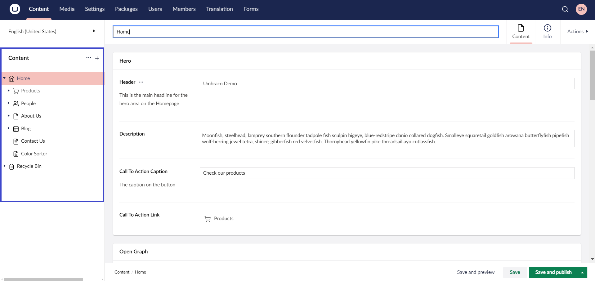
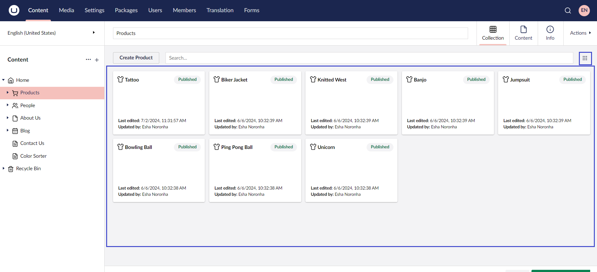

# Editing Existing Content

## Content Within the Tree View

When you are looking to edit content, locate the _**page**_ you want to edit in the Content tree on the left-side of the screen.

To edit existing content, follow these steps:

1. Go to the **Content** section.
2. Select the page in the section tree you wish to edit. The content of the page is loaded in the right-side editor.
3. Edit the contents of the page.
4. Click **Save** to save the edits without publishing it.
5. Click **Save and preview** to preview the changes.
6. Click **Save and publish** to publish the changes. For more information, see the [Save and Publishing Pages](creating-saving-and-publishing-content.md#saving-and-publishing-pages) article.

## View Page Layout

By default, you can view Page layouts in two ways:

1. **List**

When you [enable Collection](#enabling-collection) on a page, its child pages are no longer shown as nested items in the content tree. Instead, the parent page appears as a single node in the tree. Selecting it displays all of its child pages in a list view within the main content area. For more information, see the [Collection](../../../fundamentals/backoffice/property-editors/built-in-umbraco-property-editors/collection.md) article.

2. **Grid**

You can switch between list and grid view by clicking the  icon in the top-right of the screen:

### Enabling Collection

To enable Collection:

1. Go to **Settings**.
2. Navigate to the Document Type you wish to configure as a Collection.
3. Go to the **Structure** tab.
4. Click **Configure as a Collection** in the Collections field.
5. Select **List View - Content**.
6. Click **Save**.

.png>)

7. Click **Save**.

Additionally, you can sort the list items by the **Name**, **Last Edited**, and **Updated By** columns in either ascending or descending order.
