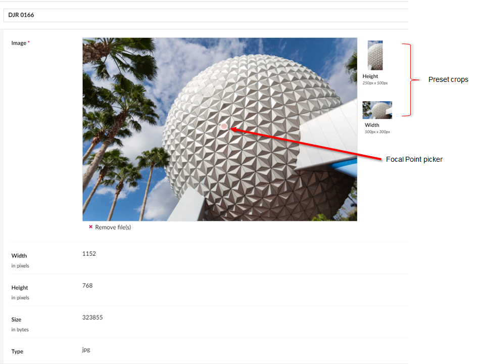
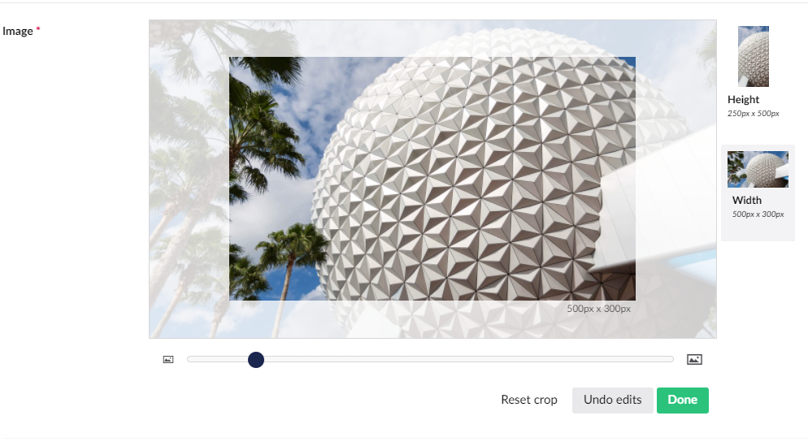

# Cropping Images

If your system administrator has set up cropping for your images, you will see a similar interface when you edit your images:

The circle in the middle of the image is the default focal point. The focal point defines the primary area or focus of the image which will be the center point of any image re-sizing. You can move the focal point by clicking and dragging it to the desired part of the image.

Next to the image, you may see specific crops of the image depending on your setup. In the above example, you can see that 2 crops have been set-up. To add or update the image crops, see [Adding properties](../../../fundamentals/data/creating-media/README.md#adding-properties) section in the [Creating media](../../../fundamentals/data/creating-media/) article.

To manually alter the pre-defined crops:

1. Select one of the crops - you will see an enlarged version of the crop.
2.  Drag the image around and zoom in or out until you have the desired result.

    
3. Once you are happy with your changes, click **Done** to save the changes.
4. If you wish to reset the crop to default view, click **Reset crop**.
5. Once you have finished editing the crops, click **Save and close**.
