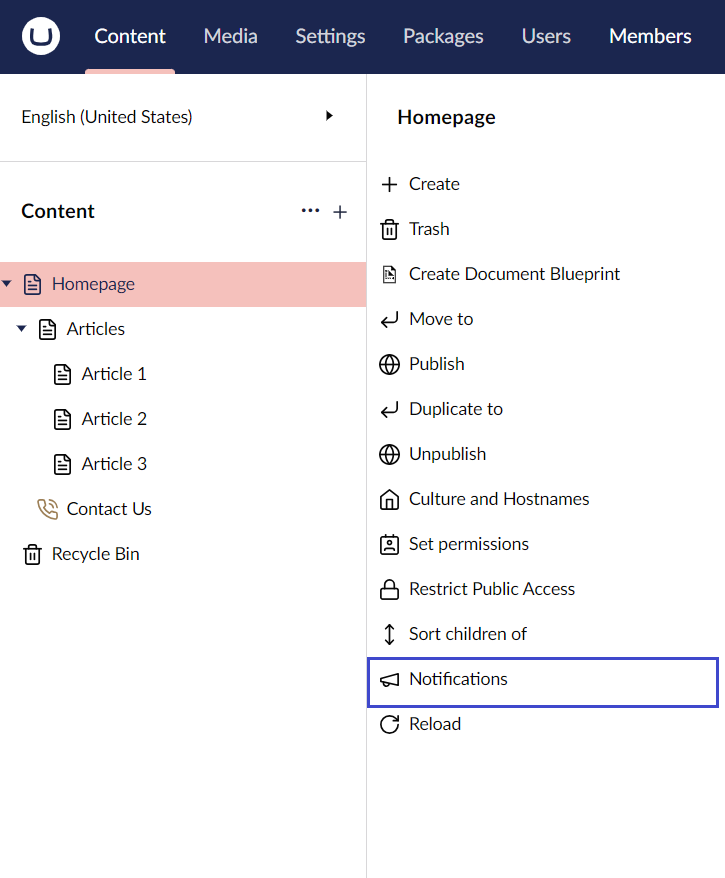
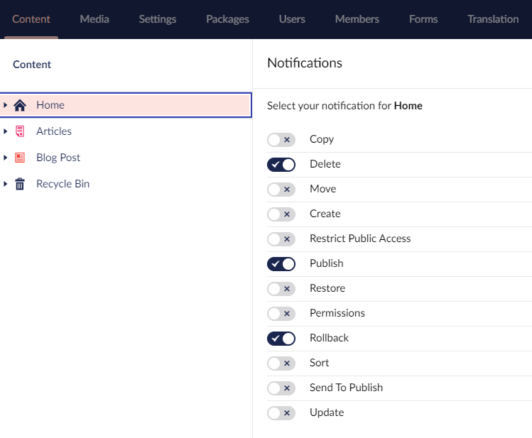

# Notifications

You can set up notifications to receive an email when an action is performed on a given content item. To receive notifications, you need to add your email address to your user profile.

To set up notifications for a content item:

1. Click **...** next to the page or select the page and click **Actions** in the top-right corner of the screen.
2.  Choose **Notifications**.

    
3.  Check the actions in which you are interested and you will receive notifications each time the given action occurs.

    
4. Click **Save**.


The notification settings apply to the chosen content item as well as any child items that appear below the item in the content tree.



If the notifications option does not appear, the SMTP settings are probably incorrect. In this case, contact the administrator of your website.

