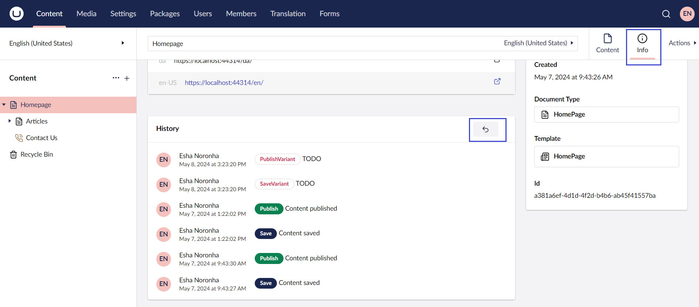
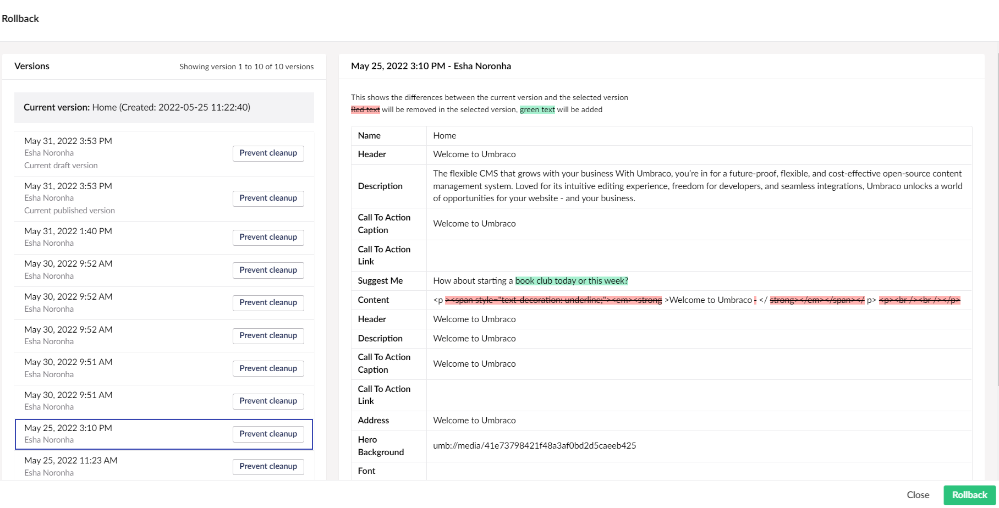

# Comparing Versions

You will never lose changes on a page because all the old versions of the page are saved in **History**.

To compare a page on the site with its previous versions:

1. Navigate to the page whose versions you wish to view.
2. Go to the **Info** tab.
3.  Click on the **Rollback** button in the **History** section.

    
4.  The Rollback window opens. Select a version you wish to compare with.

    After selecting the version, a comparison of the current page with the version you selected is displayed. The text highlighted in red and striked-out will not appear in the selected version and the text highlighted in green means the text that will be added, should you choose to rollback to that version of the page.

    
