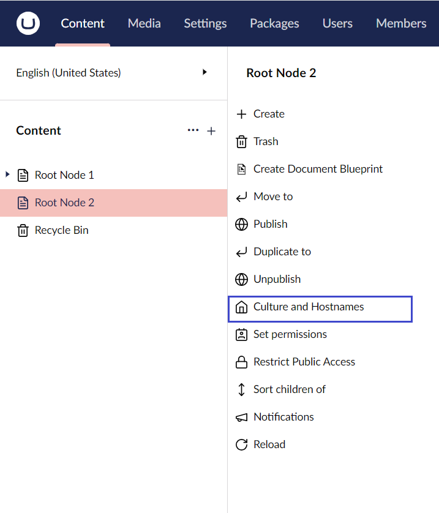
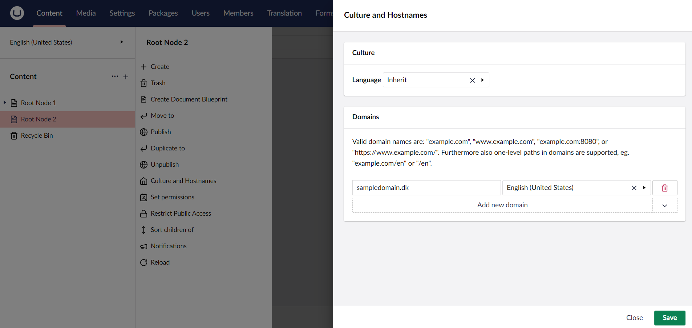
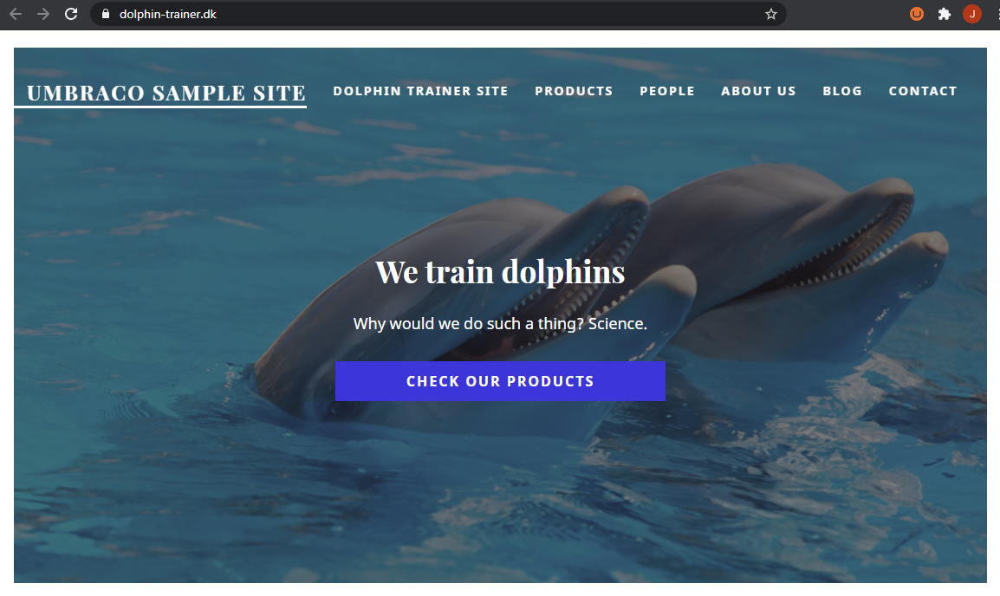
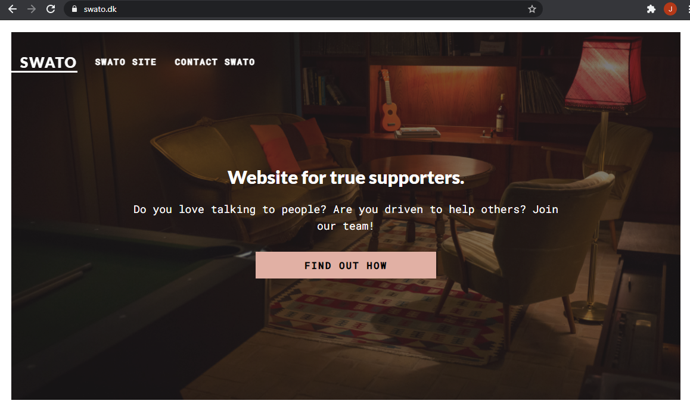

# Multisite Setup

This tutorial explains how to host multiple sites from one project or installation of Umbraco. For practical reasons, it is recommended to use [Baselines](https://docs.umbraco.com/umbraco-cloud/getting-started/baselines) on Umbraco Cloud projects.


When using Baselines on Umbraco Cloud for a multisite solution, you don’t need to worry about [Usage](https://docs.umbraco.com/umbraco-cloud/set-up/project-settings/usage) limits. You may also see better performance compared to hosting multiple websites in one project.


To create a multi-language site, see the [Creating a Multilingual Site](multilanguage-setup.md) tutorial.

## Structuring your website

The best way to handle a multisite solution is to create multiple root nodes in the Content section. Each root node acts as a separate website.

All websites in the solution use the same schema. In most cases, content pages on website A use the same properties as on website B.


On Umbraco Cloud, hostnames must be mapped to the project. Before mapping hostnames to individual websites, add them to the **Hostnames** page in the Cloud portal. This ensures they are secure with TLS.


Keep in mind that [hostnames must be configured in a specific way](https://docs.umbraco.com/umbraco-cloud/set-up/project-settings/manage-hostnames).

## Mapping the hostnames to individual websites/root nodes

At this point, multiple root nodes exist, each acting as a separate website. To map hostnames to root nodes:

1. Go to the **Content** section.
2. Click **...** next to the root node to assign the hostname.
3. Select **Culture and Hostnames**.

    
4. Click **Add new Domain** in the **Domains** section.
5. Enter the domain in the **Domain** field.
6. Select the language from the **Language** drop-down list. For multilanguage setups, different hostnames can map to specific languages.

    

7. Click **Save**.
8. Repeat steps 2-7 for each root node in the Content tree.

The sites are now available under the assigned domains.

## Best practices

This setup can be useful, but it also has drawbacks. Keep in mind that having multiple sites in one Umbraco project:

* Might increase resource usage.
* Could interfere with editors' workflows, especially if multiple people are working on both websites at once. This is because the solution still uses one shared database for both websites.
* Limits options for developing new features and making schema changes.

On Umbraco Cloud, it is recommended to use [Baselines](https://docs.umbraco.com/umbraco-cloud/getting-started/baselines). Baselines provide added benefits and greater stability compared to hosting multiple sites in one project.
