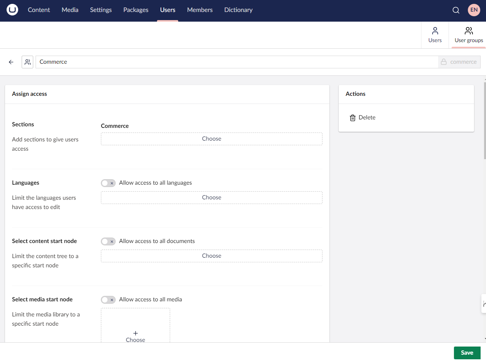

# Configuration

Before you can start to use Umbraco Commerce, you need to configure Umbraco to allow access to the relevant sections. The Umbraco Commerce UI is split over three sections within the Umbraco backoffice:

* **Settings** for managing the different store settings.
* **Commerce** for managing store-related content (orders, discounts, etc).
* **Content** for managing the Umbraco Commerce products.

In order to access these sections, you will need to ensure a User account with the relevant permissions to do so. When logged in as Administrator, access to the **Settings** and **Content** sections is already granted.

To gain access to the **Commerce** section additional configuration is needed.

## Creating a Commerce User Group

To gain access to the **Commerce** section, it is advised to create a new User Group called **Commerce**.

1. Navigate to the **User** section of the Umbraco backoffice.
2. Open the **User Groups** page.
3. Create a new User Group called **Commerce**.
4. Allow that User Group access to the **Commerce** section as a whole.
5. Click **Save**.
6. Navigate to the **Users** section.
7. Click on the User.
8. Choose **Commerce** in the **Groups** field to assign the user access to the Commerce section.
9. Click **Save**.

Creating a custom User Group provides a way of managing Users who have access to the **Commerce** section, rather than allowing individual Users access.

Learn more about [Users and User Groups in the Umbraco CMS Documentation](https://docs.umbraco.com/umbraco-cms/fundamentals/data/users).

## Accessing the Commerce Section

Once created and assigned, you should be able to refresh the backoffice and see that we now have access to the new **Commerce** section.

For more information on gaining [access to the store](../tutorials/build-a-store/permissions.md).

Further information on [store configuration](../tutorials/build-a-store/configure-store.md).
