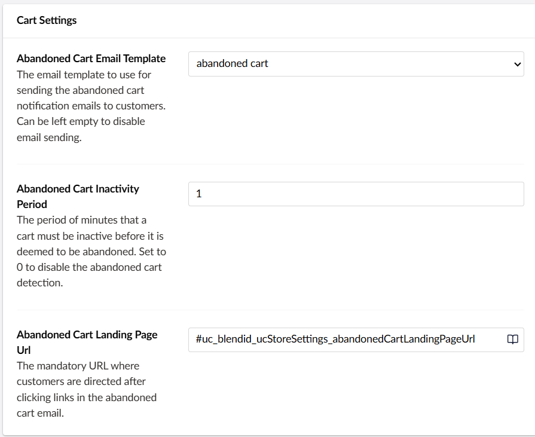
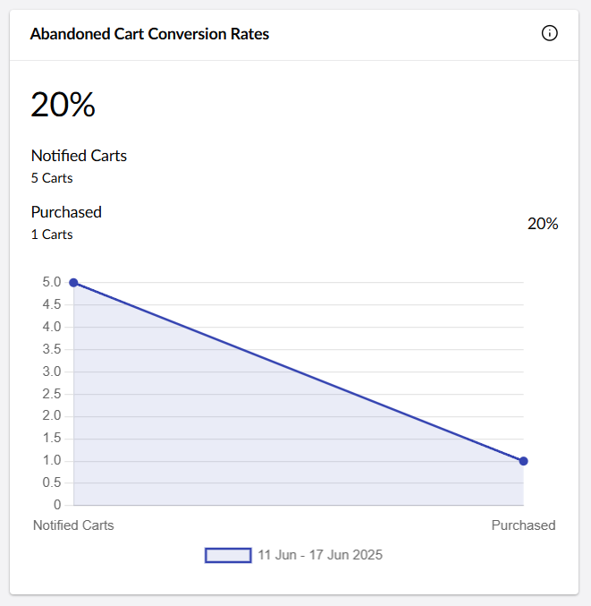

# Configuring Abandoned Cart Notification


Available from Umbraco Commerce 16.1.0


## Abandoned Cart Recurring Background Job

The abandoned cart recurring background job automatically sends reminder emails to customers about items left in their shopping carts. You can configure it using the steps below:
- Go to Store Settings in your admin dashboard.
- Select the store you want to configure.
- Scroll down to the Cart Settings section.
- Choose your Abandoned Cart Email Template. If the email template is not set, no notification will be sent but the webhooks can still be fired.
- Set the period of minutes that a cart must be inactive before it is deemed to be abandoned. If the value is 0, the abandoned cart detection is disabled.
- Enter the landing page URL for customers to be redirected to when they click on the links in the abandoned cart email.
- Click the Save button to apply your changes.




The advanced settings can be configured in the `appsettings.json`

```json
{
    "Umbraco" : {
        "Commerce": {
            // Optional settings
            "AbandonedCartNotifierService": {
                "Enable": false,
                "FirstRunTime": "",
                "Period": "1.00:00:00",
                "NotificationBatchSize": 20
            }
        }
    }
}
```

The `appsettings.json` section supports the following keys.

| Key | Description |
| -- | -- |
| `Enable` | Enable this feature.
| `FirstRunTime` | The time to first run the scheduled cleanup task, in crontab format. If empty, runs imediately on app startup. |
| `Period` | How often to run the task, in timespan format. Defaults to every 24 hours. |
| `NotificationBatchSize` | The number of abandoned carts processed each time the job is run. |

## Abandoned Cart Webhook
A new webhook called Cart Abandoned has been added. It is triggered when the Abandoned Cart Recurring Background Job detects any abandoned carts. The POST payload will look like this:
```json
{
  "orderIds": [
    "8b2cfad6-a0eb-4b87-ad86-019768ad1308",
    "95aa34bd-8a01-45a4-9492-019768ac6c61",
    "db9a2cc5-621a-40a3-9fab-019768a79d0a"
  ]
}
```

## Abandoned Cart Conversion Rates Widget

The widget shows how many notified abandoned carts are recovered through completed purchases, reflecting your store’s abandoned cart conversion rate.


