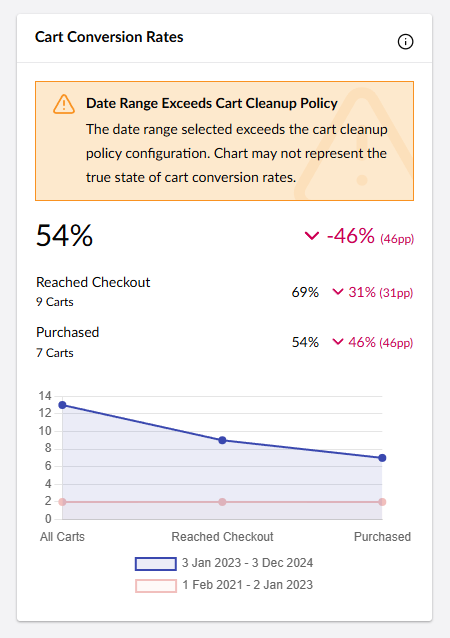

# Configuring Cart Cleanup


Available from Umbraco Commerce 15.1.0


By default Umbraco Commerce will keep all created carts indefinately. Over time this can become an issue. To assist with this is it possible to configure a cart cleanup routine to delete carts older than a pre-configured time interval.


This service can be enabled and configured in the `appSettings.json`

```json
{
    "Umbraco" : {
        "Commerce": {
            "CartCleanupPolicy": {
                "EnableCleanup": true,
                "KeepCartsForDays": 800,
                // Optional settings
                "FirstRunTime": "* 4 * * *",
                "Period": "1.00:00:00",
                "PerStorePolicies": {
                    "{STORE_ALIAS}": {
                        "KeepCartsForDays": 800,
                    }
                }
            }
        }
    }
}
```

The configuration supports the followin keys.

| Key | Description |
| -- | -- |
| `EnableCleanup` | Enables or disabled the cart cleanup service. `false` by default. |
| `KeepCartsForDays` | The number of days to keep carts after the carts last modification date. |
| `FirstRunTime` | The time to first run the scheduled cleanup task, in crontab format. If empty, runs imediately on app startup. |
| `Period` | How often to run the task, in timespan format. Defaults to every 24 hours. |
| `PerStorePolicies` | Define store specific policies. | 
| `PerStorePolicies.{STORE_ALAIS}.KeepCartsForDays` | The number of days to keep carts after the carts last modification date for the given store. | 

## Cart Conversion Rates Widget

When enabling the cart cleanup service, it's important to know that this can affect the cart conversion rates widget in the analytics section. If the widget is configured to show a time period that exceeds the cleanup policies time frame then a warning will be displayed.




