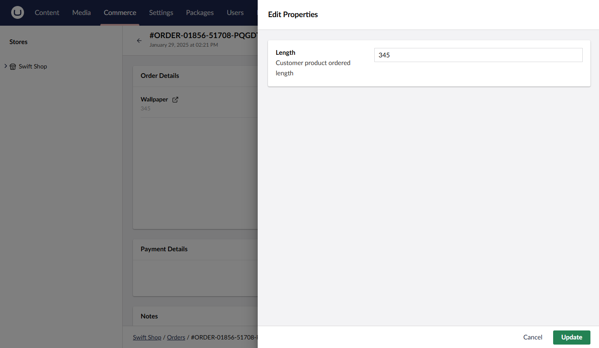

# Implementing Dynamically Priced Products

Sometimes products do not have a fixed price. Depending on the customer's requirements, the price of the product can change. Examples could be window blinds that a priced based on the size of the window, or wallpaper that is priced by the meter.

This guide shows you how to implement dynamically priced products in Umbraco Commerce.


This guide is not a direct follow-on from the [getting started tutorial](../tutorials/build-a-store/overview.md). It is assumed that your store is set up in a similar structure.


## Capturing User Input

Add a new field on the product's frontend page, to capture the desired length we want to purchase.


The selected length will reflect on the cart value.


To provide the correct calculations for an order, the captured data will need to go through two different processes behind the scenes:

* Store the user input against the order line property.
* Implement a custom order line calculator to calculate the prices based on the user input.

## Storing the User Input

1. Add a new property to the `AddToCartDto` class to capture the length.



```csharp
public class AddToCartDto
{
    ...
    public string? Length { get; set; }
}
```



2. Update the `AddToCart` method of the `CartSurfaceController` to store the length against the order line as a [property](../key-concepts/umbraco-properties.md).



```csharp
[HttpPost]
public async Task<IActionResult> AddToCart(AddToCartDto postModel)
{
    try
    {
        await _commerceApi.Uow.ExecuteAsync(async uow =>
        {
            var store = CurrentPage.GetStore();
            var order = await _commerceApi.GetOrCreateCurrentOrderAsync(store.Id)
                .AsWritableAsync(uow)
                .AddProductAsync(postModel.ProductReference, decimal.Parse(postModel.Quantity), new Dictionary<string, string>{
                    { "length", postModel.Length.ToString() }
                });

            await _commerceApi.SaveOrderAsync(order);

            uow.Complete();
        });
    }
    catch (ValidationException ex)
    {
        ...
    }
    ...
}
```



## Calculating the Order Line Price

We will calculate the price/tax rate of a given order line by multiplying the specified length by the unit price. This is done using a custom order line calculator.

1. Create a new class that implements the `IOrderLineCalculator` interface.



```csharp
public class SwiftOrderLineCalculator : IOrderLineCalculator
{
    private ITaxService _taxService;
    private IProductPriceFreezerService _productPriceFreezerService;

    public SwiftOrderLineCalculator(
        ITaxService taxService,
        IProductPriceFreezerService productPriceFreezerService)
    {
        _taxService = taxService;
        _productPriceFreezerService = productPriceFreezerService;
    }

    public async Task<Attempt<TaxRate>> TryCalculateOrderLineTaxRateAsync(OrderReadOnly order, OrderLineReadOnly orderLine, TaxSource taxSource, TaxRate fallbackTaxRate, OrderLineCalculatorContext context = null, CancellationToken cancellationToken = default)
    {
        order.MustNotBeNull(nameof(order));
        orderLine.MustNotBeNull(nameof(orderLine));

        TaxRate taxRate = fallbackTaxRate;

        if (orderLine.TaxClassId != null)
        {
            taxRate = (await _taxService.GetTaxClassAsync(orderLine.TaxClassId.Value)).GetTaxRate(taxSource);
        }

        return Attempt.Succeed(taxRate);
    }

    public async Task<Attempt<Price>> TryCalculateOrderLineUnitPriceAsync(OrderReadOnly order, OrderLineReadOnly orderLine, Guid currencyId, TaxRate taxRate, OrderLineCalculatorContext context = null, CancellationToken cancellationToken = default)
    {
        order.MustNotBeNull(nameof(order));
        orderLine.MustNotBeNull(nameof(orderLine));

        var numberOfMeters = order.Properties.TryGetValue(Constants.OrderProperties.Length, out var propertyValue)
            ? propertyValue.Value
            : string.Empty;

        var unitPrice = order.IsNew
            ? (await _productPriceFreezerService.GetProductPriceAsync(order.StoreId, order.Id, orderLine.ProductReference, orderLine.ProductVariantReference, currencyId)).ProductPrice.Value
            : (await _productPriceFreezerService.GetOrCreateFrozenProductPriceAsync(order.StoreId, order.Id, orderLine.ProductReference, orderLine.ProductVariantReference, currencyId)).Value;

        var price = !string.IsNullOrEmpty(numberOfMeters) && int.TryParse(numberOfMeters, out int result)
            ? result * unitPrice
            : orderLine.UnitPrice;

        var x = Price.Calculate(price, taxRate.Value, currencyId);

        return Attempt.Succeed(Price.Calculate(price, taxRate.Value, currencyId));
    }
}
```



2. Register the custom calculator in the `Startup.cs` file or in an `IComposer`.



```csharp
internal class SwiftShopComposer : IComposer
{
    public void Compose(IUmbracoBuilder builder)
    {
        builder.Services.AddUnique<IOrderLineCalculator, SwiftOrderLineCalculator>();
    }
}
```



## Backoffice UI

A useful extra step is to expose the captured data in the order's details in the Backoffice.

This is implemented as a custom [UI Extension](https://docs.umbraco.com/umbraco-commerce/key-concepts/ui-extensions/order-line-properties).

Create a new `umbraco-package.json` file in a folder in the `App_Plugins` directory in the root of your project and add the following code:



```json
{
    "name": "SwiftShop",
    "extensions": [
        {
            "type": "ucOrderLineProperty",
            "alias": "Uc.OrderLineProperty.ProductLength",
            "name": "Product Length",
            "weight": 400,
            "meta": {
                "propertyAlias": "productLength",
                "showInOrderLineSummary": true,
                "summaryStyle": "inline",
                "editorUiAlias": "Umb.PropertyEditorUi.TextBox",
                "labelUiAlias": "Umb.PropertyEditorUi.Label"
            }
        },
        {
            "type": "localization",
            "alias": "Uc.OrderLineProperty.ProductLength.EnUS",
            "name": "English",
            "meta": {
                "culture": "en",
                "localizations": {
                    "section": {
                        "ucProperties_productLengthLabel": "Length",
                        "ucProperties_productLengthDescription": "Customer product ordered length"
                    }
                }
            }
        }
    ]
}
```



The length property is now displayed in the order details in the Backoffice.


