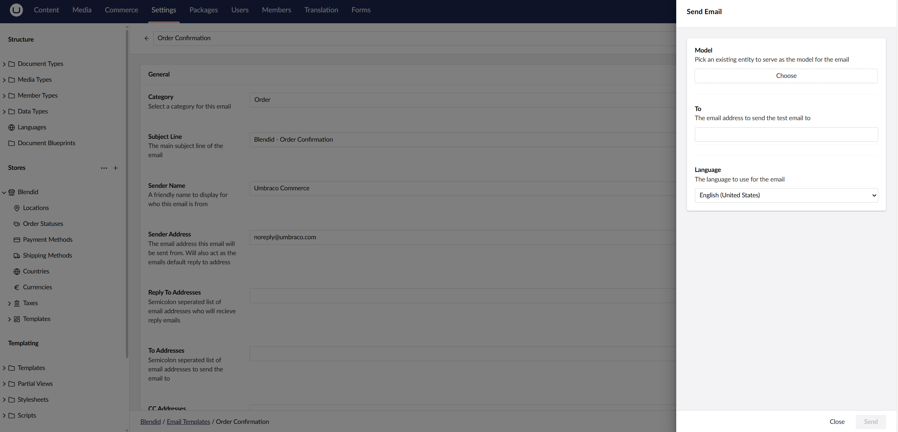

# Test your email templates

Want to see how your email templates look before sending them to the real customers? Umbraco Commerce 16.2.0, supports testing your email templates right out of the box. 



As of now, only templates under the **Cart**, **Order**, **Gift Card**, and **Discount** categories can be tested using the above steps.



## Steps
1. Go to the *Umbraco Backoffice* > *Settings*.
2. Select a store name.
3. Navigate to the *Email Templates* section.
4. Open the template you want to test.
5. Click the *Send Test Email* button.
6. Fill in the fields in the modal, and **make sure that the recipient is a test email address**.
7. Click the *Send* button.

An email with the information you provided should be sent to the test email address shortly.

## Screenshots
  
*Figure 1: Email Template Details screen in Umbraco backoffice.*

  
*Figure 2: The "Send Test Email" modal.*

  
*Figure 3: Order entity picker in the "Send test email" modal.*
