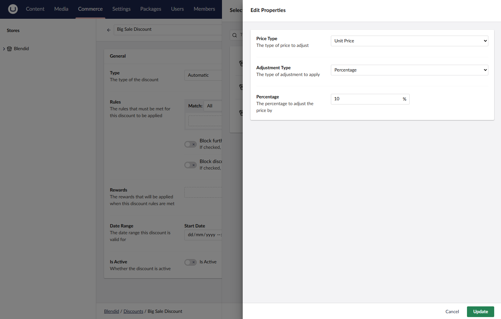

# Showing Discounted Prices

Imagine the following scenario: You’re preparing for a big sale and want to offer a 10% discount on all your products. With Umbraco Commerce’s powerful discount engine, discounts like these can be set up.

But there's a catch. Discounts are only applied once the product is added to the cart. So how do you show the discounted price before that, right on the product page?

This guide walks you through the process.


The calculate adjusted prices feature was introduced in Umbraco Commerce version 16.2.0


## Prepare the Discount

To start, set up an automatic discount with no rules but an Order Line Amount Reward set to apply a 10% discount to the unit price.




It is important that the discount applies an order line level reward. It is only order line rewards that will form part of the calculation.


## Display the Discounted Price

With the discount configured, you can now update your `ProductPage` view to use the new `TryCalculatePriceWithAdjustmentsAsync` extension method.



```csharp
var priceResult = await Model.AsProduct().TryCalculatePriceWithAdjustmentsAsync().ResultOrThrow();
if (priceResult.EffectiveUnitPrice.WithoutTax != priceResult.UnitPrice.WithoutTax)
{
    // Display the discounted price next to the original price with a strike through
    <text>@(await priceResult.EffectiveUnitPrice.FormattedAsync()) <span style="text-decoration: line-through;">@(await priceResult.UnitPrice.FormattedAsync())</span>
}
else
{
    // There is no discount so just show the unit price
    <text>@(await priceResult.UnitPrice.FormattedAsync())</text>
}
```



The `TryCalculatePriceWithAdjustmentsAsync` method returns the following model containing the calculation details.

```csharp
public class AdjustedProductPriceCalculatorResult
{
    /// <summary>
    /// Original product unit price before any adjustments
    /// </summary>
    public Price UnitPrice { get; }

    /// <summary>
    /// Quantity of the product being priced
    /// </summary>
    public decimal Quantity { get; }

    /// <summary>
    /// Unit price after unit-level discounts only (per individual item)
    /// This reflects discounts applied at the unit level (e.g., percentage off per item)
    /// </summary>
    public ReadOnlyTotalPrice AdjustedUnitPrice { get; }

    /// <summary>
    /// Line level total price after all discounts (unit + total level)
    /// This is (AdjustedUnitPrice * Quantity) + any line total-level discount adjustments
    /// </summary>
    public ReadOnlyTotalPrice AdjustedLineTotalPrice { get; }

    /// <summary>
    /// Effective unit price after all adjustments
    /// </summary>
    public Price EffectiveUnitPrice   { get; }

    /// <summary>
    /// Total discount amount per unit across all levels (unit + line + order)
    /// </summary>
    public Price TotalDiscountPerUnit  { get; }

    /// <summary>
    /// Percentage discount applied across all levels
    /// </summary>
    public decimal TotalDiscountPercentage  { get; }

    /// <summary>
    /// List of discount codes that were applied during the calculation
    /// IsFulfilled indicates if the discount was successfully applied
    /// </summary>
    public IReadOnlyCollection<AppliedDiscountCode> AppliedDiscountCodes  { get; }

    /// <summary>
    /// List of fulfilled discounts that were applied during the calculation
    /// Discounts can be automatic or from codes
    /// </summary>
    public IReadOnlyCollection<FulfilledDiscount> AppliedDiscounts  { get; }
}
```

## Displaying the Discounted Price via the Storefront API

If you are working with a headless solution, the `GET /umbraco/commerce/storefront/api/v1/products` endpoint can be passed the following query parameters:

| Key | Value | Description |
| -- | -- | -- |
| `calculateAdjustedPrices` | `boolean` (default: `false`) | Toggles whether to return calculated adjusted prices |
|  `adjustedPriceCalculationQuantity` | `decimal` (defualt: 1) | Set the quantity to use for the calculation |
| `adjustedPriceCalculationDiscountCodes` | `string` | Any discount codes to apply for the calculation |

Returned products will now have an additional `priceWithAdjustments` property containing the same properties as detailed above.

See the [Product Storefront Endpoint](../reference/storefront-api/endpoints/product.md) for more details.
