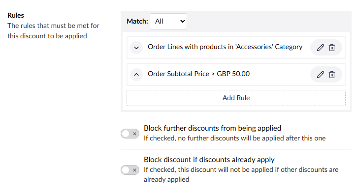

# Discounts

The discount system is a powerful and flexible way to apply different types of discounts to orders based on a wide range of conditions. Discounts can be configured to apply automatically or via a discount code, and can be targeted to specific products, categories, member groups, and more.

## Overview

Discounts provide a comprehensive solution for promotional pricing strategies. Whether you need percentage-off campaigns or multi-tier discount structures, the system supports both automated discounts that apply based on conditions. Manual discount codes can also be entered by customers during checkout.

The discount system consists of three main components:
- **Rules** - Define the conditions that must be met for a discount to apply
- **Rewards** - Specify what discount should be given when rules are satisfied
- **Configuration** - Control when, how, and to whom discounts are available

## Creating a Discount

To create a new discount, navigate to the Commerce section in the Umbraco backoffice and select **Discounts** from the sidebar. Click the **Create** button to open the discount creation interface.

## Basic Configuration

- **Name and Alias** - Every discount requires a unique **Name** for display purposes and an **Alias** for programmatic reference. The name appears in the backoffice and on customer receipts, while the alias is used internally by the system.
- **Type** - Choose between **Automatic** or **Code** discounts.
  - When **Code** is selected:
    - **Codes** - Enter one or more discount codes that customers can use and set a usage limit or allow unlimited usage.
  - **Date Range** - Set the active period for the discount using the **Start Date** and **Expiry Date** date fields.
  - **Is Active** - Toggle to enable or disable the discount without deleting it.

## Rules System

The rules system determines when a discount should be applied. Rules can be single conditions or complex multi-layered logic structures.

### Rule Builder Interface
The visual rule builder allows you to construct discount conditions using a drag-and-drop interface. Rules can be combined using logical operators to create sophisticated discount scenarios.

### Logical Operators
Rules can be grouped using three types of logic:
- **`ALL`** - Every rule in the group must be satisfied
- **`ANY`** - At least one rule in the group must be satisfied
- **`FUNNEL`** - Rules are applied sequentially, with matching items passed to the next rule

### Blocking Options
Rules can include blocking conditions to prevent discount stacking:
- **Block Further Discounts** - Prevent other discounts from applying if this one is used
- **Block if Other Discounts Apply** - Don't apply this discount if others are already active

For detailed information about available rules and their configuration, see the [Rules Reference](rules/).

## Rewards System

Rewards define what discount should be applied when rules are satisfied. The system supports different reward types for different discount scenarios.

### Reward Types
- **Order Amount Rewards** - Apply discounts to order subtotal, shipping, payment, or total
- **Order Line Rewards** - Apply discounts to specific order lines or products

### Discount Methods
Most rewards support multiple discount methods:
- **Percentage** - Apply a percentage discount (e.g., 10% off)
- **Fixed Amount** - Apply a fixed monetary discount (e.g., $5 off)

For detailed information about available rewards and their configuration, see the [Rewards Reference](rewards/).

## Discount Ordering and Priority

Discounts are processed in the order they appear in the discount list. This ordering can significantly impact how multiple discounts interact with each other.

### Reordering Discounts
You can change the processing order by:
1. From the sidebar, click the `...` button on the **Discounts** menu item.
2. Select **Sort** menu option.
3. Drag and drop discounts to reorder them.
4. Click the **Sort** button to apply the new order.

### Best Practices for Ordering
- Place percentage-based discounts before fixed-amount discounts
- Order more restrictive discounts before general ones
- Consider how blocking rules interact with discount order

## Integration and Extensibility

The discount system is built with extensibility in mind. Developers can create custom rules and rewards to meet specific business requirements.

See the [Discount Rules & Rewards Key Concepts](../../key-concepts/discount-rules-and-rewards.md) for guidance on creating custom rules & rewards.
