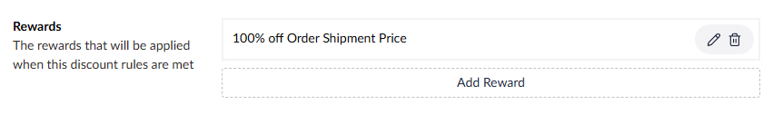
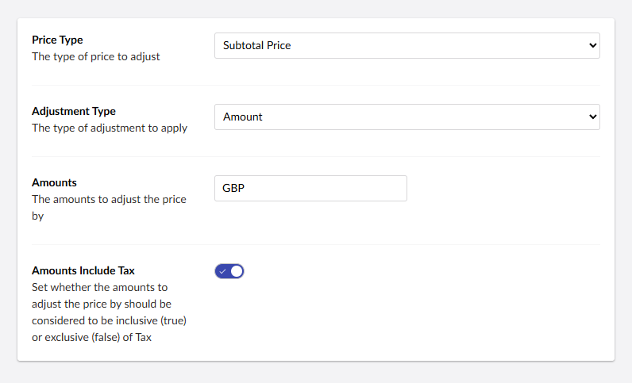
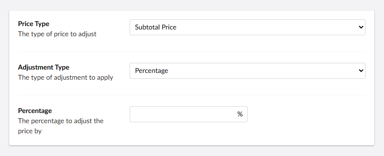
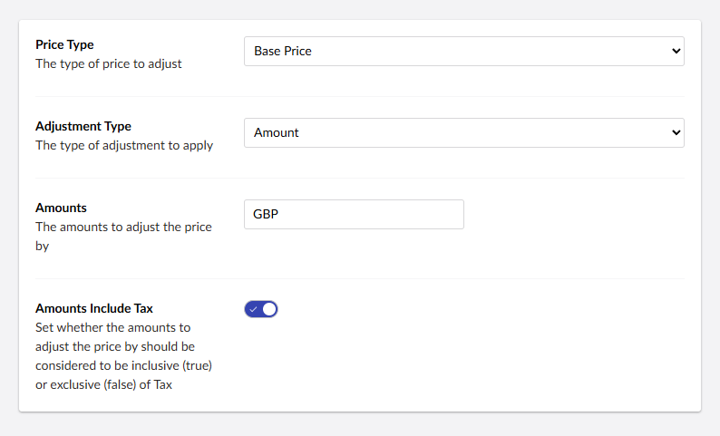
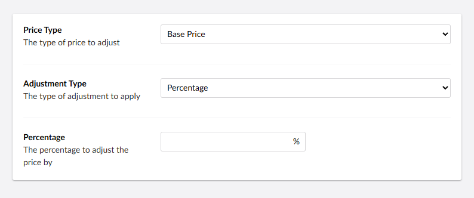
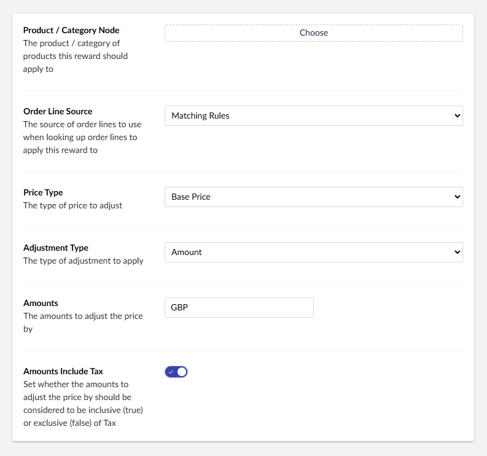
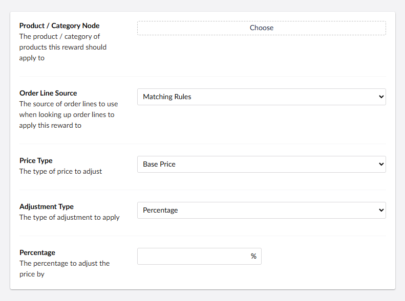

# Discount Rewards

Discount rewards define what discount should be applied when discount rules are satisfied. The reward system supports discounts such as percentage reductions, product-specific offers, and free shipping promotions.

## How Rewards Work

When discount rules are satisfied, the associated rewards are applied to the order. Rewards can target different aspects of an order, including the overall order value, specific order lines, shipping costs, or payment fees.

The rules system determines when a discount should be applied. Rules can be single conditions or complex multi-layered logic structures.

### Logical Operators
Rules can be grouped using three types of logic:
- **`ALL`** - Every rule in the group must be satisfied
- **`ANY`** - At least one rule in the group must be satisfied
- **FUNNEL** - Rules are applied sequentially, with matching items passed to the next rule

### Funnel Logic
Funnel logic is particularly powerful for product-specific discounts. Order lines that match the first rule are passed to subsequent rules for additional filtering. This enables scenarios like "Buy 2 shirts and get 20% off pants" where the system first identifies shirt purchases, then applies discounts to pants.

### Blocking Options
Rules can include blocking conditions to prevent discount stacking:
- **Block Further Discounts** - Prevent other discounts from applying if this one is used
- **Block if Other Discounts Apply** - Don't apply this discount if others are already active

For detailed information about available rules and their configuration, see the [Rules Reference](../rules/).

## Reward Types

### Order Amount Reward
Applies discounts to various aspects of the overall order amount, including subtotal, shipping, payment fees, or the complete order total.

**Configuration:**
- **Price Type** - Choose what to discount (subtotal, shipping, payment, or total)
- **Adjustment Type** - Amount or percentage
  - When **Amount** is selected:
    - **Amounts** - Define the discount value for amount based adjustments
    - **Amounts Include Tax** - Whether the amounts include tax or not (defaults to the stores tax setting)
  - When **Percentage** is selected:
    - **Percentage** - Define the discount percentage for percentage based adjustments

**Price Types:**
- **Subtotal Price** - The total of all order line amounts before shipping and fees
- **Shipment Price** - The shipping cost for the order
- **Payment Price** - Payment processing fees
- **Total Price** - The complete order total including all fees

**Use Cases:**
- Site-wide sales and promotions
- Free shipping offers
- Payment method incentives
- Volume-based discounts

### Order Line Amount Reward
Applies discounts to specific order lines based on various criteria such as product categories, sections, or custom properties.

**Configuration:**
- **Price Type** - Choose what to discount (base price, unit price or total)
- **Adjustment Type** - Amount or percentage
    - When **Amount** is selected:
        - **Amounts** - Define the discount value for amount based adjustments
        - **Amounts Include Tax** - Whether the amounts include tax or not (defaults to the stores tax setting)
    - When **Percentage** is selected:
        - **Percentage** - Define the discount percentage for percentage based adjustments

**Price Types:**
- **Base Price** - The base price of any bundle order line
- **Unit Price** - The price per individual item
- **Total Price** - The complete order line total including all fees

**Use Cases:**
- Clearance discounts
- Brand promotions
- Seasonal offers

### Order Line Product Reward
Applies discounts to specific order lines containing particular products. This reward type provides precise control over which products receive discounts.

**Configuration:**
- **Product / Category Node** - Select the specific product or category to target
- **Order Line Source** - Choose whether to target products matching rules or the entire order
- **Price Type** - Choose what to discount (base price, unit price or total)
- **Adjustment Type** - Amount or percentage
    - When **Amount** is selected:
        - **Amounts** - Define the discount value for amount based adjustments
        - **Amounts Include Tax** - Whether the amounts include tax or not (defaults to the stores tax setting)
    - When **Percentage** is selected:
        - **Percentage** - Define the discount percentage for percentage based adjustments

**Use Cases:**
- Product-specific promotions
- Inventory clearance
- Cross-selling incentives
- Bundle discounts

## Custom Reward Provider Development

The reward system is extensible, allowing developers to create custom rewards for specific business needs.

See the [Discount Rules & Rewards Key Concepts](../../../key-concepts/discount-rules-and-rewards.md) for guidance on creating custom rules.
