# Discount Rules

Discount rules define the conditions that must be met for a discount to be applied to an order. The rule system in Umbraco Commerce is highly flexible, allowing you to create single-condition rules or complex multi-layered logic structures.

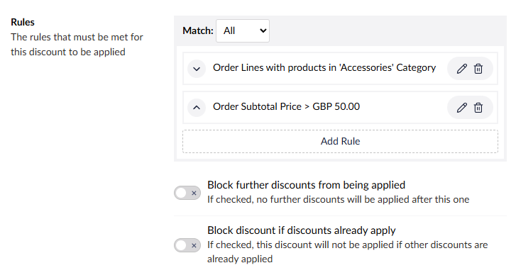

## How Rules Work

Rules are evaluated against orders during the checkout process. When all conditions within a rule (or rule group) are satisfied, the associated discount rewards are applied. Rules can be combined using logical operators to create sophisticated discount scenarios.

## Rule Types

### Group Rule
The Group rule acts as a container for other rules, allowing you to combine multiple conditions using logical operators.

**Configuration:**
- **Match Type** - Choose between `ALL`, `ANY`, or `FUNNEL` logic
- **Child Rules** - Add one or more rules to the group

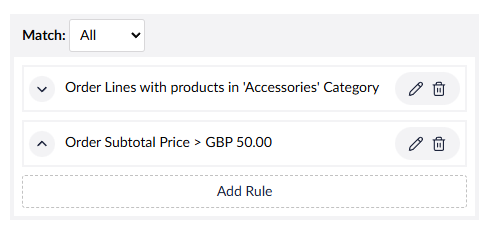

**Match Types:**
- **`ALL`** - Every child rule must be satisfied
- **`ANY`** - At least one child rule must be satisfied
- **`FUNNEL`** - Rules are applied sequentially, with matching line items passed to the next rule

For detailed examples and explanations of how each match type works, see [Rule Logic and Grouping](#rule-logic-and-grouping).

**Use Cases:**
- Complex multi-condition discounts
- Hierarchical rule structures
- Sequential filtering scenarios

### Country Rule
Checks if the order's billing or shipping country matches specific countries.

**Configuration:**
- **Country** - Select a country to match against
- **Country Source** - Choose between billing or shipping address

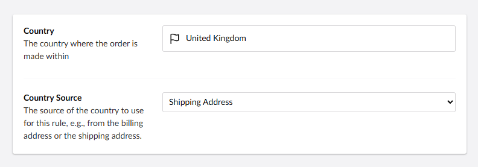

**Use Cases:**
- Geographic promotions (e.g., "Free shipping to EU countries")
- Market-specific discounts
- Compliance with regional pricing requirements

### Member Group Rule
Verifies if the customer belongs to specific member groups in Umbraco.

**Configuration:**
- **Customer Source** - Choose between the customer on the order or the current logged-in user
- **Member Groups** - Select one or more member groups
- **Match Type** - Customer must be in `ANY` or `ALL` selected groups

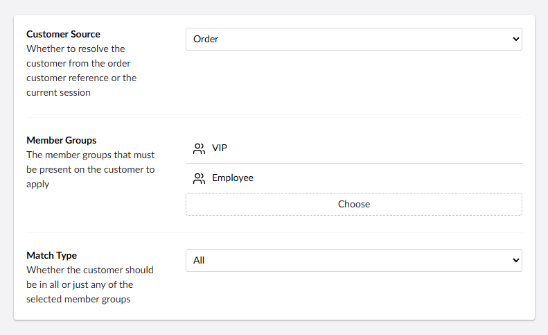

**Use Cases:**
- VIP customer discounts
- Membership tier benefits
- Employee or partner pricing
- Customer loyalty programs

### Order Amount Rule
Compares the total order value against specified amounts.

**Configuration:**
- **Price Type** - Choose from subtotal, total, shipping, or payment fees
- **Comparison Operator** - Greater than, less than, equal to, between, etc
- **Amounts** - The values per currency to compare against
- **Amounts Include Tax** - Whether the above amounts include tax (defaults to the stores tax setting)

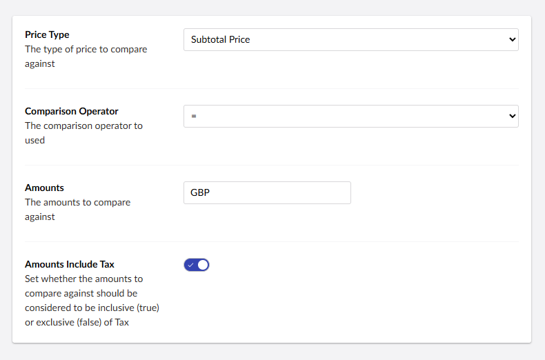

**Use Cases:**
- Minimum purchase requirements
- Free shipping thresholds
- Volume-based discounts
- Order value tiers

### Order Line Amount Rule
Evaluates the total value of specific order lines that match certain criteria.

**Configuration:**
- **Price Type** - Choose from base price, unit price, or line total
- **Comparison Operator** - Greater than, less than, equal to, between, etc
- **Amounts** - The values per currency to compare against
- **Amounts Include Tax** - Whether the above amounts include tax (defaults to the stores tax setting)
- **Accumulative** - Whether to sum matching lines or evaluate individually

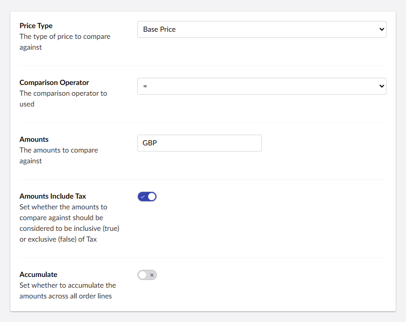

**Use Cases:**
- Product-specific spend thresholds
- High-value item filtering
- Conditional bundling discounts 

### Order Line Product Rule
Checks if specific products are present in the order lines.

**Configuration:**
- **Product** - The product to match against  (search by name or SKU)

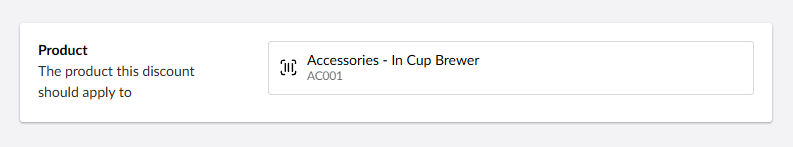 

**Use Cases:**
- Product-specific promotions
- Cross-selling incentives
- Inventory clearance discounts

### Order Line Product Category Rule
Evaluates whether products from specific categories are in the order.

**Configuration:**
- **Category** - The category to match against

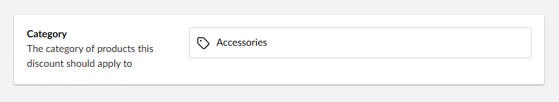

**Use Cases:** 
- Category-wide sales
- Seasonal promotions
- Department-specific discounts

### Order Line Product Section Rule
Checks if products from specific sections of the website are in the order.

**Configuration:**
- **Section** - The section of the website under which a product must be organized

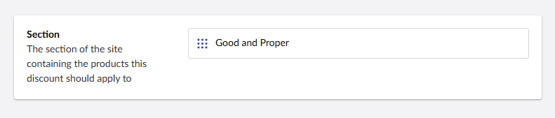

**Use Cases:**
- Site section promotions
- Brand-specific discounts
- Departmental sales
- Landing page campaigns

### Order Line Quantity Rule
Compares the quantity of specific order lines against target values.

**Configuration:**
- **Comparison Operator** - Greater than, less than, equal to, between, etc
- **Quantity** - The quantity to compare against
- **Accumulative** - Whether to sum matching lines or evaluate individually

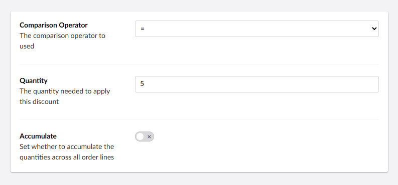

**Use Cases:**
- Bulk purchase discounts
- Buy X get Y promotions
- Minimum quantity requirements
- Inventory movement incentives

### Payment Method Rule
Verifies if a specific payment method is being used for the order.

**Configuration:**
- **Payment Method** - Select the payment method to match against

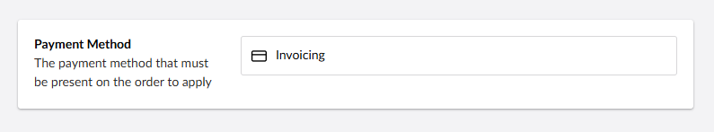

**Use Cases:**
- Payment method incentives (e.g., "5% off for bank transfers")
- Credit card promotions
- Alternative payment discounts
- Processing fee offsets

### Shipping Method Rule
Checks if a specific shipping method is selected for the order.

**Configuration:**
- **Shipping Method** - Select the shipping method to match against

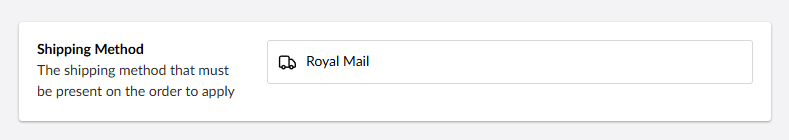

**Use Cases:**
- Shipping method promotions
- Express delivery discounts
- Local pickup incentives
- Carrier-specific offers

### Property Rule
Evaluates custom properties on orders or order lines against specified values.

**Configuration:**
- **Property Source** - Order or order line properties
- **Property Alias** - The alias of the property to evaluate
- **Comparison Operator** - Equals, contains, greater than, etc.
- **Property Value** - The value to compare against

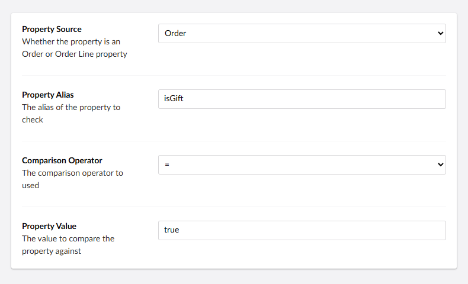

**Use Cases:**
- Custom business logic
- Third-party system integration
- Advanced product attributes
- Custom customer data evaluation

## Rule Logic and Grouping

### `ALL` Logic
All child rules within the group must be satisfied for the group to pass. This creates an "`AND`" relationship between rules.

**Example:** Free shipping for VIP members with orders over $100
- Rule Group (`ALL` Logic)
  - Member Group Rule: "VIP Members"
  - Order Amount Rule: Greater than £100

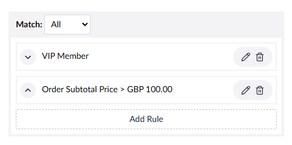

### `ANY` Logic
At least one child rule within the group must be satisfied for the group to pass. This creates an "OR" relationship between rules.

**Example:** Student or senior citizen discount
- Rule Group (`ANY` Logic)
  - Member Group Rule: "Students"
  - Member Group Rule: "Senior Citizens"

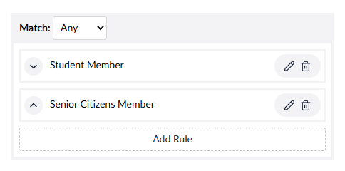

### `FUNNEL` Logic
Rules are applied sequentially, with order lines that match the first rule being passed to subsequent rules for additional filtering. This is particularly powerful for product-specific discounts.

**Example:** Buy more than 2 accessories to get a discount
- Rule Group (`FUNNEL` Logic)
  - Order Line Product Category Rule: "Accessories"
  - Order Line Quantity: Greater than 2

The funnel logic first identifies orders with accessories, then checks if the quantity of those accessories exceeds 2 to apply the discount.

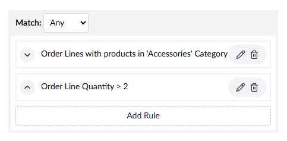

## Rule Blocking Options

Rules can include blocking conditions to prevent discount stacking and ensure certain discounts are prioritized.

**Options:**
- **Block further discounts from being applied** - Prevent other discounts from applying if this one is used
- **Block discount if discounts already apply** - Don't apply this discount if others are already active

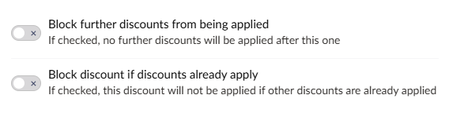

**Use Cases:**
- Exclusive promotions
- Preventing over-discounting
- Prioritizing high-value discounts

## Rule Performance Considerations

### Optimization Tips
- **Order Rules by Complexity** - Place simpler rules first to fail fast
- **Use Specific Product Rules Sparingly** - They can be more resource-intensive
- **Limit Deep Nesting** - Avoid overly complex rule hierarchies
- **Cache Expensive Calculations** - For custom property rules with complex logic

## Custom Rule Provider Development

The rule system is extensible, allowing developers to create custom rules for specific business requirements.

See the [Discount Rules & Rewards Key Concepts](../../../key-concepts/discount-rules-and-rewards.md) for guidance on creating custom rules.
