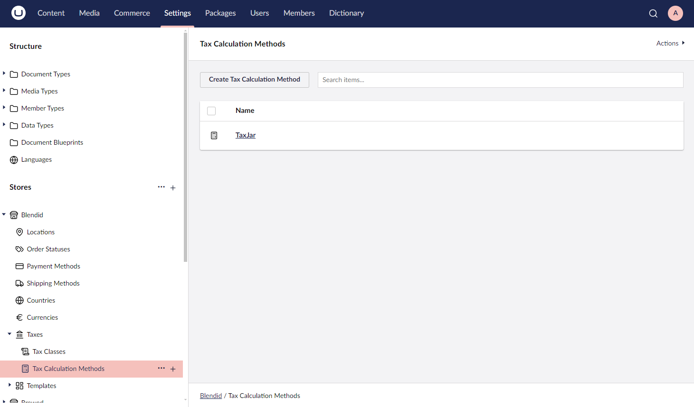

---
description: Calculated Rate Taxes in Umbraco Commerce.
---

# Calculated Tax Rates

This option allows you to dynamically calculate the tax obligations of an order by using third-party calculation platforms. This complex option is useful for countries with different tax rates for different product types or regions within the country (the norm in the US).

When using calculated rate taxes, taxes are calculated as a single price adjustment against the order total price and will not offer any breakdown.

Calculated tax rates are configured using **Tax Calculation Methods**. A tax calculation method provides a connection to a third-party calculation service via a [Sales Tax Provider](../../key-concepts/sales-taxt-providers.md). The sales tax provider passes the order details to the calculation service and returns the tax amount to be applied to the order.


Before you can configure a tax calculation method, you will need to install at least one [sales tax provider](../../key-concepts/sales-taxt-providers.md).

A TaxJar example is provided on GitHub at [https://github.com/umbraco/Umbraco.Commerce.SalesTaxProviders.TaxJar](https://github.com/umbraco/Umbraco.Commerce.SalesTaxProviders.TaxJar)


## Tax Calculation Method Configuration

1. Go to **Settings > Stores > {Your Store} > Taxes > Tax Calculation Methods**.

2. Click on the **Create Tax Calculation Method** button.
3. Choose a **Sales Tax Provider** from the list.

4. Enter the **Tax Calculation Method Name** and **Alias**.
5. Configure the **Tax Calculation Method** settings.

6. Click **Save**.

## Assigning a Tax Calculation Method

Tax calculation methods are assigned to a **Country** entity. This allows you to define different tax calculation methods for different countries. The tax calculation method assigned to an order's shipping country will be used to calculate the tax amount for the order.

## Providing Tax Codes

When calculating taxes, you may need to provide product tax codes to the calculation service. Tax codes are used to identify the type of product being sold and used by the calculation service to determine the correct tax rate. To assign a tax code to a product, you can use a **Tax Class** with a code defined for the given country.

See [Tax Classes Configuration](./fixed-tax-rates.md#tax-class-configuration) for more information on how to configure tax classes.

## Prices Inclusive of Tax

It is possible to configure a store to accept prices including tax. When using tax calculation methods it is not possible to enable this feature. A warning will show if you try to do so and a tax calculation method is already defined on a stores country.

