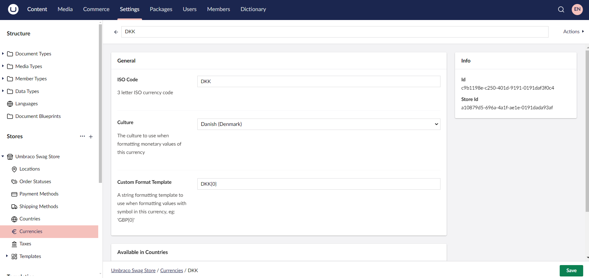

# Configuring your Store

Each store comes with a set of predefined configurations that you can extend, covering:

* [Locations](#setting-up-a-location)
* [Order Statuses](#setting-up-order-statuses)
* [Payment Methods](#setting-up-payment-methods)
* [Shipping Methods](#setting-up-shipping-methods)
* [Countries](#setting-up-a-country)
* [Currencies](#setting-up-a-currency)
* [Taxes](#setting-up-taxes)
* [Templates](#setting-up-templates)

## Setting up a Location

If your business operates in multiple regions, setting up locations helps:

* Configure stores for different locations with separate languages, shipping addresses, regional offers, local regulations, and payment gateways.
* Ship products from different locations. The system can be set up to route orders to the nearest warehouse based on the customer’s location.

### Steps to set up a location

1. Select your store from the **Stores** menu in the **Settings** section. In this case, *Umbraco Swag Store*.
2. Go to **Locations** under the Store.
3. Click **Create Location**.
4. Enter the **Name** for the Location. For example: *Denmark*
5. Provide the necessary address details.

6. **Save** the changes.

## Setting up Order Statuses

Order Status tracks the progression of an order. It helps both the store owner and customers track the order's progress from the moment it is placed until it is delivered (or returned).

When you first set up Umbraco Commerce, it comes with predefined order statuses to help manage the order lifecycle. These statuses include *New*, *Completed*, *Cancelled*, and *Error*. The statuses can be customized based on your specific business requirements.

### Steps to create an order status

1. Go to **Order Statuses** under the Store.
2. Click **Create Order Status**.
3. Enter a **Name** for the order status. For Example: *Processing*
4. Select a **Color** for the order status.

5. **Save** the changes.

## Setting up Payment Methods

Payment Methods define the payment options available in the store. By default, Umbraco Commerce includes basic providers like **Invoicing** and **Zero Value** to get started.

Umbraco Commerce also supports the integration of different third-party payment gateways. For more information, see the [Umbraco Commerce Payment Providers Documentation](../../../../commerce-add-ons/payment-providers/README.md).

### Steps to set up a payment method

1. Go to **Payment Methods** under the Store.
2. Click **Create Payment Method**.
3. Select a payment provider from the list. For example: *Zero Value*.
4. Enter a **Name** for the payment method. For example: *Zero Payment*.
5. Configure the payment method as per your requirements.

6. **Save** the changes.

## Setting up Shipping Methods

Shipping methods determine how customers receive their orders. Setting up shipping methods effectively is crucial, as it impacts customer satisfaction, fulfillment costs, and overall operational efficiency.

By default, Umbraco Commerce comes with the basic Pickup option. For more information on the integration for different providers, see the [Umbraco Commerce Shipping providers Documentation](../../../../commerce-add-ons/shipping-providers/README.md).

### Steps to create a shipping method

1. Go to **Shipping Methods** under the Store.
2. Click **Create Shipping Method**.
3. Choose the shipping provider from the list. For Example: *DHL*.
4. Enter a **Name** for the shipping method. For example: *DHL*.
5. Configure the shipping method as per your requirements.

6. **Save** the changes.

## Setting up a Country

Setting up a country involves configuring settings related to shipping, payment methods, tax rates, localization, legal compliance requirements, and so on for that specific country.

### Steps to set up a country

1. Go to **Countries** under the Store.
2. Click **Create Country**.
3. Choose an item from the list. For Example: *Create Country from ISO 3166 preset*.
4. Select a country from the list. For example: *Denmark*.
5. Configure the country details as per your requirements.

6. **Save** the changes.

## Setting up a Currency

Setting up currency is essential for ensuring that prices are displayed and transactions are processed accurately. For information on configuring an exchange rate service, see the [Currency Exchange Rate Service Provider](../../key-concepts/currency-exchange-rate-service-providers.md) article.

### Steps to set up a currency

1. Go to **Currencies** under the Store.
2. Click **Create Currency**.
3. Enter a **Name** for the currency. For Example: `DKK`.
4. Configure the currency details as per your requirements.

5. **Save** the changes.

## Setting up Taxes

Tax setup is crucial for compliance with local regulations and for ensuring that your pricing is accurate and transparent. You can set up tax rates for each jurisdiction where you must collect tax. For more information, see the [Tax Sources](../../key-concepts/tax-sources.md) article.

### Steps to set up taxes

1. Go to **Taxes** under the Store.
2. Click **Create Tax Class**.
3. Enter a **Name** for the tax class. For Example: *Custom*.
4. Configure the tax rates as per your requirements.

5. **Save** to changes.

## Setting up Templates

Defines the different **Email**, **Print**, and **Export** templates available for the store. These templates help maintain consistency and professionalism in communication with customers and facilitate data handling.

### Steps to create an Email Template

1. Expand the **Templates** folder under the Store.
2. Go to **Email Templates**.
3. Click **Create Email Template**.
4. Enter a **Name** for the Email template. For Example: *Shipping Notification*.
5. Configure the email details as per your requirements.

6. **Save** the changes.

Similarly, you can create custom **Print** and **Export** Templates.

## Setting up Store Defaults

In addition to the above settings, you can configure a series of default settings on a store from the store editor. See the [Stores reference](../../reference/stores/README.md) article for more information.
