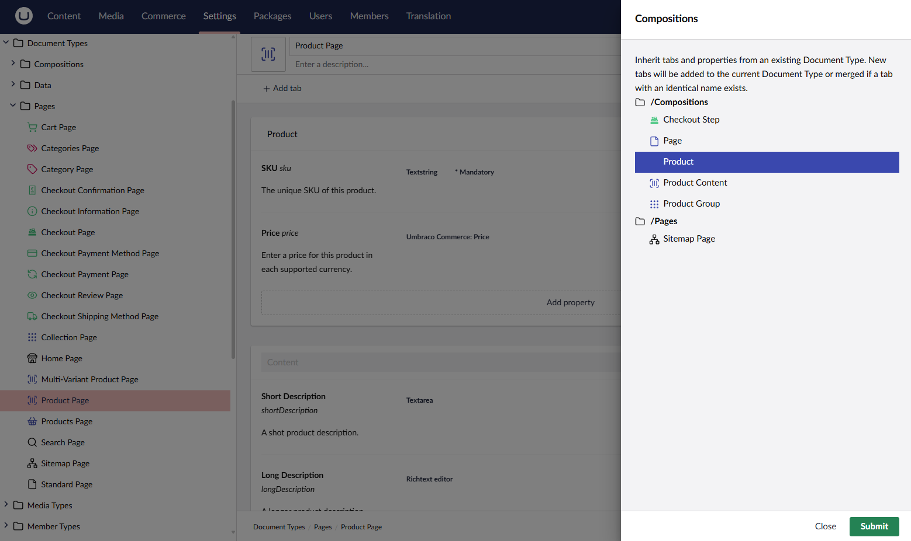
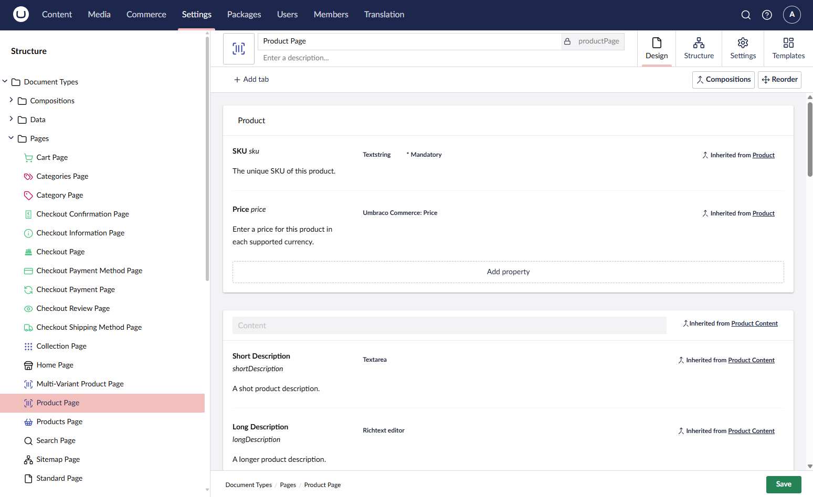
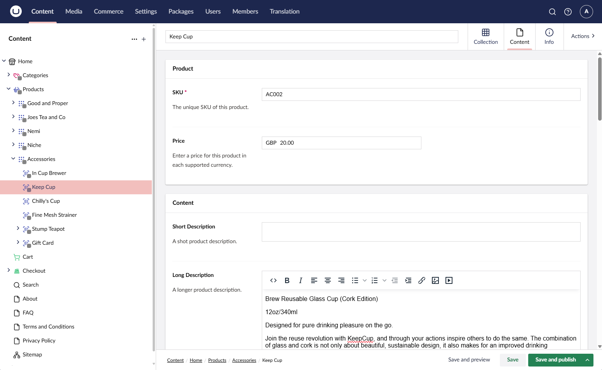

# Creating your first Product

By default, products in Umbraco Commerce are regular content nodes. These can consist of any number of properties depending on the site design. To be considered a product, however, a Document Type must contain the fields `Sku` and `Price`, with their corresponding aliases `sku` and `price`.

## Create a Product Composition

Because any node in Umbraco can be a product, the first step is to create a **Product** Composition. This composition can be applied to any Document Type to make it a product.

1. Navigate to the **Settings** section of the backoffice.
2. Create a new Element Type called **Product**.
3. Add an SKU property with the alias `sku` and select the `Text Box Editor`.
4. Add a Price property with the alias `price` and select the `Price Property Editor` that comes with Umbraco Commerce.

6. Click **Save** to create the Element Type.

## Create a Product Document Type

With the product composition created, you can now create a Document Tyoe for a product.

1. Navigate to the **Settings** section of the backoffice.
2. Create or open a Document Type that you want to use as a product.
3. Click the **Compositions** button.
4. Select the `Product` composition you created earlier and **Submit**.

5. Add any other properties to your Document Type as needed for your product.

6. Click **Save** to save the changes.

## Allow Creating Product Pages

If you haven't already, you'll need to allow the product Document Type to be a child node of the store root or product container Document Type.

1. Open your store root or product container Document Type to edit.
2. Navigate to the **Structure** tab.
3. Add our new Document Type to the **Allowed child node types** property.

4. Click **Save** to save the changes.

## Create a Product

1. Navigate to the **Content** section of the backoffice.
2. Create a new content node somewhere beneath the store root using the Document Type you created earlier.

3. Fill in the details of the product, including the SKU and Price properties.

4. Click **Save and Publish** to save the product.
5. Navigate to the frontend of the site to view the product page.

With the product created, you can now move on to [Implementing a Shopping Cart](./cart.md).
