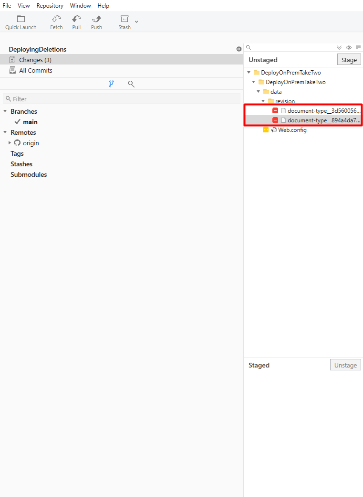

# Deploying deletions

With Umbraco Deploy deletions are environment specific. This means that in order to delete something entirely from your project, you need to delete it on all environments.

In this article you can read about the correct way of deleting files, schema and content when using Umbraco Deploy.

When you are using Umbraco Deploy, you might have more than one environment - including a local clone of the project. These environments each have their own database. The databases contain references to all  content, media, and schema files such as Document Types and Templates etc.

Databases are environment-specific. When deploying between environments, Umbraco Deploy compares incoming schema files with database references using both _alias_ and _GUID_. If a mismatch occurs between the database references and deployed files, an error appears. Learn more in the [Troubleshooting section](../troubleshooting.md).

The workflow described above does not pick up deletions of content and schema from the database, which is why you'll need to delete the content and/or schema on all your environments, in order to fully complete the deletion.

The main reason Umbraco Deploy does not delete schema and content on deployments, is because it could lead to unrecoverable loss of data. Imagine that you delete a Document Type on your Development environment, and push this deletion to your production environment where you have a lot of content nodes based on the deleted Document Type. When the deployments goes through, all of those content nodes would be instantly removed with no option to roll back as the Document Type they are based on no longer exists. To avoid anyone ending up in this unfortunate situation, deletes are not automatically handled and will require an active decision from you on each environment in order to take place.

## Example scenario

Let's say you've deleted a Document Type on your Development environment, and now you want to deploy this deletion to the production environment.

Before you deploy the changes, in Git it will show that the following changes are ready to be committed and deployed:

Commit the changes and push them to your repository and trigger a deployment to your environment.

Once the deployment is complete, you will notice the following:

* The Document Type you deleted on Development is still present in the backoffice on the production environment.

You might wonder why the Document Type that you have deleted, is still there. The reason is, that deploy only deletes the associated UDA file, and not the actual Document Type in the database.

To fully delete a Document Type from the project, delete it from the backoffice of every environment in use. A Document Type is fully deleted once it has been removed from all environments and no UDA file remains.

You should however keep in mind that if you at any point during the process, save your Document Type again, a UDA file will be regenerated and when you start deploying changes between environments, this will likely end up recreating your deleted Document Type.

## Which deletions are deployed?

Every **file** that's deleted, will also be deleted on the next environment when you deploy. However, there are some differences depending on what you have deleted.

Here's an overview of what happens when you deploy different deletions to the next environment.

### Deleting Schema (Document Types, Datatypes etc.)

Deleted:

* The associated `.uda` file.

Not deleted:

* The entry in the database.
* The item will still be visible in the backoffice.

### Deleting a Template

Deleted:

* The associated `.uda` file.
* The associated `.cshtml` file (the view file).

Not deleted:

* The entry in the database.
* The template file will be empty, but still be visible in the backoffice.

### Deleting files (css files, config files etc.)

As these are **only** files, everything will be deleted on the next environment upon deployment.

### Deleting content and / or media

Content and media deletions will not be picked up by deployments and will have to be deleted on each environment you wish to delete the content or media on.

### Deleting backoffice languages

Deleted:

* The associated `.uda` file

Not deleted:

* The entry in the database
* The language will still be visible in the backoffice/content dashboard (for multilingual content)

Deleting the language in the backoffice on the target environment will ensure the environments are in sync.
