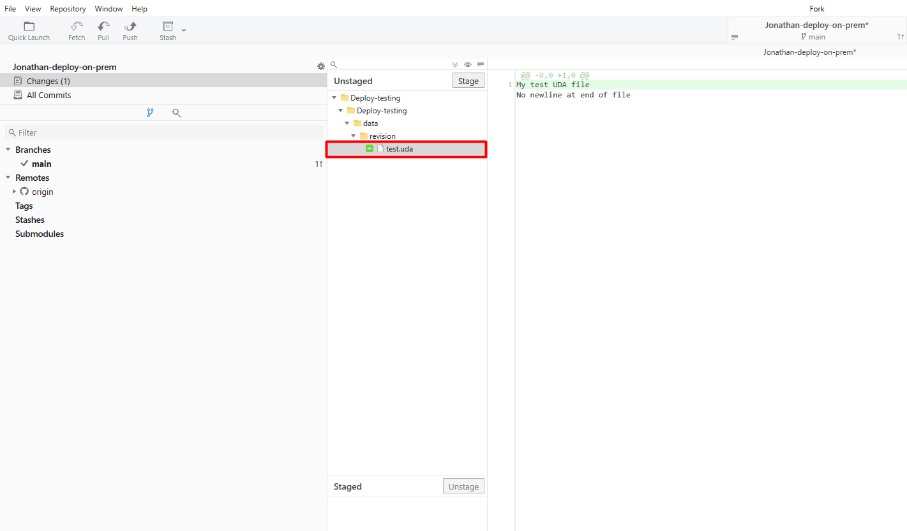

# Setting up Umbraco Deploy

## Prerequisites

Ensure to first read and follow the setup guides for either new or existing projects below:

<details>

<summary>New project</summary>

This section covers cover how to install and set up Umbraco Deploy on a new website.

### Requirement

* Visual Studio 2017 v15.9.6 or later
* Umbraco Deploy license
* SQL Server Database

**Set up the Git repository and Umbraco project**

The first step to get Umbraco Deploy up and running is to set up a GitHub repository. This will store the source code and serve as our environment for setting up a CI/CD pipeline, following the GitHub Actions example.

1. Using the Visual Studio template, set up a GitHub repository with a .gitignore file.
2. Clone down the repository to your local machine.
3. Create a new Umbraco project.
4. Run the project.
5. Choose to use a custom SQL connection string pointing to your local database.
6. Commit the files so they are ready to be pushed up once we have set up the build server.

When Umbraco has been installed in a repository, we can continue to install and configure Umbraco Deploy in the project.

</details>

<details>

<summary>Existing project</summary>

This section covers the steps to install Umbraco deploy on your already existing website with content.

Additionally, it covers how to generate the UDA files based on your production website's database.

### Requirement

* Visual Studio 2017 v15.9.6 or later
* Umbraco Deploy license
* Copy of your production site's database
* Copy of views, CSS, and scripts folder from production

**Step 1: Install Umbraco Deploy on Existing site**

To install Umbraco Deploy on an existing site there are additional steps that need to be taken so Umbraco Deploy can run with your website. On an existing Umbraco website, there is already a set of Document Types, Templates, and Data Types with IDs in the database. In order for Umbraco Deploy to work with your website, you will need to make sure that these IDs are in sync between the different environments that you want to add to your setup.

1. Make a copy of the database on the production site.
2. Download your `/Views` folder as well as the folders holding your css files and scripts.

When the production database, folder, and files have been copied down, it's time to set up a git repository and a new Umbraco project.

**Step 2: Set up Git repository and Umbraco project**

The next step to get Umbraco Deploy up and running is to set up a repository and install Umbraco into it.

1. Set up a repository with a .gitignore file using the Visual Studio template.
2. Clone down the repository to your local machine.
3. Create a new Umbraco project.
4. Use the copy of your production Database when setting up the database for the empty project.
5. Add the `/Views` folder as well as the folders holding your css files and scripts.
6. Commit the files so they are ready to be pushed up once you have set up the build server.
7. Run the project.

When Umbraco has been installed in a repository, we can continue to install and configure Umbraco Deploy in the project.

</details>

## Source Control Configuration

After the Umbraco files have been committed add the following lines to the .gitignore so that they will not be picked up by Git when we are deploying.

```
**/media/*

# Umbraco deploy specific
**/umbraco/Deploy/deploy*
```


The deploy-specific update here will ensure that temporary files generated by Deploy during its operations will not be included in source control.


Make sure that the updates to the .gitignore file are also committed.

## Installing and Configuring Umbraco Deploy

When Umbraco has been installed in a repository, we can install Umbraco Deploy in the project.

To install Umbraco Deploy, run `dotnet add package Umbraco.Deploy.OnPrem` from the command line or `Install-Package Umbraco.Deploy.OnPrem` from the package manager console in Visual Studio.


To use Umbraco Forms with Umbraco Deploy, install the `Umbraco.Forms.Deploy` package.



To deploy content with editors such as Multi URL Picker or Block List/Grid Editor, install the `Umbraco.Deploy.Contrib` NuGet package.


With Umbraco Deploy installed, to use it in the project you will need to create and add configuration for an API key/secret.

For improved security, it is recommended to set the `ApiSecret` (instead of the `ApiKey`) setting to a **cryptographically random value of 64 bytes**. Using Base64-encoding to get the string representation, will result in a value of 88 characters. For versions prior to Deploy 12 or when not using the API secret setting, the recommendation is to set the `ApiKey` to a randomly generated string of 64 characters.

<details>

<summary>Generate and set API secret (recommended)</summary>

You can use the following C# code to generate the API secret:

```csharp
using System;
using System.Security.Cryptography;

byte[] secret = new byte[64];
RandomNumberGenerator.Create().GetBytes(secret);
string apiSecret = Convert.ToBase64String(secret);

Console.Write(apiSecret);
```

Or by running the following PowerShell command:
```pwsh
$secret = [byte[]]::new(64); [System.Security.Cryptography.RandomNumberGenerator]::Create().GetBytes($secret); return [System.Convert]::ToBase64String($secret)
```

This same Deploy API secret must be used on each environment for the website.


We strongly recommend generating different secrets for different websites/projects.


The key should be applied in `appsettings.json`:

```json
{
  "Umbraco": {
    "Deploy": {
        "Settings": {
            "ApiSecret": "<your API secret here>",
        }
    }
  }
}
```

</details>

<details>

<summary>Generate and set API key (deprecated)</summary>

You can use the following C# code to generate the API key:

```csharp
using System;
using System.Security.Cryptography;

byte[] secret = new byte[32];
RandomNumberGenerator.Create().GetBytes(secret);

var apiKey = new StringBuilder(secret.Length * 2);
for (int i = 0; i < secret.Length; i++)
{
   apiKey.AppendFormat("{0:X2}", secret[i]);
}

Console.Write(apiKey.ToString());
```

Or by running the following PowerShell command:
```pwsh
$secret = [byte[]]::new(32); [System.Security.Cryptography.RandomNumberGenerator]::Create().GetBytes($secret); return -join ($secret | %{ '{0:X2}' -f $_ })
```

This same Deploy API key must be used on each environment for the website.


We strongly recommend generating different keys for different websites/projects.


The key should be applied in `appsettings.json`:

```json
{
  "Umbraco": {
    "Deploy": {
        "Settings": {
            "ApiKey": "<your API key here>",
        }
    }
  }
}
```

</details>

#### Configuring Environments

Once the API secret has been added, it is now time to configure the environments, also in the `appsettings.json` file.

An example configuration with a single upstream environment file will look like this:

```json
{
   "Umbraco": {
      "Deploy": {
         "Settings": {
            "ApiSecret": "<your API secret here>"
         },
         "Project": {
            "CurrentWorkspaceName": "Live",
            "Workspaces": [
               {
                  "Id": "efef5e89-a19b-434b-b68a-26e022a0ad52",
                  "Name": "Live",
                  "Type": "live",
                  "Url" :"https://localhost:44307"
               }
            ]
         }
      }
   }
}
```

The setting under _Project:CurrentWorkspaceName_ should match the _Name_ provided in the list of _Workspaces_ that match the current environment. Using this Umbraco Deploy will indicate the correct current environment on the "Workspaces" dashboard.


In Umbraco Deploy 9, this value was set using the configuration key _Debug:EnvironmentName_. Although included under a "Debug" section, this setting is required for the installations of Umbraco Deploy on-premises (other than on Umbraco Cloud). Hence why it was moved to the "Project" section in Umbraco Deploy 10.


Expected values for _Type_ are "development", "staging", or "live". These settings are required, though only the `live` environment strictly requires the specific value `live`. You can use other values if you have more than these three environments. All values for _Type_ must be written in lowercase.

You will need to generate a unique GUID for each environment. This can be done in Visual Studio:

1. Open "Tools".
2. Select "Create GUID".
3. Use the Registry Format.
4. Copy the GUID into the `id` value.
5. Generate a "New GUID" for each environment you will be adding to your setup.

Or by running the following PowerShell command:
```pwsh
[guid]::NewGuid().ToString()
```

The URL configured for each environment should be the root URL for the website and needs to be accessible by the other environments over **HTTPS**.

#### Validating Source Control

Once the configuration has been set up with the correct information we can now go ahead and make sure that the source control is including our files in the `/umbraco/Deploy` folder of our Umbraco project.

This can be done by going to the `/umbraco/Deploy/Revision` folder of the project and create a test `.uda` file, and then check in either your Git GUI or in the command line and verify whether the test file is being tracked.



We can see that the file has been created and it is being tracked by Git and we can go ahead and delete the test file.

Now that Umbraco Deploy has been installed on the project, we can go ahead and commit the files to the repository.

**Do not push the files up yet** as a CI/CD build server will first need to be set up and connected to our repository.

#### Include your Umbraco Deploy license file

Before moving on to setting up the build server, make sure that your license is included in your project.

For Umbraco Deploy On-Premise, this will be a key provided to you when taking out your subscription to the product. It should be added to your configuration at the key `Umbraco:Licenses:Umbraco.Deploy.OnPrem`.

For example, in `appsettings.json`:

```json
  "Umbraco": {
    "CMS": {
      ...
    },
    "Licenses": {
      "Umbraco.Deploy.OnPrem": "<your license key>"
    },
    "Deploy": {
       ...
    }
```


You might run into issues when using a period in the product name when using environment variables. Use an underscore in the product name instead, to avoid problems.

```json
"Umbraco_Deploy_OnPrem": "YOUR_LICENSE_KEY"
```


Umbraco Cloud projects use a license file placed in the `/umbraco/Licenses` folder that is provided when your project is created.

Read more about the [Umbraco Deploy licensing model](../installation/the-licensing-model.md).
