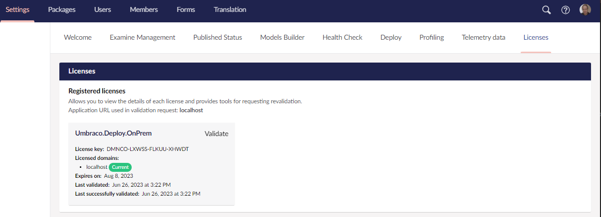

# The Licensing Model

Umbraco Deploy is a commercial product. You will need a **valid license** to use the product.

A license for Umbraco Deploy is included when hosting on Umbraco Cloud.

## How does it work?

Licenses are sold per domain and will also work on all subdomains. With every license, you will also be able to configure two development/testing domains.

### Example

Let's say that you have a license configured for your domain, `mysite.com`, and you've configured two development domains, `devdomain.com` and `devdomain2.com`.

The license will cover the following domains:

* `localhost`
* `*.mysite.com`
* `www.mysite.com`
* `mysite.com.local`
* `devdomain.com`
* `www.devdomain.com`
* `devdomain2.com`
* `www.devdomain2.com`


You can have only 1 license per Umbraco installation.


## What does a license cover?

There are a few differences as to what the licenses cover:

A single license covers one Umbraco solution. It includes all domains hosted by the solution, all production environments (if load-balancing), and all non-production environments.

To clarify the above:

* You only need one license when you have a solution covering multiple domains- for example, `www.mysite.com` and `www.mysite.dk` - load balanced in production over multiple servers running from the same database, managed from the same backoffice instance, and with any number of non-production environments (staging, QA, etc.)
* You need two licenses if you have a web presence that consists of two separate websites hosted on different domains or sub-domains - for example, `www.mysite.com` and `shop.mysite.com` - with each of these managed as a separate Umbraco installation using their own database and backoffice in production.


The license for Umbraco Deploy comes with a recurring yearly fee. Learn more about this and pricing on [Umbraco.com](https://umbraco.com/products/umbraco-deploy/).


## Purchasing your license

You can look at the pricing, plans, features, and purchase the license on the [Umbraco Deploy On-premises](https://umbraco.com/products/add-ons/deploy/umbraco-deploy-on-premises/) page.

## Installing your license

Once you've configured your license with the correct domains, you are ready to install the license on your Umbraco installation.

For Umbraco Deploy On-Premise 12 and above, this will be a key provided to you when taking out your subscription to the product. It should be added to your configuration at the key `Umbraco:Licenses:Products:Umbraco.Deploy.OnPrem`.

For example, in `appsettings.json`:

```json
  "Umbraco": {
    "CMS": {
      ...
    },
    "Licenses": {
      "Products": {
        "Umbraco.Deploy.OnPrem": "<your license key>"
      }
    },
    "Deploy": {
       ...
    }
```


You might run into issues when using a period in the product name when using environment variables. Use an underscore in the product name instead, to avoid problems.

```json
"Umbraco_Deploy_OnPrem": "YOUR_LICENSE_KEY"
```


Umbraco Cloud projects use a license file placed in the `/umbraco/Licenses` folder that is provided automatically when your project is created.

## Validating the license

On start-up and on a schedule, Umbraco running Deploy On-premise will call out to a service. It will pass the configured license key to determine its validity. The response triggers a notification that the Umbraco Deploy will handle. It will amend the available functionality as appropriate to a valid, invalid  or expired license.

You can view the status of the Umbraco Deploy On-premise license in the backoffice. This is available via the _Settings_ section, listed along with any other products using the same licensing service:



### When and how to configure an `UmbracoApplicationUrl`

The website domain used for validating the license is determined from your Umbraco instance. To ensure the correct one is used, you can configure the `UmbracoApplicationUrl`.

If you are running on a single domain for both your frontend and backend environments, it's not necessary to configure a `UmbracoApplicationUrl`.

If you have different domains for your frontend and backend, then it's advised that you configure an `UmbracoApplicationUrl` set to your backoffice URL. This helps the licensing engine know which URL should be used for validation checks. Without this configuration setting, the licensing engine will try and work out the domain to validate from the HTTP request object. This can lead to errors when switching between domains.

An `UmbracoApplicationUrl` can be configured in your `appsettings.json` file like so:

```json
{
    "Umbraco": {
        "CMS": {
            "WebRouting": {
                "UmbracoApplicationUrl": "https://admin.my-custom-domain.com/"
            }
        }
    }
}
```

See the [Fixed Application URL](https://docs.umbraco.com/umbraco-cms/extending/health-check/guides/fixedapplicationurl) documentation for more details about this setting.

### Validating a license without an outgoing Internet connection

Some Umbraco installations will have a highly locked down production environment, with firewall rules that prevent outgoing HTTP requests. This will interfere with the normal process of license validation.

On start-up, and periodically whilst Umbraco is running, the license component used by Umbraco Deploy will make an HTTP POST request to `https://license-validation.umbraco.com/api/ValidateLicense`.

If it's possible to do so, the firewall rules should be adjusted to allow this request.

If such a change is not feasible, there is another approach you can use.

You will need to have a server, or serverless function, that is running and can make a request to the online license validation service. That needs to run on a daily schedule, making a request and relaying it onto the restricted Umbraco environment.

Then configure a random string as an authorization key in configuration. This is used as protection to ensure only valid requests are handled. You can also disable the normal regular license checks - as there is no point in these running if they will be blocked:

```json
{
  "Umbraco": {
    "Licenses": {
      "Products": {
        "Umbraco.Deploy.OnPrem": "<your license key>"
      },
      "EnableScheduledValidation": false,
      "ValidatedLicenseRelayAuthKey": "<your authorization key>"
    }
  }
}
```

Your Internet enabled server should make a request of the following form to the online license validation service:

```
POST https://license-validation.umbraco.com/api/ValidateLicense
{
    "ProductId": "Umbraco.Deploy.OnPrem",
    "LicenseKey": "<your license key>",
    "Domain": "<your licensed domain>"
}
```

The response should be relayed exactly via an HTTP request to your restricted Umbraco environment:

```
POST http://<your umbraco environment>/umbraco/licenses/validatedLicense/relay?productId=<product id>&licenseKey=<license key>
```

A header with a key of `X-AUTH-KEY` and value of the authorization key you have configured should be provided.

This will trigger the same processes that occur when the normal scheduled validation completes ensuring your product is considered licensed.
