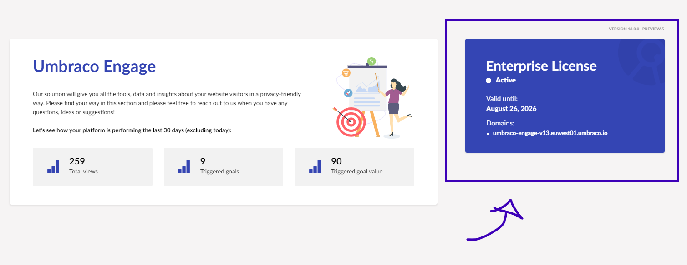

# Licensing

Umbraco Engage is a commercial product. You can run Umbraco Engage unrestricted locally without the need for a license and will display a trial banner. Running Umbraco Engage in the public domain will require you to have a **valid license**.

## How does it work?

Licenses are sold per backoffice domain. If you have alternative staging/QA environment domains or require one or more subdomains, additional domains can be added to the license on request.


The licenses are not bound to a specific product version. They will work for all versions of the related product.


Let's say that you have a license configured for your domain, `mysite.com`, and you've requested two development domains, `devdomain.com` and `devdomain2.com`.

The license will cover the following domains:

* `localhost`
* `*.local`
* `*.test`
* `mysite.com`
* `www.mysite.com`
* `devdomain.com`
* `www.devdomain.com`
* `devdomain2.com`
* `www.devdomain2.com`


You can have only 1 license per Umbraco installation.


## What does a license cover?

There are a few differences as to what the licenses cover:

* A single license covers the installation of Umbraco Engage in 1 production backoffice domain, as well as in any requested development domains.
* The development and production domains work with or without the `www` subdomain.
* The license also includes `localhost`, `*.local`, and `*.test` as valid domains.
* Each individual subdomain has to be specified as part of the license (e.g. `subdomain.mysite.com`), wildcard subdomains are not allowed.


If multiple backoffice domains share the same installation, you have to purchase and add [**additional domains**](#add-additional-domains) to your license.

This is an add-on domain for existing licenses. Refunds will not be given for this product.


## Configuring your license

You can look at the pricing, features, and purchase a license on the [Umbraco Engage](https://umbraco.com/products/add-ons/engage/) page. A member of the sales team will manage this process. You will need to provide all domains you wish to have covered by the license such as primary and development/staging/QA domains. You should then receive a license code to be installed in your solution.

### Add additional domains

To add additional domains to your license, [reach out to the sales team](https://umbraco.com/products/add-ons/engage/) with your request and they will manage this process.

## Installing your license

Once you have received your license code it needs to be installed on your site.

1. Open the root directory for your project files.
2. Locate and open the `appSettings.json` file.
3. Add your Umbraco Engage license key to `Umbraco:Licenses:Umbraco.Engage`:

```json
"Umbraco": {
  "Licenses": {
    "Umbraco.Engage": "YOUR_LICENSE_KEY"
  }
}
```


You might run into issues when using a period in the product name when using environment variables. Use an underscore in the product name instead, to avoid problems.

```json
"Umbraco_Engage": "YOUR_LICENSE_KEY"
```



### Verify the license installation

You can verify that your license is successfully installed by logging into your project's backoffice and navigating to the settings section. Here you will see a license dashboard which should display the status of your license.



### When and how to configure an `UmbracoApplicationUrl`

If you are running on a single domain for both your frontend and backend environments, it's not necessary to configure a `UmbracoApplicationUrl`.

If you have different domains for your frontend and backend, then it's advised that you configure an `UmbracoApplicationUrl` set to your backoffice URL. This helps the licensing engine know which URL should be used for validation checks. Without this configuration setting, the licensing engine will try and work out the domain to validate from the HTTP request object. This can lead to errors when switching between domains.

An `UmbracoApplicationUrl` can be configured in your `appSettings.json` file like so:

```json
{
    "Umbraco": {
        "CMS": {
            "WebRouting": {
                "UmbracoApplicationUrl": "https://admin.my-custom-domain.com/"
            }
        }
    }
}
```

See the [Fixed Application URL](https://docs.umbraco.com/umbraco-cms/extending/health-check/guides/fixedapplicationurl) documentation for more details about this setting.
