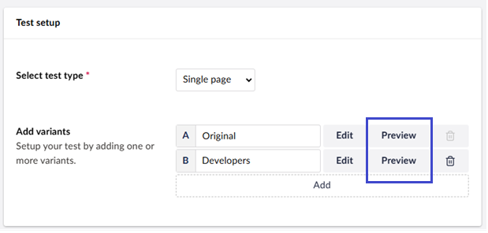
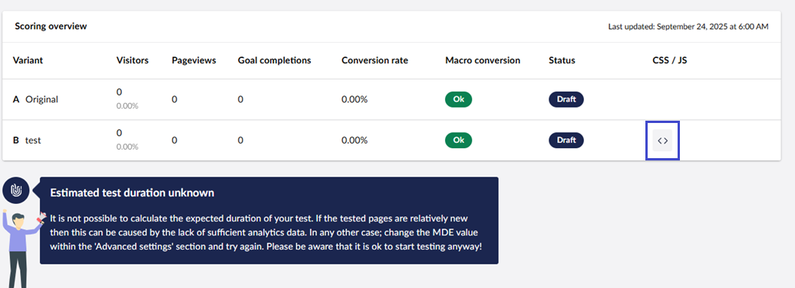
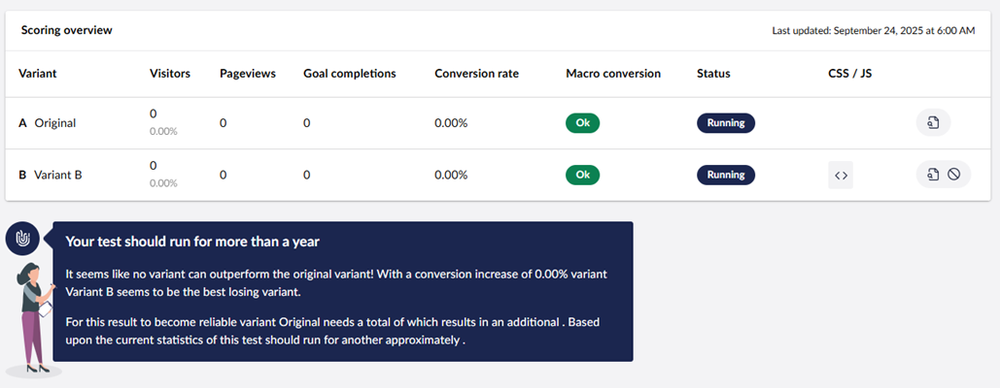

# Previewing an A/B Test

There are different ways to preview your A/B Test variants.

## During the setup of your new A/B Test

When setting up a new A/B Test there are three options to preview your A/B Test variant. First of all, you open the preview of your variant by clicking on the **preview** button in the overview of variants:

With all variants set up, you can get an overview before the A/B Test. In that screen, you also have the option to preview all variants:

## During a running test

You can preview all the A/B test variants while a test is running. Go to the specific test, and you will have an overview of the current results. You can also preview each variant by clicking the "preview"-button.

