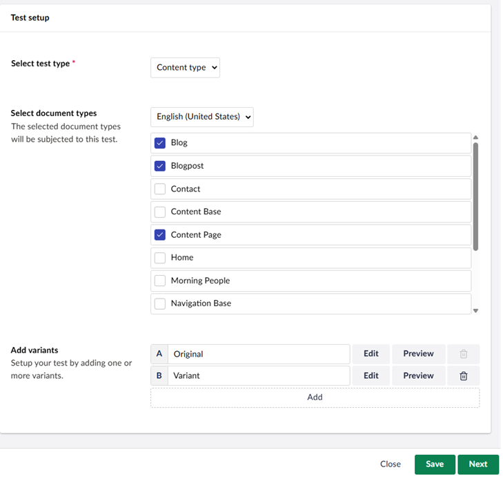
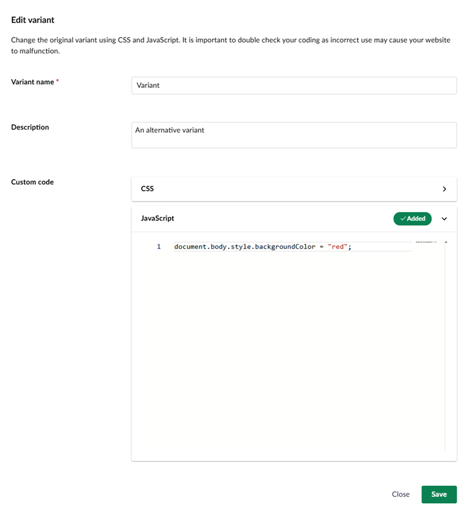

# Document Type Test

Test all pages using a specific Document Type with this test. Select the Document Type(s) you want to test and Umbraco Engage makes sure the correct CSS and JavaScript is inserted to the correct pages.

The test type **Content Type** can be started in the [Engage section](../../introduction/the-umbraco-engage-section.md) and in the [Content App](../../introduction/content-apps.md). The type is selected in the **Test setup** section.

The test allows you to select one or more Document Types within Umbraco. On all pages using the selected Document Type(s) the A/B Test will render the additional CSS and JavaScript you will enter. The CSS and JavaScript must not create any side effects on these pages. This is a manual task.

Once you have selected the pages you want to test, you can specify one or more variants. For each variant, it is possible to click the Edit button. This will bring up a popup that allows you to write JavaScript or CSS:

In this example, some JavaScript changes the page's background color.

You can check if your code works by clicking **Preview**.

After creating all variants, start your A/B testing as written in the [Setting up the A/B test](../setting-up-the-ab-test.md) article.
